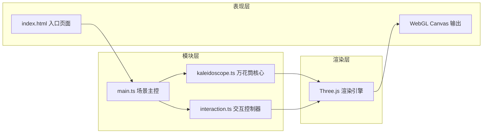

## 1. 架构设计



## 2. 技术说明

- **前端框架**：无 UI 框架，原生 TypeScript
- **三维引擎**：Three.js（含 postprocessing OutlinePass）
- **构建工具**：Vite（支持 HMR 热更新）
- **类型系统**：TypeScript 严格模式，目标 ES2020
- **样式方案**：原生 CSS，内联于 index.html

## 3. 文件结构

```
project-root/
├── package.json              # 依赖声明与启动脚本
├── vite.config.js            # Vite 构建配置
├── tsconfig.json             # TypeScript 配置
├── index.html                # 入口页面（含样式与 UI 结构）
└── src/
    ├── main.ts               # 场景初始化、渲染循环、事件调度
    ├── kaleidoscope.ts       # 棱镜碎片生成、矩阵变换、参数更新
    └── interaction.ts        # 鼠标/滚轮/滑块交互、阻尼惯性、重置动画
```

### 模块职责

| 文件 | 职责 |
|------|------|
| main.ts | 创建 Scene / Camera / Renderer / OutlinePass，组装 kaleidoscope 与 interaction，驱动 requestAnimationFrame 主循环，管理全局状态 |
| kaleidoscope.ts | Prism 碎片数据结构，基于对称轴数量的空间分布算法，公转/自转矩阵计算，HSL 颜色偏移，LOD 策略 |
| interaction.ts | 鼠标拖拽旋转相机（球面坐标转换），滚轮缩放，滑块事件绑定与参数广播，视角阻尼插值，重置缓动动画，Raycaster 悬停检测，信息标签 DOM 更新 |

## 4. 核心类型定义

```typescript
// kaleidoscope.ts
interface Prism {
  id: number;
  group: number;           // 对称组编号
  basePosition: Vector3;   // 初始基准位置
  size: number;            // 0.3 - 0.8
  baseColor: Color;        // 初始颜色
  rotationAxis: Vector3;   // 自转轴
  rotationSpeed: number;   // 自转方向 ±1
  mesh: Mesh;              // 三棱柱或四面体
  lodLevel: number;        // 0=详细 1=简化
}

interface KaleidoscopeParams {
  rotationSpeed: number;   // 0.5 - 5
  symmetryAxes: number;    // 2 - 6
  colorOffset: number;     // 0 - 2π
}

// interaction.ts
interface CameraState {
  theta: number;           // 水平角
  phi: number;             // 垂直角
  radius: number;          // 视距
}
```

## 5. 关键算法

### 5.1 对称分布算法
- 以对称轴数量 N 将碎片分配到 N 个对称组
- 每组以 Y 轴为中心在水平面上按 `2πi/N` 旋转复制
- 每个基准位置在球坐标系下按斐波那契球面采样分布于立方体内

### 5.2 视角阻尼
- 使用指数平滑 `current += (target - current) * (1 - exp(-dt / damping))`
- 垂直角 phi 超出 ±60° 时施加回弹力矩，模拟软边界

### 5.3 颜色偏移
- 将 Color 转换为 HSL，H 分量加上偏移量后模 2π，再转回 RGB
- 每帧根据 colorOffset 参数实时更新所有碎片材质

### 5.4 LOD 策略
- 每帧计算碎片到相机距离
- 距离 > 阈值时将三棱柱 geometry 替换为 PlaneGeometry（双面渲染）
- 距离 < 阈值时恢复原几何体

## 6. 性能优化

- 所有碎片共享同一批 Material 实例（仅颜色不同），减少 draw call 切换
- 使用 InstancedMesh 备选方案（如碎片数量继续增长）
- 参数变更时批量更新矩阵，避免逐帧重建 geometry
- 滑块节流（rAF 调度），确保 <100ms 响应
