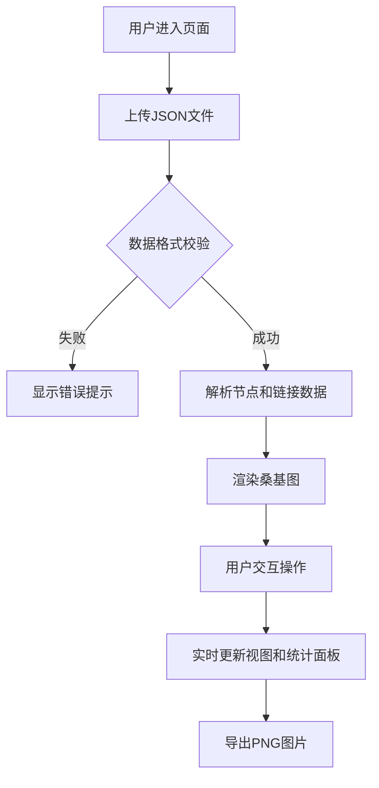

## 1. 产品概述

交互式桑基图可视化Web应用，解决手动绘制复杂能量流或资金流图耗时且无法联动的痛点。用户上传JSON数据文件后，系统自动解析并渲染可交互的桑基图，支持节点拖拽、路径高亮、缩放查看、数据统计和PNG导出。

- 目标用户：数据分析师、财务人员、能源管理者、产品经理
- 核心价值：快速将结构化数据转化为可视化的流量关系图，支持交互探索

## 2. 核心功能

### 2.1 功能模块

1. **数据上传模块**：JSON文件拖拽/点击上传、数据格式校验、错误提示
2. **桑基图渲染模块**：D3.js桑基图布局、节点矩形、渐变流量带、拖拽交互、缩放平移
3. **高亮过滤模块**：节点/流量带点击高亮、双击过滤、空白重置
4. **统计面板模块**：选中节点详情、全图摘要统计、上下游节点跳转、过滤列表
5. **导出模块**：PNG图片导出下载

### 2.2 页面详情

| 页面名称 | 模块名称 | 功能描述 |
|-----------|-------------|---------------------|
| 主页面 | 上传区域 | 拖拽/点击上传JSON文件，校验数据格式，显示错误提示 |
| 主页面 | 桑基图画布 | 渲染交互式桑基图，支持节点拖拽、缩放、点击高亮、双击过滤 |
| 主页面 | 右侧统计面板 | 显示选中节点详情（名称、输入/输出流量、上下游节点）或全图统计 |
| 主页面 | 导出按钮 | 将当前桑基图导出为PNG图片并下载 |

## 3. 核心流程

用户上传JSON文件 → 系统校验数据格式 → 解析节点和连接数据 → 渲染桑基图 → 用户交互（拖拽/点击/缩放）→ 实时更新视图和统计面板 → 导出PNG

## 4. 用户界面设计

### 4.1 设计风格

- **主色调**：深色主题背景 `#1A1A2E`，节点色 `#16213E`，流量带色阶从 `#0F3460` 到 `#E94560`
- **字体**：现代无衬线字体，标题加粗，正文常规
- **布局**：左侧画布自适应，右侧300px固定侧边栏，响应式适配
- **毛玻璃效果**：侧边栏使用 `backdrop-filter: blur(10px)`
- **动画**：节点拖拽0.3s平滑过渡，流量带悬停放大至1.2倍并显示数值标签

### 4.2 页面设计概述

| 页面名称 | 模块名称 | UI元素 |
|-----------|-------------|-------------|
| 主页面 | 上传区域 | 拖拽框、上传按钮、格式说明、错误提示条 |
| 主页面 | 桑基图画布 | SVG画布、缩放控制、节点矩形（带标签）、渐变流量带 |
| 主页面 | 右侧统计面板 | 毛玻璃背景、标题、统计数据卡片、上下游节点列表、过滤列表 |
| 主页面 | 导出按钮 | 顶部工具栏按钮、下载图标 |

### 4.3 响应式

- Desktop-first 设计
- 宽度 < 768px 时：侧边栏折叠为顶部下拉面板
- 触摸屏支持：双指缩放、长按拖拽节点

### 4.4 性能要求

- 节点数 ≤ 50、连接数 ≤ 200 时，拖拽帧率 ≥ 55fps
- 数据解析和首次渲染时间 < 2秒
