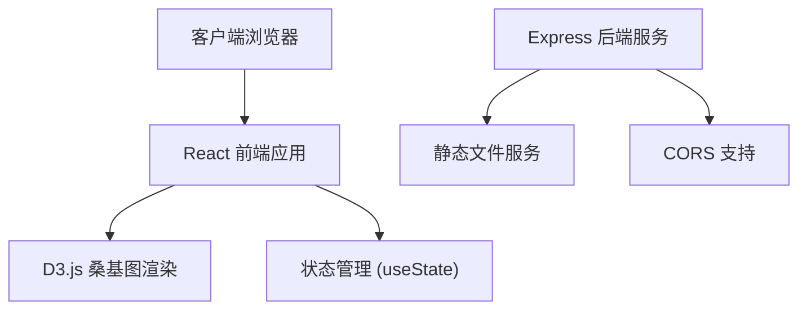

## 1. 架构设计



## 2. 技术描述

- **前端**：React 18 + TypeScript + Vite + D3.js + d3-sankey
- **构建工具**：Vite（支持React和HMR，输出目录dist）
- **后端**：Express 4 + TypeScript（静态文件服务、CORS支持）
- **图标库**：lucide-react
- **样式方案**：原生CSS（深色主题、毛玻璃效果、响应式）

## 3. 项目文件结构

```
.
├── package.json              # 项目依赖和脚本
├── vite.config.js            # Vite构建配置
├── tsconfig.json             # TypeScript配置
├── index.html                # 入口HTML
├── src/
│   ├── main.tsx              # React应用入口
│   ├── App.tsx               # 主组件（状态管理、布局）
│   └── components/
│       ├── SankeyChart.tsx   # 桑基图渲染组件
│       └── SidePanel.tsx     # 右侧统计面板组件
└── server/
    └── index.ts              # Express服务器
```

## 4. 核心数据类型定义

```typescript
// 节点数据
interface SankeyNode {
  id: string;
  label: string;
}

// 链接数据
interface SankeyLink {
  source: string;
  target: string;
  value: number;
}

// 桑基图数据
interface SankeyData {
  nodes: SankeyNode[];
  links: SankeyLink[];
}

// 选中节点详情
interface NodeStats {
  id: string;
  label: string;
  inputTotal: number;
  outputTotal: number;
  upstreamNodes: { id: string; label: string; value: number }[];
  downstreamNodes: { id: string; label: string; value: number }[];
}
```

## 5. 组件职责划分

### 5.1 App.tsx（主组件）
- 管理全局状态：上传数据、选中节点、过滤链接、高亮状态
- 处理文件上传和数据校验
- 布局组织：上传区域、画布区域、侧边栏
- 传递props给子组件

### 5.2 SankeyChart.tsx（桑基图组件）
- 接收数据、选中状态、过滤列表等props
- 使用D3.js + d3-sankey计算布局
- 渲染SVG节点和流量带
- 处理拖拽、点击、缩放等交互事件
- 实现PNG导出功能

### 5.3 SidePanel.tsx（统计面板组件）
- 接收选中节点、数据、过滤列表等props
- 显示选中节点的输入/输出流量统计
- 显示上下游节点列表（支持点击跳转高亮）
- 未选中时显示全图总流量和节点数
- 显示被过滤的链接列表

## 6. 关键实现点

### 6.1 数据校验
- 检查JSON结构是否包含 nodes 和 links 数组
- 验证每个节点有 id 和 label
- 验证每个链接有 source、target（存在于nodes中）和 value（正数）

### 6.2 桑基图渲染
- 使用 d3-sankey 的 sankey() 布局计算节点位置
- 节点宽度固定20px，高度按流量值缩放
- 流量带使用线性渐变（源节点色→目标节点色）
- 节点使用 d3.drag() 实现拖拽，拖拽时重新计算路径

### 6.3 高亮与过滤
- 点击节点/流量带时，设置高亮状态，其他元素透明度设为0.2
- 双击流量带时，添加到过滤列表，重新渲染时过滤掉
- 点击空白区域重置高亮状态

### 6.4 PNG导出
- 使用 html2canvas 或原生 Canvas API 将SVG渲染为Canvas
- 导出为PNG并触发下载（仅包含画布区域，不含侧边栏）

### 6.5 性能优化
- 使用 React.memo 避免不必要的重渲染
- D3操作使用 ref 直接操作DOM，不经过React虚拟DOM
- 拖拽时使用 requestAnimationFrame 确保流畅性
