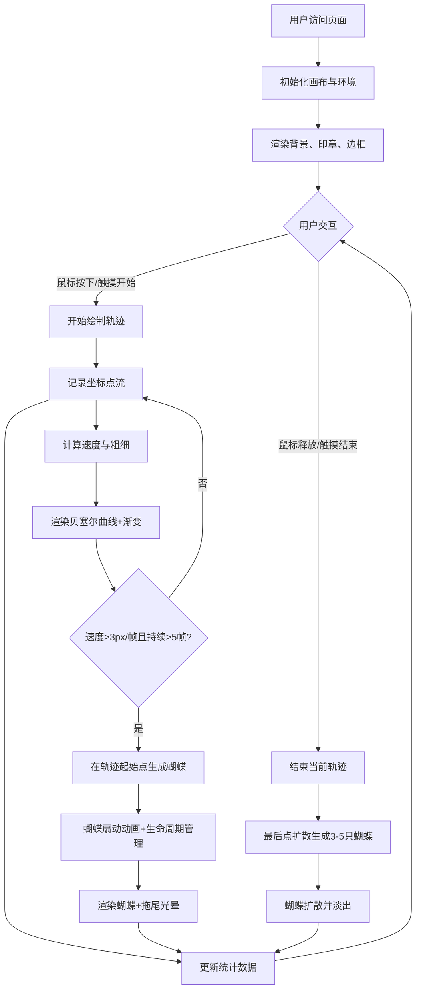

## 1. 产品概述

「墨舞蝶影」是一款面向数字艺术家和创意爱好者的浏览器端交互式水墨画布工具。用户通过鼠标拖拽或触摸滑动，在宣纸风格的画布上绘制飘逸的墨迹轨迹，轨迹上会自动绽放出半透明的水墨蝴蝶，蝴蝶的翅膀纹理和颜色由墨迹的粗细、速度与色彩通道实时混合决定。

- 主要用途：艺术创作、休闲绘画、创意表达
- 目标用户：数字艺术家、设计师、创意工作者、普通用户
- 产品价值：将传统水墨艺术与现代交互技术融合，提供低门槛、高美感的数字艺术创作体验

## 2. 核心功能

### 2.1 用户角色
无需用户注册与登录，所有功能开放给所有访问者。

| 角色 | 访问方式 | 核心权限 |
|------|----------|----------|
| 访客用户 | 直接访问网页 | 绘制墨迹、生成蝴蝶、查看实时统计 |

### 2.2 功能模块
1. **画布系统**：宣纸风格背景、印章装饰、卷角阴影、柔光边框
2. **墨迹轨迹模块**：贝塞尔曲线绘制、动态粗细变化、颜色渐变、尾部渐隐、发光墨点
3. **蝴蝶动画模块**：蝴蝶生成、翅膀扇动、斑点装饰、扩散效果、拖尾光晕
4. **实时统计模块**：蝴蝶数量、轨迹长度、绘制时间
5. **响应式适配**：移动端尺寸缩放、触摸事件优化

### 2.3 功能详情

| 模块名称 | 子功能 | 功能描述 |
|---------|--------|----------|
| 画布系统 | 背景渲染 | 宣纸白#F5F0E8到淡墨灰#D4CFC8的全屏渐变背景 |
| 画布系统 | 印章装饰 | 随机散布8-12个半透明仿古印章（#8B7355，透明度0.08，直径20-40px） |
| 画布系统 | 边框效果 | 0.5px柔光边框#C4B998，四角卷角阴影（向外扩散8px，透明度0.15） |
| 墨迹轨迹 | 贝塞尔曲线 | 基于鼠标坐标流生成平滑贝塞尔曲线 |
| 墨迹轨迹 | 动态粗细 | 慢速拖动8-12px，快速拖动1-4px，根据速度插值 |
| 墨迹轨迹 | 颜色渐变 | 从#1A1A1A纯黑到#3D2B1F深褐的骨骼脉络感渐变 |
| 墨迹轨迹 | 尾部渐隐 | 轨迹末尾使用透明度衰减实现淡出效果 |
| 墨迹轨迹 | 发光墨点 | 轨迹末端半径4px白色墨点（透明度0.6），停笔后渐缩消失 |
| 蝴蝶动画 | 触发生成 | 速度>3px/帧且持续>5帧时，在轨迹起始点绽放蝴蝶 |
| 蝴蝶动画 | 颜色生成 | 翅膀颜色为轨迹颜色的补色（如黑色→#E5E5E5淡彩） |
| 蝴蝶动画 | 尺寸随机 | 蝴蝶大小20-50px随机，移动端缩小50% |
| 蝴蝶动画 | 透明度变化 | 初始透明度0.2，1秒内渐至0.9后保持 |
| 蝴蝶动画 | 翅膀扇动 | 正弦波驱动-30°到+30°开合，周期0.6-1.2s随机 |
| 蝴蝶动画 | 斑点装饰 | 翅膀上3-6个亮色斑点（#FFD700/#FF6B6B/#4ECDC4），扇动时轻微缩放 |
| 蝴蝶动画 | 生命周期 | 每只蝴蝶存在5-8秒后透明度归零消失 |
| 蝴蝶动画 | 扩散效果 | 鼠标停止后在最后点生成3-5只蝴蝶向外扩散（半径30-80px），2秒后消失 |
| 蝴蝶动画 | 拖尾光晕 | 扇动时周围0.3px拖尾光晕（翅膀主色，透明度0.2，长度20px，延迟0.15s） |
| 蝴蝶动画 | 数量上限 | 最多60只蝴蝶，达到上限时最旧的提前消失 |
| 实时统计 | 蝴蝶数量 | 当前活跃蝴蝶数量（上限60） |
| 实时统计 | 轨迹长度 | 墨迹总长度（像素，四舍五入整数） |
| 实时统计 | 绘制时间 | 累计绘制时间（秒，精确到0.1s） |

## 3. 核心流程

### 3.1 主流程描述
用户进入页面 → 看到宣纸风格画布和装饰 → 鼠标按下/触摸开始绘制 → 生成动态粗细的贝塞尔墨迹 → 速度超过阈值时自动绽放蝴蝶 → 鼠标释放/触摸结束 → 最后位置扩散生成蝴蝶群 → 实时统计持续更新 → 用户可继续绘制或刷新重置

### 3.2 流程图

## 4. 用户界面设计

### 4.1 设计风格

- **主色调**：宣纸白#F5F0E8、淡墨灰#D4CFC8、纯黑#1A1A1A、深褐#3D2B1F
- **点缀色**：金色#FFD700、珊瑚红#FF6B6B、青碧#4ECDC4、印章棕#8B7355
- **边框色**：柔光金#C4B998
- **整体风格**：东方水墨意境、留白雅致、古韵诗意
- **字体**：衬线字体（如宋体/思源宋体），营造书卷气息
- **布局**：居中画布（宽95%，高90%），四周3%留白，左下角统计面板
- **动画风格**：柔和平滑、自然流畅、水墨晕染感

### 4.2 页面设计概述

| 区域 | 模块名称 | UI元素描述 |
|------|---------|-----------|
| 全屏背景 | 渐变背景 | 宣纸白→淡墨灰线性渐变（从上至下） |
| 全屏背景 | 装饰印章 | 8-12个随机位置圆形印章，#8B7355，透明度0.08 |
| 中央区域 | Canvas容器 | 宽95vw × 高90vh，居中，四周3%留白 |
| Canvas边缘 | 柔光边框 | 0.5px #C4B998边框 |
| Canvas四角 | 卷角阴影 | 向外扩散8px阴影，透明度0.15 |
| 左下角 | 统计面板 | 白色半透明背景，三行文字：蝴蝶数量、轨迹长度、绘制时间 |
| Canvas内 | 墨迹层 | 贝塞尔曲线，动态粗细，颜色渐变，尾部渐隐 |
| Canvas内 | 墨点 | 轨迹末端，半径4px白色发光点，跟随移动 |
| Canvas内 | 蝴蝶层 | 半透明蝴蝶，扇动翅膀，斑点，拖尾光晕 |

### 4.3 响应式设计

- **桌面端（≥768px）**：
  - Canvas：宽95vw × 高90vh
  - 蝴蝶尺寸：20-50px
  - 墨点半径：4px
  - 统计面板：标准字体大小

- **移动端（<768px）**：
  - Canvas：保持95vw × 90vh
  - 蝴蝶尺寸：缩小50%（10-25px）
  - 墨点半径：缩小50%（2px）
  - 统计面板：字体适当缩小
  - 触摸事件：单指绘制，忽略多指操作

### 4.4 性能设计

- **帧率目标**：稳定50fps以上，蝴蝶满60只时不低于45fps
- **采样限制**：墨迹轨迹每秒采样不超过120个点
- **蝴蝶上限**：60只，超出时淘汰最旧实例
- **渲染优化**：离屏缓存背景层、分层渲染、增量重绘
