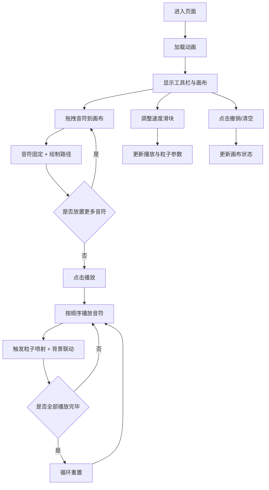

## 1. 产品概述

「幻音涂鸦」是一款浏览器端交互式音画协同创作游戏，玩家通过在画布上拖拽彩色音符块绘制旋律路径，系统将视觉创作与音频反馈实时联动，打造沉浸式的音乐绘画体验。

- 核心价值：降低音乐创作门槛，让零基础用户通过可视化方式体验旋律创作的乐趣
- 目标用户：音乐爱好者、创意玩家、休闲用户群体
- 产品定位：轻量级、高颜值、即时反馈的Web创意工具

## 2. 核心功能

### 2.1 功能模块

1. **音符工具栏**：四种颜色音符块（红/蓝/绿/紫），支持拖拽到画布
2. **旋律画布**：中央Canvas绘制区域，展示音符位置、发光路径、粒子效果
3. **播放控制**：播放/暂停按钮、循环播放机制
4. **速度调节**：0.5x~3x播放速度滑块，影响粒子效果同步变化
5. **编辑操作**：清空画布、撤销上一步操作
6. **音频引擎**：Web Audio API生成四种固定音高（Do/Re/Mi/Fa）
7. **视觉反馈**：粒子喷射、音符脉冲高亮、背景色调联动

### 2.2 功能详情

| 模块名称 | 子功能 | 功能描述 |
|----------|--------|----------|
| 音符工具栏 | 音符拖拽 | 从左侧工具栏拖拽彩色圆块到画布，松开后固定位置 |
| 音符工具栏 | 发光效果 | 每个音符块带轻微发光阴影（box-shadow） |
| 旋律画布 | 路径绘制 | 新音符放置后，自动连接到上一个音符，生成发光渐变路径 |
| 旋律画布 | 路径脉动 | 路径宽度在2px~6px之间周期性脉动 |
| 播放控制 | 顺序播放 | 按音符放置顺序依次播放音高 |
| 播放控制 | 循环重置 | 全部播放完毕后自动从头循环 |
| 速度调节 | 速度滑块 | 右侧滑块控制0.5x~3x播放速度 |
| 速度调节 | 粒子联动 | 高速时粒子更少更快，低速时粒子密集轨迹更长 |
| 编辑操作 | 清空画布 | 一键删除所有音符和路径 |
| 编辑操作 | 撤销操作 | 移除最后一个音符，重绘剩余路径，伴随淡出动画 |
| 音频引擎 | 音调生成 | 红=Do 261Hz，蓝=Re 293Hz，绿=Mi 329Hz，紫=Fa 349Hz |
| 视觉反馈 | 粒子喷射 | 每播放一个音符喷射50个同色粒子，0.8秒内大小从4px衰减到0 |
| 视觉反馈 | 音符脉冲 | 播放时音符放大1.3倍再恢复，持续0.2秒 |
| 视觉反馈 | 背景联动 | 播放时背景根据音符颜色平滑偏移，持续0.5秒 |

## 3. 核心流程

### 3.1 主创作流程

玩家进入页面 → 从工具栏拖拽音符到画布 → 音符自动连接成发光路径 → 点击播放按钮 → 旋律依次播放并触发粒子特效与背景联动 → 循环播放或调整速度 → 可清空或撤销继续创作

## 4. 用户界面设计

### 4.1 设计风格

- **整体风格**：暗色未来感、赛博霓虹、沉浸式体验
- **主背景色**：#0D0D1A（深墨蓝紫）
- **主色调**：
  - 红色音符 #FF3366
  - 蓝色音符 #00BFFF
  - 绿色音符 #39FF14
  - 紫色音符 #9932CC
- **背景渐变**：动态从深蓝 #0B0B2A 到暗紫 #1B0B2A 缓慢过渡
- **按钮风格**：圆角矩形（8px圆角），悬停半透明→不透明（0.2s过渡），点击缩放反馈（0.95倍弹回）
- **字体**：现代无衬线字体，标题使用稍具艺术感的展示字体

### 4.2 页面布局

| 区域 | 位置 | 尺寸 | 内容 |
|------|------|------|------|
| 工具栏 | 左侧 | 宽度60px，高度100% | 四个彩色音符圆块（直径40px，垂直居中） |
| 画布区域 | 中央 | 自适应剩余空间（最小400x300px） | Canvas绘制音符、路径、粒子 |
| 控制条 | 底部 | 高度30px，宽度100% | 左：播放/暂停、清空、撤销；右：速度滑块 |

### 4.3 响应式适配

- **桌面端（≥600px）**：左侧垂直工具栏 + 中央画布 + 底部控制条
- **移动端（<600px）**：顶部水平工具栏 + 下方画布 + 底部控制条
- **画布最小尺寸**：400x300px，超出时自适应

### 4.4 动画与微交互

- 页面加载：渐入动画 + 音符块依次淡入
- 拖拽音符：跟随光标半透明预览
- 放置音符：轻微弹性缩放动画
- 路径生成：从起点到终点的光线描边动画
- 按钮悬停：透明度过渡 + 轻微上浮
- 按钮点击：缩放至0.95倍再弹回
- 撤销操作：路径淡出再淡入（透明度1→0→1，0.3秒）

## 5. 性能要求

- 粒子总数上限：1000个
- 游戏循环帧率：稳定30fps以上
- 音频播放：无卡顿、无延迟
- 内存占用：长时间运行无明显泄漏
