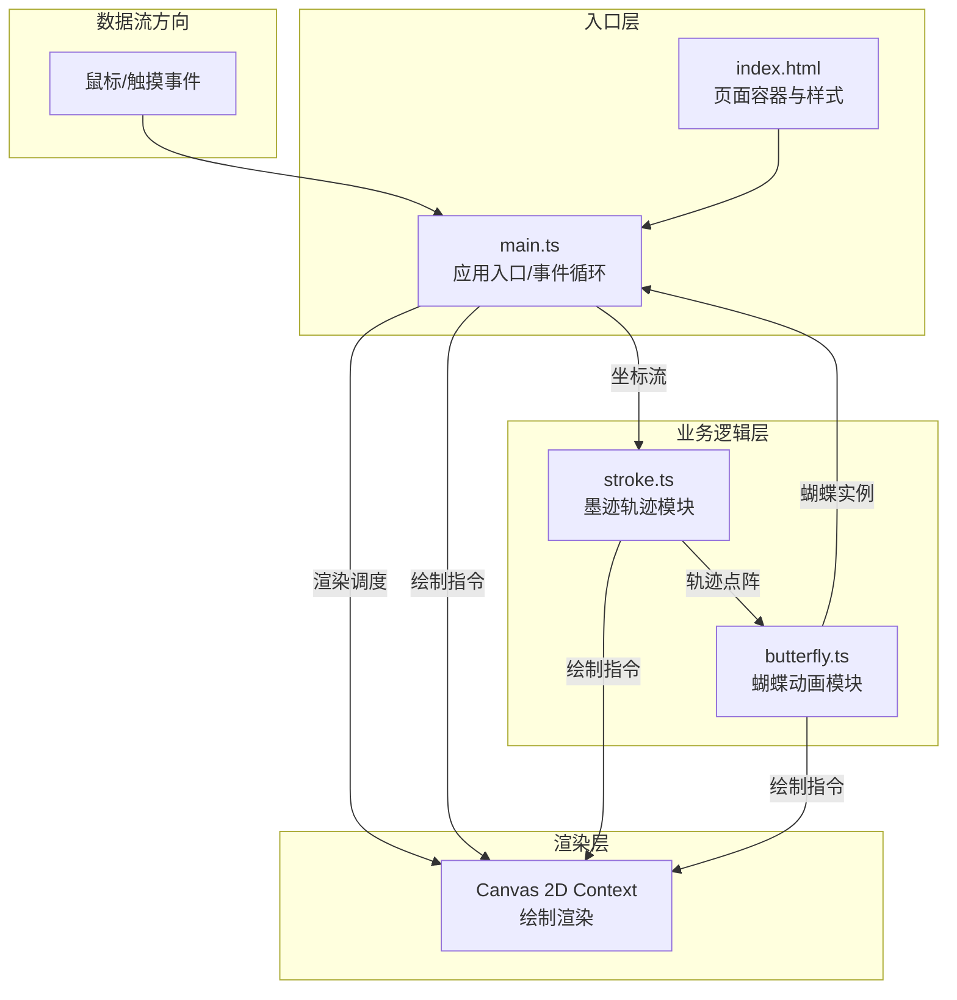

## 1. 架构设计

本项目为纯前端Canvas应用，采用模块化架构设计，按职责分离文件，通过主入口协调各模块通信。



## 2. 技术选型

- **前端框架**：原生TypeScript（不使用React/Vue，因需精细控制Canvas渲染循环）
- **构建工具**：Vite 5.x（支持HMR热更新、快速启动）
- **类型系统**：TypeScript 5.x（严格模式，目标ES2020）
- **渲染技术**：Canvas 2D API（高性能矢量绘制）
- **样式方案**：内联CSS + CSS变量（响应式适配）

### 依赖清单
```json
{
  "devDependencies": {
    "typescript": "^5.3.0",
    "vite": "^5.0.0"
  }
}
```

## 3. 文件结构与职责

| 文件路径 | 职责 | 对外接口 |
|---------|------|---------|
| `package.json` | 项目配置、依赖管理、启动脚本 | - |
| `vite.config.js` | Vite构建配置、HMR支持 | - |
| `tsconfig.json` | TypeScript编译配置（严格模式ES2020） | - |
| `index.html` | 入口页面、Canvas容器、背景样式、响应式CSS | - |
| `src/main.ts` | 应用入口、事件分发、渲染循环、统计管理 | 启动/停止、事件回调 |
| `src/stroke.ts` | 墨迹轨迹绘制、贝塞尔曲线、动态粗细、发光墨点 | `addPoint()`、`render()`、`getPoints()` |
| `src/butterfly.ts` | 蝴蝶实例管理、扇动动画、扩散效果、拖尾光晕 | `spawn()`、`update()`、`render()`、`getCount()` |

## 4. 模块接口定义

### 4.1 核心数据类型

```typescript
// 坐标点
interface Point {
  x: number;
  y: number;
  timestamp: number;
  velocity?: number;  // 速度 px/帧
  thickness?: number; // 计算得到的粗细
  color?: string;     // 计算得到的颜色
}

// 墨迹轨迹段
interface StrokeSegment {
  start: Point;
  control: Point;
  end: Point;
  thickness: number;
  color: string;
  alpha: number;
}

// 斑点
interface Spot {
  offsetX: number;  // 相对蝴蝶中心的X偏移
  offsetY: number;  // 相对蝴蝶中心的Y偏移
  color: string;    // 斑点颜色
  baseRadius: number; // 基础半径
  wing: 'left' | 'right'; // 所在翅膀
}

// 轨迹点历史（用于光晕延迟跟随）
interface TrailPoint {
  x: number;
  y: number;
  alpha: number;
}

// 蝴蝶实例
interface Butterfly {
  id: number;
  x: number;
  y: number;
  targetX: number;   // 扩散目标X
  targetY: number;   // 扩散目标Y
  size: number;      // 尺寸（px）
  wingColor: string; // 翅膀主色
  wingPatternColor: string; // 翅膀纹理色
  baseAlpha: number; // 当前基础透明度
  spawnTime: number; // 生成时间戳
  lifetime: number;  // 生命周期（ms）
  flapPeriod: number; // 扇动周期（s）
  flapPhase: number;  // 扇动相位
  spots: Spot[];      // 斑点列表
  trail: TrailPoint[]; // 拖尾光晕历史点
  isSpreading: boolean; // 是否为扩散蝴蝶
  spreadStartTime?: number; // 扩散开始时间
  spreadDuration: number;  // 扩散持续时间（ms）
}
```

### 4.2 Stroke 模块接口

```typescript
class StrokeManager {
  // 添加新坐标点，返回该点信息
  addPoint(x: number, y: number): Point;
  
  // 渲染所有轨迹到canvas
  render(ctx: CanvasRenderingContext2D): void;
  
  // 获取最近N个点（用于蝴蝶生成判断）
  getRecentPoints(count: number): Point[];
  
  // 清空所有轨迹
  clear(): void;
  
  // 结束当前绘制段，返回总长度
  endStroke(): number;
  
  // 获取累计轨迹总长度（像素）
  getTotalLength(): number;
  
  // 获取当前正在绘制的状态
  isDrawing(): boolean;
  
  // 获取轨迹末端发光墨点位置（null表示无活动墨点）
  getTipGlow(): { x: number; y: number; radius: number; alpha: number } | null;
  
  // 更新墨点淡出状态（停笔后调用）
  updateTipFade(deltaTime: number): void;
}
```

### 4.3 Butterfly 模块接口

```typescript
class ButterflyManager {
  // 生成新蝴蝶
  spawn(options: {
    x: number;
    y: number;
    strokeColor: string;  // 轨迹颜色，用于计算补色
    strokeVelocity: number; // 轨迹速度，用于尺寸调整
    isSpread?: boolean;  // 是否为扩散蝴蝶
    spreadTarget?: { x: number; y: number }; // 扩散目标
    spreadDuration?: number; // 扩散持续时间
  }): Butterfly;
  
  // 更新所有蝴蝶状态（位置、扇动、生命周期）
  update(deltaTime: number, currentTime: number): void;
  
  // 渲染所有蝴蝶到canvas
  render(ctx: CanvasRenderingContext2D): void;
  
  // 获取当前活跃蝴蝶数量
  getCount(): number;
  
  // 清空所有蝴蝶
  clear(): void;
}
```

### 4.4 Main 模块协调流程

```typescript
// 事件循环伪代码
function gameLoop(currentTime: number) {
  const deltaTime = currentTime - lastTime;
  lastTime = currentTime;
  
  // 1. 更新墨迹
  if (!isDrawing) {
    strokeManager.updateTipFade(deltaTime);
  }
  
  // 2. 更新蝴蝶
  butterflyManager.update(deltaTime, currentTime);
  
  // 3. 清空画布
  ctx.clearRect(0, 0, canvas.width, canvas.height);
  
  // 4. 渲染墨迹
  strokeManager.render(ctx);
  
  // 5. 渲染蝴蝶
  butterflyManager.render(ctx);
  
  // 6. 更新统计UI
  updateStats();
  
  requestAnimationFrame(gameLoop);
}
```

## 5. 数据流向详解

### 5.1 绘制事件流
```
用户鼠标/触摸
    ↓
main.ts 事件监听 (mousedown/touchstart)
    ↓ isDrawing = true
mousemove/touchmove（节流，≤120点/秒）
    ↓ 坐标(x, y)
strokeManager.addPoint(x, y)
    ├→ 内部计算：速度velocity = 距离/时间
    ├→ 内部计算：粗细thickness = 映射(速度, 1-12px)
    ├→ 内部计算：颜色color = 插值(#1A1A1A, #3D2B1F, 速度比例)
    └→ 存储Point到轨迹数组
        ↓
main.ts 定时检查最近5个点的velocity
    ↓ 均>3px/帧？
butterflyManager.spawn(起始点, 颜色, 速度)
    ↓
生成Butterfly实例加入数组
```

### 5.2 结束绘制流
```
mouseup/touchend
    ↓
main.ts: isDrawing = false
    ↓
strokeManager.endStroke() → 返回段长度，累加到总长度
    ↓
获取最后一个点 lastPoint
    ↓ 循环3-5次
生成随机角度angle、随机半径radius(30-80px)
计算targetX = lastPoint.x + cos(angle)*radius
计算targetY = lastPoint.y + sin(angle)*radius
    ↓
butterflyManager.spawn(
  x: lastPoint.x, y: lastPoint.y,
  isSpread: true,
  spreadTarget: {x: targetX, y: targetY},
  spreadDuration: 2000ms
)
```

### 5.3 渲染帧流
```
requestAnimationFrame
    ↓
main.ts 游戏循环
    ├→ strokeManager.render(ctx)
    │   └→ 遍历StrokeSegment
    │       ├→ 贝塞尔曲线: moveTo → quadraticCurveTo
    │       ├→ lineWidth = thickness
    │       ├→ strokeStyle = color with alpha
    │       └→ stroke()
    │   └→ 渲染末端墨点: arc() + fill(白色半透明)
    │
    └→ butterflyManager.render(ctx)
        └→ 遍历Butterfly实例
            ├→ 计算扇动角度: sin(t/period * 2π + phase) * 30°
            ├→ 绘制拖尾光晕（延迟0.15s的历史位置）
            ├→ 绘制左翼（旋转-wingAngle）
            │   ├→ 翅膀形状（椭圆路径）
            │   ├→ 翅膀纹理（颜色取反+HSV偏移）
            │   └→ 遍历斑点，绘制圆（缩放随扇动）
            ├→ 绘制右翼（旋转+wingAngle）
            │   └→ 同左翼
            └→ 绘制身体（中间竖线椭圆）
```

## 6. 性能优化策略

| 优化点 | 方案 |
|-------|------|
| 采样频率 | 坐标点节流，时间戳差<8ms(≈120fps)则丢弃 |
| 蝴蝶上限 | 数量≥60时，按spawnTime排序，删除最早的N只 |
| 背景渲染 | 印章和渐变背景预渲染到离屏Canvas，每帧直接drawImage |
| 轨迹渐隐 | 按段存储alpha值，而非逐帧重算衰减 |
| 蝴蝶扇动 | 正弦值查表优化，避免每帧Math.sin调用 |
| 渲染分层 | 墨迹层与蝴蝶层分开脏矩形检测（可选） |
| GC优化 | 对象池复用Point/Butterfly对象（蝴蝶数>40时启用） |
| 移动端 | 自动降低DPR采样（devicePixelRatio>1时取min(2, DPR)） |

## 7. 颜色计算算法

### 7.1 墨迹颜色渐变
```typescript
function getInkColor(velocityRatio: number): string {
  // velocityRatio: 0(最慢) → 1(最快)
  // 慢 → #1A1A1A (纯黑), 快 → #3D2B1F (深褐)
  const r = lerp(0x1A, 0x3D, velocityRatio);
  const g = lerp(0x1A, 0x2B, velocityRatio);
  const b = lerp(0x1A, 0x1F, velocityRatio);
  return `rgb(${r},${g},${b})`;
}
```

### 7.2 蝴蝶补色计算
```typescript
function getComplementaryColor(hex: string): string {
  // 解析RGB
  const {r, g, b} = hexToRgb(hex);
  // 补色 = 255 - 原色，但降低饱和度得到淡彩
  const cr = 255 - r;
  const cg = 255 - g;
  const cb = 255 - b;
  // 混合白色降低饱和度（约30%灰）
  const fr = Math.round(cr * 0.7 + 255 * 0.3);
  const fg = Math.round(cg * 0.7 + 255 * 0.3);
  const fb = Math.round(cb * 0.7 + 255 * 0.3);
  return `rgb(${fr},${fg},${fb})`;
}
```

### 7.3 粗细映射
```typescript
function getThickness(velocity: number): number {
  // velocity: 0~20+ px/帧
  // 慢速(≤1): 12px, 中速(5): 6px, 快速(≥10): 1px
  const clamped = Math.min(Math.max(velocity, 0), 10);
  const ratio = clamped / 10; // 0~1
  return 12 - ratio * 11; // 12 → 1
}
```
