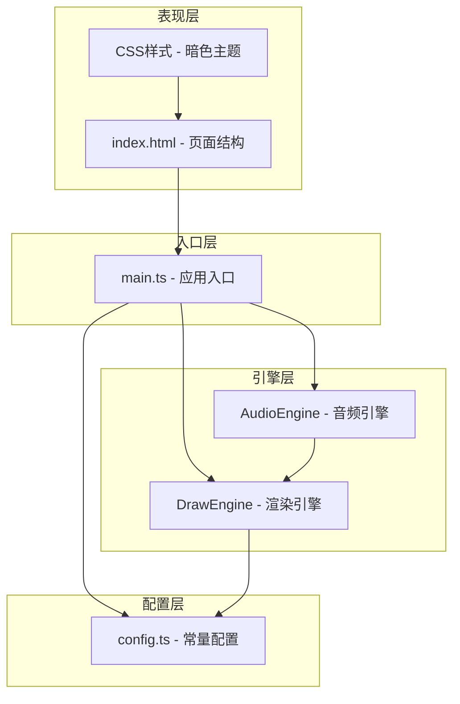
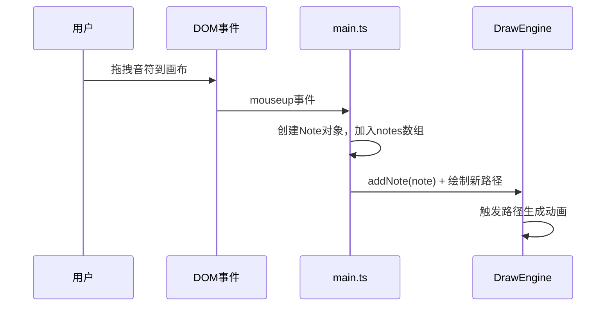
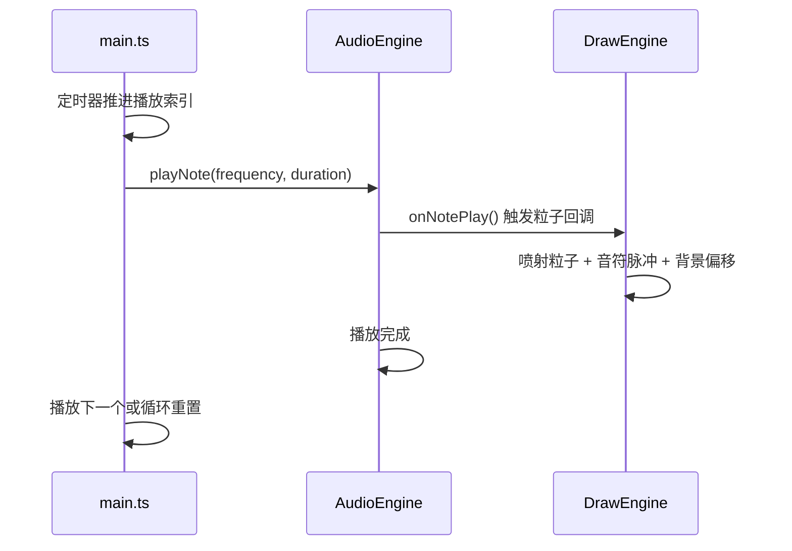

## 1. 架构设计

本项目为纯前端TypeScript + Canvas应用，采用分层架构设计，将音频、渲染、配置逻辑解耦。



## 2. 技术说明

- **前端框架**：无框架，原生TypeScript + HTML5 Canvas
- **构建工具**：Vite 5.x（支持HMR热更新）
- **语言标准**：TypeScript 5.x，严格模式，编译目标ES2020
- **音频技术**：Web Audio API（OscillatorNode + GainNode）
- **渲染技术**：HTML5 Canvas 2D Context
- **包管理器**：npm

## 3. 文件结构

```
auto51/
├── .trae/
│   └── documents/          # 文档目录
├── src/
│   ├── main.ts             # 应用入口：初始化、事件监听、游戏循环
│   ├── audio.ts            # AudioEngine：Web Audio API封装
│   ├── draw.ts             # DrawEngine：Canvas渲染、粒子系统
│   └── config.ts           # 配置常量：颜色、粒子参数、音高映射
├── index.html              # 入口页面：HTML结构 + 加载动画
├── vite.config.js          # Vite构建配置
├── tsconfig.json           # TypeScript配置
└── package.json            # 依赖管理
```

### 3.1 文件职责说明

| 文件 | 职责 | 关键输出 |
|------|------|----------|
| main.ts | 协调AudioEngine与DrawEngine，管理全局状态（音符列表、播放状态、速度），处理DOM事件，驱动requestAnimationFrame循环 | 游戏主循环、事件分发、状态同步 |
| audio.ts | 封装Web Audio API，管理AudioContext，创建振荡器播放指定频率，通过增益节点控制音量，播放时触发粒子回调 | 音符播放、音量控制、回调触发 |
| draw.ts | 负责所有Canvas绘制：背景渐变、音符块、路径轨迹、粒子系统更新与渲染；接受鼠标事件和音频回调更新状态 | 视觉渲染、粒子物理、动画帧更新 |
| config.ts | 集中管理所有常量：音符颜色映射、音高频率、粒子数量/大小/生命周期、路径宽度范围、动画帧率等 | 统一配置入口 |

## 4. 核心数据模型

### 4.1 类型定义

```typescript
// 音符颜色类型
type NoteColor = 'red' | 'blue' | 'green' | 'purple';

// 音符数据
interface Note {
  id: number;
  color: NoteColor;
  x: number;
  y: number;
  pulseProgress: number; // 0~1，脉冲动画进度
  isPlaying: boolean;
}

// 粒子数据
interface Particle {
  x: number;
  y: number;
  vx: number;
  vy: number;
  color: string;
  size: number;
  initialSize: number;
  life: number; // 0~1，剩余生命值
  decay: number;
}

// 路径数据
interface Path {
  fromId: number;
  toId: number;
  progress: number; // 0~1，绘制动画进度
}

// 游戏状态
interface GameState {
  notes: Note[];
  particles: Particle[];
  isPlaying: boolean;
  currentNoteIndex: number;
  playbackSpeed: number;
  fadeProgress: number; // 撤销淡出动画
  bgColorOffset: { r: number; g: number; b: number };
  nextNoteId: number;
}
```

## 5. 核心流程时序

### 5.1 音符放置流程



### 5.2 播放流程



## 6. 关键技术实现

### 6.1 音频引擎
- 使用`AudioContext`创建音频上下文（首次用户交互后初始化，兼容浏览器策略）
- `OscillatorNode`生成正弦波音调，频率从config读取
- `GainNode`控制音量包络（attack: 0.02s, release: 0.1s），避免爆音
- 每个音符播放时长与速度成反比

### 6.2 粒子系统
- 对象池模式管理粒子，避免频繁GC
- 粒子初始速度：随机方向，速度范围与播放速度正相关
- 生命周期：0.8秒基础值，与播放速度成反比
- 大小线性衰减：初始4px → 0
- 最大粒子数限制：1000个，超出时丢弃最早粒子

### 6.3 渲染循环
- `requestAnimationFrame`驱动，目标帧率60fps，保证30fps以上
- 每帧更新：粒子物理、音符脉冲、路径脉动、背景渐变
- 分层渲染：背景层 → 路径层 → 音符层 → 粒子层

### 6.4 响应式布局
- CSS Flex布局实现三栏结构
- 媒体查询`@media (max-width: 600px)`切换工具栏到顶部
- Canvas尺寸通过`ResizeObserver`监听容器变化并实时调整

## 7. 性能优化策略

| 优化点 | 方案 |
|--------|------|
| 粒子数量 | 上限1000，FIFO淘汰，对象池复用 |
| Canvas渲染 | 离屏Canvas缓存静态背景，减少重绘开销 |
| 音频播放 | 预创建AudioContext，避免重复初始化 |
| 事件处理 | 拖拽使用requestAnimationFrame节流 |
| 内存管理 | 及时移除已死亡粒子，避免数组无限增长 |
