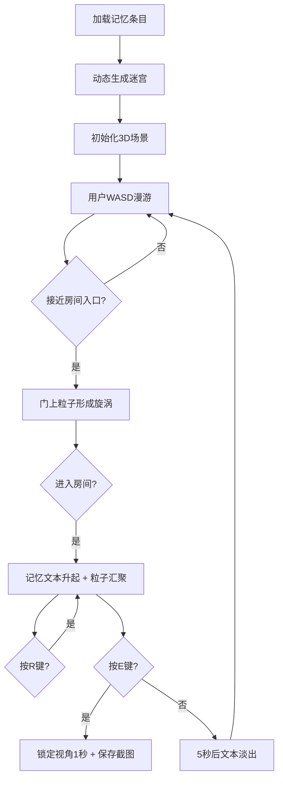

## 1. 产品概述

「记忆迷宫」是一款沉浸式3D记忆可视化应用，将人生重要记忆点转化为可探索的粒子迷宫，让用户以第一人称视角漫步于自己的记忆长河中。

- 核心价值：将抽象的记忆转化为具象的、可交互的3D空间体验，通过情绪色彩和粒子效果增强记忆的情感共鸣
- 目标用户：希望以创新方式记录和回顾人生重要时刻的用户

## 2. 核心功能

### 2.1 用户角色
| 角色 | 注册方式 | 核心权限 |
|------|----------|----------|
| 普通用户 | 无需注册 | 漫步迷宫、查看记忆、保存截图 |

### 2.2 功能模块
1. **迷宫漫游系统**：WASD键盘控制第一人称行走，碰撞检测，视角旋转
2. **迷宫动态生成**：根据6-8个记忆条目递归生成唯一迷宫地图
3. **粒子墙壁系统**：情绪色粒子云墙壁，布朗运动，接近凸起效果
4. **记忆房间交互**：3D文本动画，粒子汇聚效果，呼吸脉动，R键重播
5. **截图保存功能**：E键锁定视角1秒后保存带水印的3D截图

### 2.3 页面详情
| 页面名称 | 模块名称 | 功能描述 |
|----------|----------|----------|
| 主场景 | 迷宫漫游 | 3D迷宫场景渲染，第一人称控制，粒子效果 |
| 主场景 | 记忆房间 | 进入房间触发记忆动画，3D文本显示 |
| 主场景 | 交互系统 | 截图保存，动画重播，控制提示 |

## 3. 核心流程

用户进入应用后，系统根据预设的记忆条目动态生成迷宫。用户通过WASD在迷宫中行走，走到房间入口时门上粒子形成旋涡。进入房间后，记忆文本从地板升起，粒子向文本汇聚。用户可按R键重播动画，按E键保存当前视角的截图。

## 4. 用户界面设计

### 4.1 设计风格
- **主色调**：深空背景 #0B0B1A，霓虹蓝文本 #00E5FF
- **情绪色彩**：快乐暖黄、悲伤冰蓝、愤怒猩红、平静薄荷、焦虑紫灰（饱和度60%，明度80%+）
- **视觉风格**：赛博朋克风，低饱和高对比，粒子发光效果，磨砂玻璃地面
- **字体**：发光霓虹效果，3D立体文本
- **图标**：简洁控制图标覆盖右下角（WASD移动、E截图、R重播）

### 4.2 页面设计概述
| 页面名称 | 模块名称 | UI元素 |
|----------|----------|--------|
| 主场景 | 迷宫环境 | 半透明磨砂玻璃地面，暗色粒子流动层，深空背景 |
| 主场景 | 粒子墙壁 | 情绪色渐变粒子云，布朗运动，接近凸起效果 |
| 主场景 | 记忆房间 | 3D发光文本，粒子汇聚光晕，呼吸脉动效果 |
| 主场景 | 走廊指引 | 漂浮指南针光点，转角指引方向 |
| 主场景 | 控制提示 | 右下角图标组，平滑过渡动画 |

### 4.3 响应式
- 桌面端优先，自适应窗口大小
- 键盘控制为主，不支持移动端触摸操作

### 4.4 3D场景指引
- **环境**：深空背景 #0B0B1A，无HDRI，自发光粒子作为主要光源
- **光照**：环境光 + 粒子自发光，无需额外光源
- **相机**：第一人称透视相机，FOV 75，位置高度1.6单位
- **运动**：WASD平移，鼠标视角旋转，移动速度3单位/秒
- **后期处理**：轻微泛光效果，增强霓虹发光感
- **性能预算**：粒子总数≤4万，目标FPS≥30（集成显卡）
