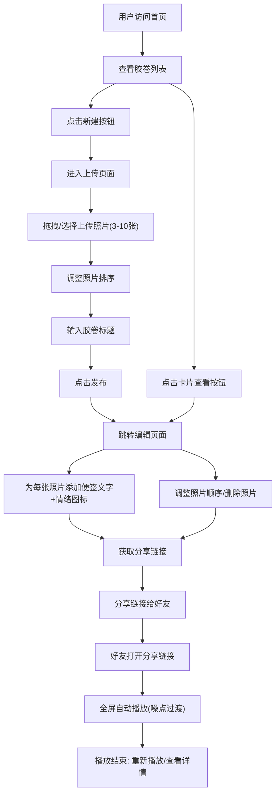

## 1. 产品概述

「胶卷回忆录」是一款帮助用户在浏览器中创建并分享复古胶卷风格回忆录的全栈Web应用。它解决数字照片缺乏沉浸式分享体验和情感叙事的问题——用户上传一组照片（3-10张），系统将它们排列成一卷可横向滚动的复古胶卷，每张照片附带半透明「便签」叠印在角落，用户可以在便签上书写回忆文字并选择情绪图标，整卷胶卷可以导出为可分享的链接，其他用户打开链接后胶卷会像老式幻灯机一样自动逐张播放，带有仿旧噪点过渡和轻微的镜头呼吸感。

- 目标用户：希望以沉浸式、情感化方式分享照片回忆的普通用户
- 核心价值：将数字照片转化为具有胶片质感、叙事节奏和情感温度的分享体验

## 2. 核心功能

### 2.1 用户角色
| 角色 | 注册方式 | 核心权限 |
|------|----------|----------|
| 创建者 | 无需注册 | 上传照片、编辑便签、发布胶卷、获取分享链接 |
| 观赏者 | 无需注册 | 通过分享链接观看胶卷自动播放、手动切换照片 |

### 2.2 功能模块
1. **首页（胶卷列表）**：展示用户创建的胶卷列表，按时间倒序排列，每卷展示缩略封面、标题、照片数量，支持点击进入编辑或分享
2. **上传页面**：拖拽/点击上传照片（3-10张），照片排序、标题输入、发布
3. **编辑页面**：暗室预览胶卷，左右切换照片，编辑便签文字与情绪图标，删除照片，调整顺序，全屏浏览
4. **分享播放页面**：全屏自动播放，仿旧噪点过渡，暂停/继续，手动切换，进度条，播放结束画面

### 2.3 页面详情
| 页面 | 模块 | 功能描述 |
|------|------|----------|
| 首页 | 导航栏 | 毛玻璃效果导航，应用标题"胶卷回忆录"渐变金色字，右侧圆形新建按钮带涟漪动画 |
| 首页 | 胶卷卡片列表 | 缩略封面60%+标题+照片数量，悬浮上浮4px+阴影加深+缩略图放大1.03+蒙层+查看按钮，渐入动画 |
| 首页 | 响应式适配 | <768px卡片单列，宽度100%-40px margins |
| 上传页面 | 虚线拖拽区 | 拖入时实线+亮金色+淡金背景，缩略图水平滚动容器，删除叉号，拖拽排序 |
| 上传页面 | 标题输入 | 圆角输入框，占位符"给这卷胶卷取个名字..." |
| 上传页面 | 发布按钮 | 渐变金色，点击缩放+loading旋转+绿色已保存状态 |
| 编辑页面 | 暗室预览区 | 80vw/1000px宽，70vh高，黑色背景模拟暗室，照片自适应+便签叠右下角 |
| 编辑页面 | 便签编辑 | 模态框输入文字(200字)+实时字符计数，保存后淡入更新，情绪图标选择 |
| 编辑页面 | 照片切换 | 左右箭头+键盘方向键，水平偏移+缩放切换动画 |
| 编辑页面 | 浮动工具栏 | 毛玻璃效果，编辑便签/删除照片/调整顺序 |
| 编辑页面 | 全屏模式 | 双击进入/退出，弹性动画0.4s |
| 分享页面 | 自动播放 | 全屏，5秒/张，仿旧噪点过渡(0.4s)，鼠标悬停暂停+进度条 |
| 分享页面 | 手动切换 | 点击左/右半屏切换，噪点过渡 |
| 分享页面 | 导航圆点 | 底部圆点指示位置，当前白色放大动画 |
| 分享页面 | 播放结束 | "本卷完"浮现+重新播放/查看详情按钮 |

## 3. 核心流程

用户打开应用 → 首页查看胶卷列表 → 点击"新建"进入上传页 → 拖拽上传3-10张照片 → 调整排序 → 输入标题 → 点击发布 → 跳转编辑页面 → 为每张照片添加便签文字和情绪图标 → 获取分享链接 → 分享给好友 → 好友打开链接 → 全屏自动播放胶卷 → 播放结束可重新播放或查看详情

## 4. 用户界面设计

### 4.1 设计风格
- **主色调**：复古暖调——棕(#B8860B)、米(#F5F0E8)、金灰(#D4AF37)，辅以白色、黑色(#000)、浅灰(#8A8A8A)
- **按钮风格**：圆角(6-25px)、渐变金色背景、柔和投影
- **字体**：标题字重700/28px渐变金色，正文细体深灰#2C2C2C/20px，辅助浅灰#8A8A8A/14px
- **布局**：卡片居中排列(最大1200px)、毛玻璃导航栏、暗室预览
- **图标**：情绪图标(❤️✨🌙☀️🍂等)、箭头、云朵上传、加号新建
- **动画**：卡片渐入(0.15s间隔)、悬浮上浮4px、噪点过渡(0.4s)、弹性缩放、涟漪扩散、拖拽排序

### 4.2 页面设计概览
| 页面 | 模块 | UI元素 |
|------|------|--------|
| 首页 | 背景 | 灰白到浅米(#EAE5DD→#F5F0E8)竖纹亚麻质感渐变 |
| 首页 | 导航栏 | 毛玻璃#FFFFFF80/模糊16px，标题渐变#B8860B→#8B6914，新建按钮直径48px渐变+涟漪 |
| 首页 | 卡片 | 宽280px高200px圆角12px投影#00000015，缩略图60%，hover上浮4px+阴影#00000030+放大1.03+蒙层#00000080+查看按钮 |
| 上传页面 | 拖拽区 | 500×300px虚线#B8860B/2px/圆角16px/背景#FDFBF7，云朵图标48px |
| 上传页面 | 缩略图容器 | 120×120px圆角8px间距12px，左右半圆滚动按钮 |
| 上传页面 | 标题输入 | 圆角8px边框#C9B99A/1px高48px占位#BFA98A |
| 上传页面 | 发布按钮 | 180×50px圆角25px渐变#B8860B→#D4AF37白色22px/600 |
| 编辑页面 | 预览区 | 80vw/1000px×70vh黑色#000暗室 |
| 编辑页面 | 便签 | 半透明白#FFFFFFCC圆角12px padding12px，文字#333/16px，情绪图标24px |
| 编辑页面 | 切换箭头 | 半透明圆形40px#FFFFFF30，hover#FFFFFF80 |
| 编辑页面 | 工具栏 | 毛玻璃#FFFFFF80/模糊8px圆角20px |
| 分享页面 | 播放器 | 全屏黑色，噪点过渡1-3px随机像素/密度30% |
| 分享页面 | 进度条 | 半透明白色4px圆角2px |
| 分享页面 | 导航圆点 | 黑点/当前白点缩放1→1.2→1/0.3s |
| 分享页面 | 结束画面 | "本卷完"白色32px/细体/0.7透明度上移20px/1s |

### 4.3 响应式
- 桌面优先设计，最大内容宽度1200px居中
- 窗口宽度<768px时卡片改为单列，宽度100%-40px margins
- 预览区80vw自适应，最大1000px
- 分享播放页全屏适配

### 4.4 性能要求
- 自动播放每帧不超过18ms（约55fps）
- 拖拽和滚动响应延迟<50ms
- 所有动画使用requestAnimationFrame或硬件加速CSS属性(transform, opacity)
- 图片预处理为640px宽jpeg质量80%
