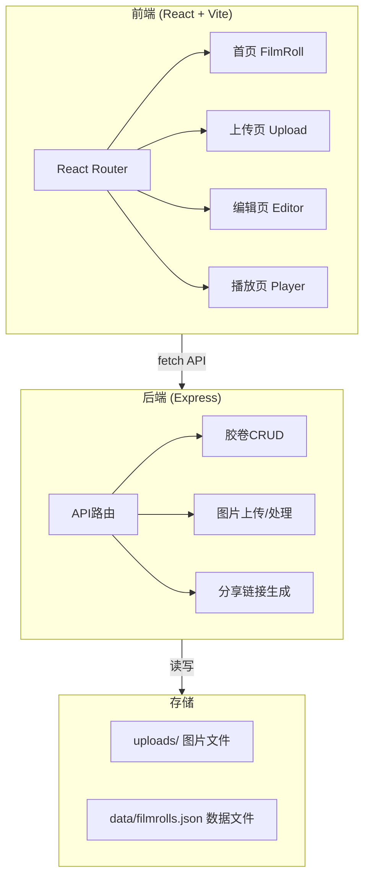
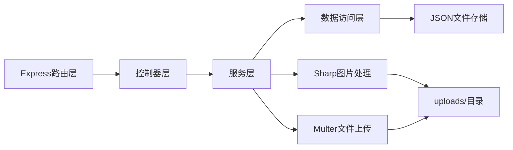
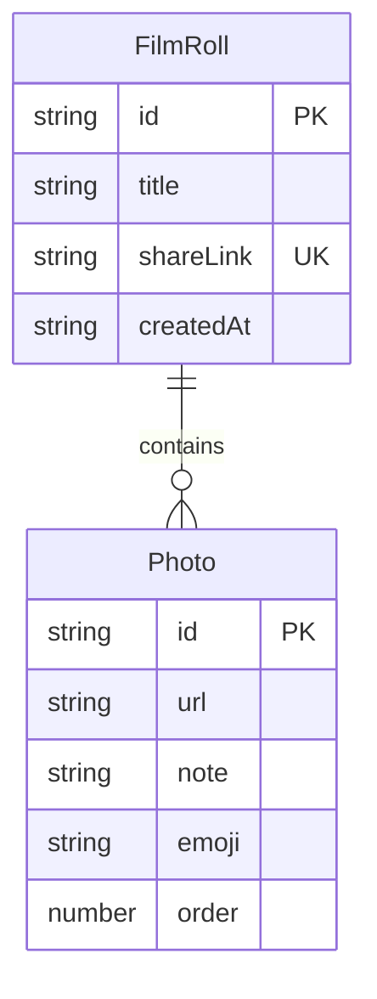

## 1. 架构设计



## 2. 技术说明

- **前端**：React@18 + TypeScript + Vite + Tailwind CSS + React Router DOM + Zustand
- **初始化工具**：vite-init (react-express-ts 模板)
- **后端**：Express@4 + TypeScript + multer(文件上传) + sharp(图片处理) + uuid(唯一ID)
- **数据库**：JSON文件存储（data/filmrolls.json），无需外部数据库
- **图片处理**：sharp库预处理为640px宽jpeg质量80%

## 3. 路由定义

| 路由 | 用途 |
|------|------|
| `/` | 首页，展示胶卷列表 |
| `/create` | 上传页面，创建新胶卷 |
| `/edit/:id` | 编辑页面，编辑胶卷便签和排序 |
| `/share/:link` | 分享播放页面，全屏自动播放 |

## 4. API定义

### 4.1 TypeScript类型定义

```typescript
interface Photo {
  id: string;
  url: string;
  note: string;
  emoji: string;
  order: number;
}

interface FilmRoll {
  id: string;
  title: string;
  shareLink: string;
  photos: Photo[];
  createdAt: string;
}
```

### 4.2 API端点

| 方法 | 路径 | 请求体 | 响应 | 说明 |
|------|------|--------|------|------|
| GET | `/api/filmrolls` | - | `FilmRoll[]` | 获取所有胶卷列表 |
| GET | `/api/filmrolls/:id` | - | `FilmRoll` | 获取单个胶卷详情 |
| GET | `/api/filmrolls/share/:link` | - | `FilmRoll` | 通过分享链接获取胶卷 |
| POST | `/api/filmrolls` | `{ title: string }` | `FilmRoll` | 创建新胶卷 |
| POST | `/api/filmrolls/:id/photos` | FormData (photos) | `Photo[]` | 上传照片到胶卷 |
| PUT | `/api/filmrolls/:id` | `Partial<FilmRoll>` | `FilmRoll` | 更新胶卷（便签、排序等） |
| DELETE | `/api/filmrolls/:id/photos/:photoId` | - | `{ success: boolean }` | 删除胶卷中的照片 |

## 5. 服务端架构



## 6. 数据模型

### 6.1 数据模型定义



### 6.2 数据存储

使用JSON文件 `data/filmrolls.json` 存储所有胶卷数据，结构如下：

```json
{
  "filmrolls": [
    {
      "id": "uuid-string",
      "title": "胶卷标题",
      "shareLink": "uuid-string",
      "photos": [
        {
          "id": "uuid-string",
          "url": "/uploads/filename.jpg",
          "note": "便签文字",
          "emoji": "❤️",
          "order": 0
        }
      ],
      "createdAt": "2026-06-11T00:00:00.000Z"
    }
  ]
}
```

图片文件存储在 `uploads/` 目录，文件名使用uuid避免冲突。
