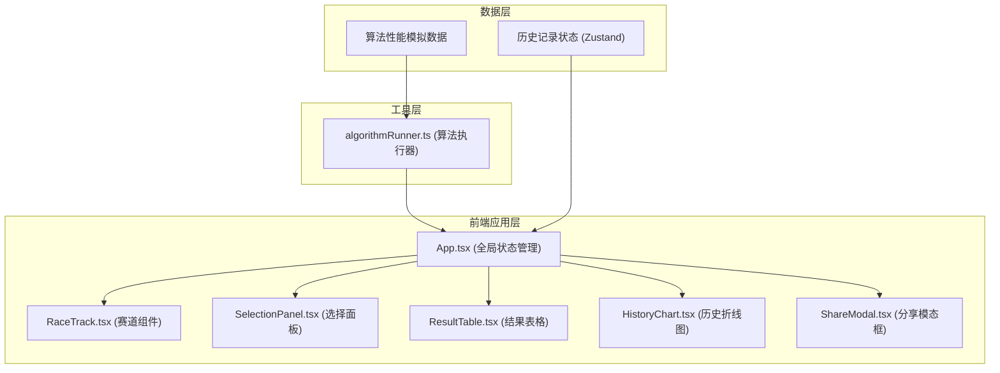
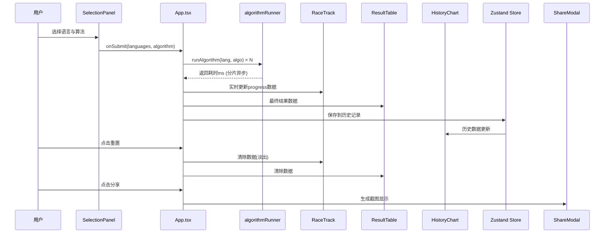

## 1. 架构设计



## 2. 技术描述

- **前端框架**：React 18 + TypeScript
- **构建工具**：Vite 5 + @vitejs/plugin-react
- **状态管理**：Zustand（轻量级状态）
- **样式方案**：原生CSS + CSS变量（Tailwind不强制使用，自定义暗色科技主题）
- **动画方案**：CSS动画/过渡 + requestAnimationFrame分片执行
- **图表实现**：原生Canvas API绘制历史折线图（避免引入重型图表库）
- **图片生成**：html2canvas或原生Canvas截图生成Base64

## 3. 项目文件结构

| 文件路径 | 职责 | 调用关系 |
|----------|------|----------|
| package.json | 项目依赖与脚本配置 | 构建入口 |
| vite.config.js | Vite构建配置（HMR支持） | 构建入口 |
| tsconfig.json | TypeScript严格模式配置（ES2020） | 类型检查 |
| index.html | 入口HTML（暗色背景+加载提示） | 加载入口 |
| src/main.tsx | React应用入口，挂载根节点 | 渲染入口 |
| src/components/App.tsx | 主应用组件，全局状态管理，数据流向控制 | 调用算法执行器，向子组件传递数据 |
| src/components/RaceTrack.tsx | 赛道组件，渲染动态进度柱与FPS标记 | 接收算法名称与进度数据props |
| src/components/SelectionPanel.tsx | 算法选择面板，多选语言+单选算法 | 向App传递选择结果 |
| src/components/ResultTable.tsx | 结果排名表格，奖牌色染色 | 接收执行结果数据 |
| src/components/HistoryChart.tsx | 历史记录Canvas折线图 | 接收历史数据数组 |
| src/components/ShareModal.tsx | 分享快照模态框 | 展示Base64图片 |
| src/utils/algorithmRunner.ts | 算法执行工具，模拟耗时计算 | 纯函数模块，返回执行时间ms |
| src/store/useRaceStore.ts | Zustand全局状态存储 | 历史记录与当前状态管理 |
| src/styles/globals.css | 全局样式与CSS变量 | 主题定义与动画关键帧 |

## 4. 数据流向



## 5. 类型定义

```typescript
// 编程语言类型
type ProgrammingLanguage = 'JavaScript' | 'Python' | 'C++' | 'Go';

// 算法场景类型
type AlgorithmType = 'bubbleSort' | 'binarySearch' | 'fibonacciRecursive';

// 单条赛道状态
interface RaceItem {
  language: ProgrammingLanguage;
  progress: number;        // 0-100
  status: 'idle' | 'running' | 'finished';
  elapsedMs: number;
  fps: number;
}

// 算法执行结果
interface AlgorithmResult {
  language: ProgrammingLanguage;
  elapsedMs: number;
  rank: number;
  gapPercent: number;      // 与最快的差距百分比
}

// 历史记录条目
interface HistoryEntry {
  id: string;
  timestamp: number;
  algorithm: AlgorithmType;
  results: Omit<AlgorithmResult, 'rank' | 'gapPercent'>[];
}
```

## 6. 性能优化策略

1. **算法执行分片**：使用requestAnimationFrame将模拟计算切分为多个帧，单帧不超过16ms
2. **动画GPU加速**：进度柱动画使用transform: scaleX()而非width，触发硬件加速
3. **Canvas高效渲染**：历史折线图使用原生Canvas，脏矩形重绘减少绘制开销
4. **状态最小化更新**：Zustand选择器避免不必要的重渲染
5. **CSS变量主题**：颜色与动画参数集中管理，减少重排重绘
