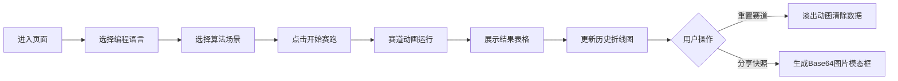

## 1. 产品概述

「算法赛跑」是一个面向在线教育场景的代码性能可视化对比工具，通过赛道动画的方式直观展示不同编程语言在各类算法下的执行效率差异，让抽象的时间复杂度概念变得具象可感。

- 目标用户：计算机科学讲师、编程学习者、算法爱好者
- 核心价值：将枯燥的性能数据转化为生动的竞赛动画，提升教学趣味性和学习记忆点

## 2. 核心功能

### 2.1 用户角色

| 角色 | 注册方式 | 核心权限 |
|------|----------|----------|
| 访客用户 | 无需注册 | 进行算法对比、查看历史记录、生成分享图片 |

### 2.2 功能模块

1. **算法选择面板**：编程语言多选（2-4种）、算法场景单选、开始赛跑按钮
2. **实时赛道动画**：4条水平赛道、渐变色进度柱、实时状态显示、FPS帧率标记
3. **结果数据面板**：对比表格、耗时数据、差距百分比、排名奖牌染色
4. **历史记录折线图**：最近5次对比记录、各语言性能趋势、悬停数据点提示
5. **操作功能区**：重置赛道（带淡出动画）、分享快照（生成Base64图片）

### 2.3 页面详情

| 页面名称 | 模块名称 | 功能描述 |
|----------|----------|----------|
| 主页面 | 算法选择面板 | 下拉多选编程语言、单选算法场景、带弹性反馈动画的开始按钮 |
| 主页面 | 实时赛道动画 | 水平渐变色进度柱（#1A1A40→#00FF88）、状态文字显示、FPS标记、发光分隔线 |
| 主页面 | 结果数据面板 | 排名表格、奖牌色背景（金#FFD700/银#C0C0C0/铜#CD7F32）、差距百分比 |
| 主页面 | 历史记录折线图 | 虚线折线、最近5次记录、悬停数据标签 |
| 主页面 | 操作按钮区 | 重置按钮（淡出0.5s）、分享快照（模态框展示Base64图片） |

## 3. 核心流程

用户进入页面 → 选择2-4种编程语言 → 选择1种算法场景 → 点击「开始赛跑」→ 赛道进度柱平滑增长（1-3秒缓出动画）→ 实时显示运行状态与FPS → 完成后展示排名表格与差距百分比 → 数据自动记入历史折线图 → 用户可重置赛道或生成分享快照

## 4. 用户界面设计

### 4.1 设计风格

- **主色调**：暗色科技主题，背景#0B0C10，主色#66FCF1，强调色#45A29E
- **赛道渐变**：深蓝#1A1A40 → 荧光绿#00FF88
- **奖牌色系**：金牌#FFD700、银牌#C0C0C0、铜牌#CD7F32
- **按钮风格**：圆角矩形、涟漪扩散动画（0.6秒）、按下弹性反馈（缩放0.95→1.0，0.2秒）
- **字体**：等宽代码字体用于数据展示，现代无衬线字体用于标题
- **布局**：上下布局，顶部毛玻璃选择面板（blur(10px)），中部赛道区两侧留白，底部历史图与操作区
- **特殊效果**：赛道间发光分隔线、毛玻璃背景、渐变进度柱

### 4.2 页面设计概览

| 页面名称 | 模块名称 | UI元素 |
|----------|----------|--------|
| 主页面 | 选择面板 | 半透明浅灰毛玻璃背景、blur(10px)、下拉菜单、弹性按钮 |
| 主页面 | 赛道区域 | 水平赛道、渐变色柱、FPS标签、发光分隔线、状态文字 |
| 主页面 | 结果面板 | 排名表格、奖牌色行背景、百分比差距标签 |
| 主页面 | 历史折线图 | 虚线、数据点、悬停Tooltip、颜色与赛道对应 |
| 主页面 | 操作按钮 | 涟漪动画、淡出效果、模态框分享图片 |

### 4.3 响应式

- 桌面端优先，最小宽度1024px
- 赛道区域固定宽度居中展示，两侧自适应留白
- 表格与折线图在可用宽度内自适应布局

### 4.4 动画帧率

- 所有动画目标60fps流畅运行
- 最低保证55fps渲染帧率
- 算法执行通过requestAnimationFrame分片，避免阻塞UI超过16ms
