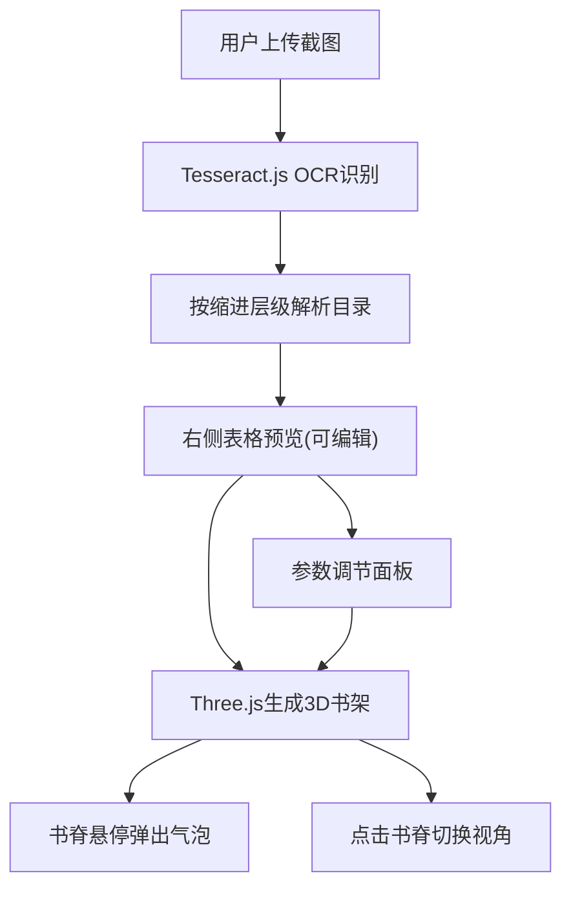

## 1. 产品概述
目录书阁是一款将静态文本目录截图转换为沉浸式3D虚拟书架的Web应用，解决传统目录清单缺乏空间感和视觉层次的问题。用户上传图书目录或章节列表截图后，系统通过OCR智能识别文字层级，自动生成可交互的3D立体书架，让目录浏览变得生动有趣。

## 2. 核心功能

### 2.1 用户角色
| 角色 | 注册方式 | 核心权限 |
|------|----------|----------|
| 普通用户 | 无需注册，直接使用 | 上传截图、OCR识别、3D书架浏览、参数调节 |

### 2.2 功能模块
1. **主页面**：导航栏、3D书架画布区、OCR结果预览与参数控制面板、文件上传入口
2. **OCR识别模块**：截图上传、Tesseract.js文字识别、层级解析、结果预览与编辑
3. **3D书架模块**：书架生成、书脊渲染、悬停交互、点击视角切换、动画效果
4. **参数控制模块**：书架层数调节、书脊间距调节、背景颜色切换

### 2.3 页面详情
| 页面名称 | 模块名称 | 功能描述 |
|----------|----------|----------|
| 主页面 | 导航栏 | 左侧显示应用名称"目录书阁"，右侧重新上传按钮 |
| 主页面 | 上传区域 | 点击/拖拽上传PNG/JPG截图，显示加载进度 |
| 主页面 | 3D书架画布 | Three.js渲染的5层虚拟书架，支持书脊悬停弹出和点击视角切换 |
| 主页面 | OCR预览表格 | 右侧实时显示识别结果，支持手动编辑修正，点击行定位书脊 |
| 主页面 | 参数控制面板 | 书架层数滑块(3-7)、书脊间距滑块(4-12)、背景色切换(深木纹/纯黑/深蓝) |

## 3. 核心流程
用户拖拽或点击上传目录截图 → 系统调用Tesseract.js进行OCR识别 → 按缩进层级解析出章节标题和页码 → 右侧表格展示解析结果(可编辑) → Three.js生成3D书架并渲染书脊 → 用户悬停书脊查看缩略摘要气泡 → 用户点击书脊切换视角至正面 → 用户调节参数实时更新书架展示

## 4. 用户界面设计

### 4.1 设计风格
- **主色调**：深灰色背景(#1A1A2E) + 深木纹渐变书架(#3E2723→#5D4037)
- **层级色阶**：一级暖橙(#FF8C00)、二级亮黄(#FFD700)、三级淡绿(#90EE90)
- **文字颜色**：书脊标题白色加粗(#FFFFFF)，页码亮黄(#FFD700)
- **按钮风格**：圆角8px，细边框1px solid #555，半透明磨砂玻璃效果
- **字体**：系统无衬线字体，标题24px加粗，正文12-14px
- **布局风格**：左右两栏(60%/40%)，顶部导航栏，卡片式面板
- **光影效果**：顶部暖色氛围灯(#FFA500点光源)、底部柔和背光(#8B4513)、发光粒子飘落、自然呼吸脉动

### 4.2 页面设计概述
| 页面名称 | 模块名称 | UI元素 |
|----------|----------|--------|
| 主页面 | 导航栏 | 深灰背景，左侧白色24px加粗标题，右侧圆角按钮 |
| 主页面 | 上传区 | 虚线边框拖拽区，居中上传图标和提示文字 |
| 主页面 | 3D画布 | 居中展示，宽600-1200px自适应，Canvas元素 |
| 主页面 | OCR表格 | 斑马纹行，可编辑单元格，点击行高亮 |
| 主页面 | 参数面板 | 滑块控件带数值显示，单选按钮组切换背景 |
| 主页面 | 悬停气泡 | 毛玻璃blur(4px)效果，动态模糊缩略图，箭头指向书脊 |

### 4.3 响应式设计
桌面端优先设计，左右两栏布局。最小支持宽度1200px，低于此宽度提示用户使用更大屏幕。3D画布最小宽度600px。

### 4.4 3D场景设计
- **环境氛围**：老图书馆风格深木纹色渐变背景，暖色灯光营造复古氛围
- **光照设置**：顶部点光源(#FFA500，强度0.3，书架上方45度位置) + 底部背光(#8B4513，强度0.2) + 环境光
- **相机设置**：PerspectiveCamera，初始视角俯视书架45度，点击书脊时平滑过渡到正面视角(距离50单位)
- **书架构成**：5层木质隔板，每层均匀排列书脊，书脊厚度按层级(20/12/6单位)，高度80单位，间距8单位
- **交互动画**：悬停书脊Z轴弹出15单位(0.3s ease-out)，视角切换0.8s ease-in-out，书架Z轴呼吸脉动0.5px(周期6s)
- **特殊效果**：书脊边缘发光(悬停时)、悬浮气泡动态模糊缩略图、顶部发光粒子缓慢飘落、自然呼吸脉动
- **性能预算**：帧率稳定30FPS以上，书架构建时间<2秒，OCR识别<5秒(2000x2000以下)
