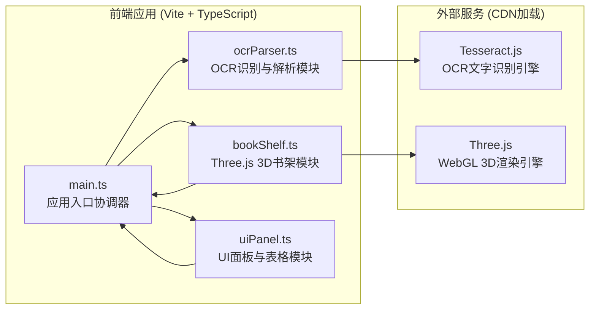

## 1. 架构设计



## 2. 技术说明
- **前端框架**：原生 TypeScript + 模块化架构，无额外UI框架依赖，保持轻量
- **构建工具**：Vite@5 (ESM模块，HMR热更新，极速构建)
- **3D渲染**：Three.js@0.160 + @types/three，原生WebGL渲染
- **OCR引擎**：Tesseract.js@5 (纯JS实现，CDN方式加载，支持中英文)
- **样式方案**：原生CSS3 + CSS变量，无CSS框架依赖，毛玻璃效果使用backdrop-filter
- **动画方案**：Three.js内置缓动函数 + CSS3 transition/animation，无额外动画库

## 3. 模块划分与文件结构

| 文件路径 | 模块职责 | 核心能力 |
|----------|----------|----------|
| package.json | 项目配置 | 依赖管理、启动脚本 |
| vite.config.js | 构建配置 | Vite开发服务器、HMR、路径别名 |
| tsconfig.json | 类型配置 | 严格模式、ES2020目标、模块解析 |
| index.html | 入口页面 | DOM结构、进度条、Canvas容器、面板容器 |
| src/main.ts | 应用入口 | Three.js场景初始化、模块协调、事件绑定、生命周期管理 |
| src/ocrParser.ts | OCR模块 | Tesseract.js调用、文字层级解析、结构化数据输出、进度回调 |
| src/bookShelf.ts | 3D书架模块 | 场景/相机/光源管理、书架生成、书脊Mesh创建、射线检测、悬停/点击交互、视角动画、粒子系统、呼吸脉动 |
| src/uiPanel.ts | UI面板模块 | OCR结果表格渲染、参数面板控件、数据双向绑定、书脊定位通信 |

## 4. 核心数据类型定义

```typescript
// 目录条目数据结构
interface CatalogItem {
  id: string;
  level: 1 | 2 | 3;          // 层级
  title: string;             // 章节标题
  page: string;              // 页码
  indent: number;            // 原始缩进空格数
  bbox?: {                   // OCR识别的边界框(用于截取缩略图)
    x0: number; y0: number; x1: number; y1: number;
  };
  shelfIndex?: number;       // 书架层索引
  positionOnShelf?: number;  // 在书架上的位置
}

// 书架配置参数
interface ShelfConfig {
  layers: number;            // 层数 3-7
  bookGap: number;           // 书脊间距 4-12
  background: 'wood' | 'black' | 'navy';  // 背景主题
}

// OCR识别进度
interface OCRProgress {
  status: 'loading' | 'recognizing' | 'parsing' | 'done' | 'error';
  progress: number;          // 0-100
  message?: string;
}

// 书脊3D数据
interface BookSpine3D {
  mesh: THREE.Mesh;          // 书脊网格
  item: CatalogItem;         // 关联目录数据
  originalZ: number;         // 原始Z位置
  isHovered: boolean;        // 悬停状态
  isSelected: boolean;       // 选中状态
}
```

## 5. 核心算法与实现要点

### 5.1 OCR文字层级解析算法
1. Tesseract.js识别输出含bbox坐标的文字行
2. 按y坐标排序行 → 计算每行的起始x坐标偏移 → 换算为缩进空格数
3. 规则映射：缩进0-2空格=一级，3-5空格=二级，6+空格=三级
4. 正则提取行尾数字作为页码，剩余文本作为标题

### 5.2 3D书架布局算法
1. 总条目数按层数均匀分配，计算每层条目数
2. 每层书脊总宽度 = Σ(厚度) + Σ(间距)，居中对齐在层板上
3. 每层Y坐标 = 底部起始Y + 层索引 × (书脊高度80 + 层板厚度10)
4. 书脊Z坐标按层级微偏移，一级略靠前，营造层次

### 5.3 书脊文字Canvas贴图
1. 动态创建离屏Canvas，尺寸匹配书脊正面比例(高80×厚度)
2. 使用measureText计算字体大小，标题自动缩放至不溢出宽度
3. 左上角绘制黄色页码小字，中央绘制白色加粗标题
4. Canvas转为Three.js Texture，应用于MeshStandardMaterial

### 5.4 射线拾取与交互
1. THREE.Raycaster每帧检测鼠标与书脊Mesh的交集
2. 悬停：将书脊Z += 15(0.3s ease-out tween)，边缘发光材质启用
3. 点击：计算目标相机位置(书脊正面，距离50单位)，使用球面线性插值0.8s过渡
4. 气泡：CSS 2D overlay，将3D坐标project为屏幕2D坐标定位

### 5.5 动画系统
1. 呼吸脉动：sin(t/6) × 0.5 应用于书架group的position.z
2. 发光粒子：THREE.Points + ShaderMaterial，每个粒子Y轴缓慢下落，到顶部循环
3. 动态模糊气泡：CSS filter: blur()，使用CSS animation在0-4px间周期变化
4. 视角切换：THREE.MathUtils.damp平滑插值相机position和lookAt目标

## 6. 性能优化策略
- **Three.js层面**：合并书脊几何体(若同材质)、限制光源数量(3个以内)、禁用阴影计算、frustumCulled默认开启
- **OCR层面**：上传前将图片压缩至最大边2000px、使用Tesseract.js worker线程、识别参数使用默认LSTM引擎
- **渲染层面**：使用requestAnimationFrame驱动，FPS监控，低于30FPS时降低粒子数量
- **内存层面**：OCR完成后释放worker，书脊Canvas texture用完释放，重建书架时dispose旧材质几何体

## 7. 性能指标与验收标准
| 指标 | 目标值 | 测量方式 |
|------|--------|----------|
| 首屏加载 | ≤3秒 | Chrome DevTools Performance |
| OCR识别(2000px) | ≤5秒 | console.time |
| 书架构建渲染 | ≤2秒 | 从数据到首帧时间 |
| 悬停响应延迟 | ≤100ms | 鼠标事件到DOM更新 |
| 运行帧率 | ≥30FPS | Three.js Stats面板 |
