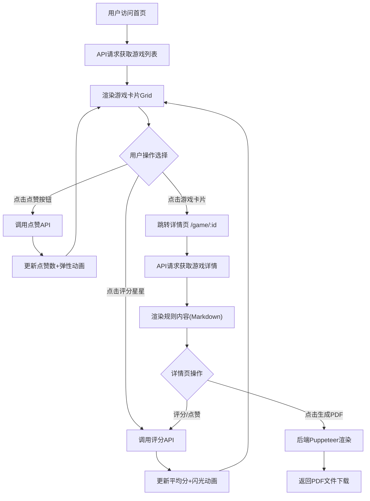

## 1. 产品概述

「桌游集市」是一个面向独立游戏社区的全栈Web应用，为玩家提供浏览、评价和分享自定义桌游规则的平台。用户可以浏览社区成员创作的桌游规则卡片，进行点赞和评分，并能一键生成可打印的PDF规则书。

- **目标用户**：独立游戏爱好者、桌游设计师、社区玩家
- **核心价值**：降低桌游规则分享门槛，提供专业的规则展示和打印体验

## 2. 核心功能

### 2.1 用户角色

| 角色 | 注册方式 | 核心权限 |
|------|----------|----------|
| 访客用户 | 无需注册 | 浏览游戏列表、查看详情、生成PDF |
| 社区用户 | 模拟用户ID（前端本地存储） | 评分、点赞、发表评论 |

### 2.2 功能模块

1. **首页**：游戏卡片列表展示、热度排序、搜索筛选、顶栏导航
2. **游戏详情页**：完整规则展示（Markdown渲染）、设计者信息、标签、评分评论区
3. **评分系统**：1-5星评分、单次评分限制、平均分实时计算
4. **点赞系统**：心形点赞按钮、弹性动画、即时数量更新
5. **PDF生成**：一键生成包含封面、规则正文、标签的PDF规则书

### 2.3 页面详情

| 页面名称 | 模块名称 | 功能描述 |
|----------|----------|----------|
| 首页 | 顶栏导航 | 固定定位、毛玻璃效果、Logo展示、导航链接 |
| 首页 | 游戏卡片列表 | CSS Grid布局、按热度排序、悬浮动画效果 |
| 首页 | 游戏卡片 | 封面图、名称、简介、平均评分、点赞数、悬浮放大 |
| 游戏详情页 | 规则内容区 | Markdown渲染、左栏60%宽度、白色背景 |
| 游戏详情页 | 元信息区 | 设计者信息、标签、生成PDF按钮、sticky定位 |
| 游戏详情页 | 评分评论区 | 星级评分、评论列表、用户头像、时间戳 |

## 3. 核心流程

### 3.1 主要用户流程

用户访问首页 → 浏览游戏卡片列表（按热度排序）→ 点击卡片进入详情页 → 查看完整规则和评论 → 进行评分/点赞 → 点击「生成PDF规则书」→ 下载PDF文件

### 3.2 流程图

## 4. 用户界面设计

### 4.1 设计风格

- **主色调**：深灰 #1F2937（标题）、金色 #F59E0B（评分星星选中）、浅金色 #FCD34D（悬停）
- **辅助色**：红色 #EF4444（点赞选中）、灰色 #9CA3AF（点赞默认）、灰色 #D1D5DB（星星默认）
- **背景色**：渐变从 #F3F4F6（浅石灰）到 #F9FAFB（米白）
- **按钮风格**：圆角、0.2s ease-out悬停过渡
- **字体**：显示字体选用 Playfair Display（优雅衬线），正文字体选用 Inter
- **布局风格**：卡片式布局、顶部固定导航、桌面端左右分栏
- **图标风格**：Font Awesome 风格的线性图标，交互时有动画反馈

### 4.2 页面设计概述

| 页面名称 | 模块名称 | UI元素 |
|----------|----------|--------|
| 首页 | 顶栏导航 | 固定定位、backdrop-filter: blur(12px)、rgba(255,255,255,0.8)背景、Logo文字 |
| 首页 | 卡片Grid | minmax(280px, 1fr)、gap: 24px、padding: 32px |
| 首页 | 游戏卡片 | 圆角16px、边框1px solid #E5E7EB、阴影0 4px 6px -1px rgba(0,0,0,0.1)、悬浮transform: scale(1.05) translateY(-4px) |
| 详情页 | 内容布局 | 左栏60%（规则内容白色背景+内边距24px）、右栏40%（sticky定位元信息） |
| 详情页 | 评分星星 | 5个图标、默认#D1D5DB、选中#F59E0B、悬停渐变#FCD34D |
| 详情页 | 点赞按钮 | 心形图标、默认#9CA3AF、选中#EF4444、点击缩放0.8→1.0弹性动画 |

### 4.3 响应式设计

- **设计策略**：桌面端优先，移动端自适应
- **断点**：768px
  - 桌面端（>768px）：双栏布局，卡片Grid多列
  - 移动端（≤768px）：单栏布局，卡片100%宽度，详情页上下堆叠
- **触摸优化**：按钮最小44x44px触摸区域，评分星星增大点击区域

### 4.4 动画与性能要求

- **卡片悬浮**：transform: scale(1.05) translateY(-4px)，阴影增强，保持55FPS+
- **评分更新**：新平均值闪光动画，界面200ms内反映变化
- **点赞按钮**：点击时scale(0.8)→scale(1.0)弹性动画
- **页面加载**：列表页首次渲染≤1.5秒
