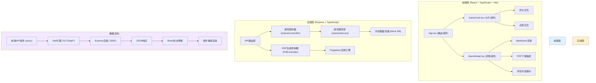
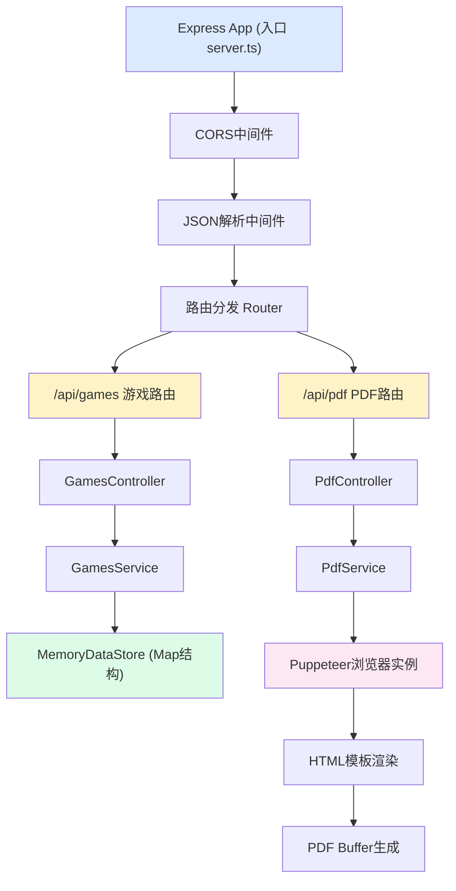
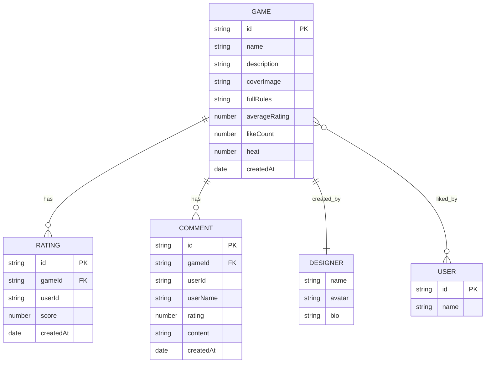

## 1. 架构设计



## 2. 技术描述

- **前端框架**：React 18 + TypeScript
- **构建工具**：Vite（支持HMR热更新，API代理到后端3000端口）
- **路由管理**：React Router DOM（前端路由）
- **HTTP客户端**：axios（请求后端API）
- **Markdown渲染**：react-markdown + remark-gfm
- **后端框架**：Express 4 + TypeScript
- **跨域处理**：cors中间件
- **唯一ID生成**：uuid
- **PDF生成**：puppeteer（无头浏览器渲染HTML为PDF）
- **数据存储**：内存Mock数据（开发阶段使用Map模拟数据库）

## 3. 路由定义

### 3.1 前端路由

| 路由路径 | 用途 | 对应组件 |
|----------|------|----------|
| `/` | 首页，展示桌游卡片列表 | App.tsx 内的列表视图 |
| `/game/:id` | 游戏详情页 | GameDetail.tsx |

### 3.2 后端API路由

| 方法 | 路径 | 用途 |
|------|------|------|
| GET | `/api/games` | 获取游戏列表（支持按热度/评分排序） |
| GET | `/api/games/:id` | 获取单个游戏完整详情 |
| POST | `/api/games/:id/rating` | 提交评分（userId + score 1-5） |
| POST | `/api/games/:id/like` | 点赞/取消点赞（userId） |
| POST | `/api/games/:id/comments` | 发表评论 |
| GET | `/api/games/:id/comments` | 获取评论列表 |
| GET | `/api/games/:id/pdf` | 生成并下载PDF规则书 |

## 4. API定义

### 4.1 类型定义（TypeScript）

```typescript
// 游戏核心类型
interface Game {
  id: string;
  name: string;
  description: string;           // 简短简介
  coverImage: string;            // Base64图片（最大200KB）
  fullRules: string;             // 完整规则（Markdown格式）
  designer: DesignerInfo;
  tags: string[];                // 如：策略、合作、随机
  ratings: Rating[];
  averageRating: number;         // 1-5星，计算值
  likeCount: number;
  likedBy: string[];             // 用户ID数组
  createdAt: Date;
  heat: number;                  // 热度值（用于排序）
}

interface DesignerInfo {
  name: string;
  avatar?: string;
  bio?: string;
}

interface Rating {
  userId: string;
  score: number;                 // 1-5
  createdAt: Date;
}

interface Comment {
  id: string;
  gameId: string;
  userId: string;
  userName: string;
  rating: number;
  content: string;
  createdAt: Date;
}

// API响应格式
interface ApiResponse<T> {
  success: boolean;
  data: T;
  message?: string;
}

// 请求体
interface RatingRequest {
  userId: string;
  score: number;                 // 1-5
}

interface LikeRequest {
  userId: string;
}

interface CommentRequest {
  userId: string;
  userName: string;
  rating: number;
  content: string;
}
```

### 4.2 请求/响应示例

**获取游戏列表响应：**
```json
{
  "success": true,
  "data": [
    {
      "id": "game-001",
      "name": "星际征途",
      "description": "一款太空探索主题的策略桌游...",
      "coverImage": "data:image/png;base64,...",
      "averageRating": 4.5,
      "likeCount": 128,
      "tags": ["策略", "科幻", "竞争"],
      "heat": 256
    }
  ]
}
```

**评分请求：**
```json
{
  "userId": "user-abc",
  "score": 5
}
```

## 5. 服务器架构图



### 5.1 文件结构与调用关系

```
桌游集市/
├── package.json
├── vite.config.js
├── tsconfig.json
├── index.html
├── src/
│   ├── main.tsx              # React入口 → 渲染App
│   ├── App.tsx               # 主路由组件 → 调用API → 传props给子组件
│   ├── types/
│   │   └── index.ts          # 共享类型定义
│   ├── api/
│   │   └── client.ts         # axios实例封装 → 发请求
│   ├── components/
│   │   ├── GameCard.tsx      # 卡片组件 → 接收game props → 调API评分/点赞 → 回调通知父组件
│   │   └── GameDetail.tsx    # 详情组件 → 取路由参数→调API→渲染Markdown→触发PDF下载
│   └── styles/
│       └── globals.css       # 全局样式
└── server/
    ├── index.ts              # Express入口
    ├── routes/
    │   ├── games.ts          # 游戏相关路由
    │   └── pdf.ts            # PDF相关路由
    ├── controllers/
    │   ├── gamesController.ts
    │   └── pdfController.ts
    ├── services/
    │   ├── gamesService.ts
    │   └── pdfService.ts
    ├── store/
    │   └── memoryStore.ts    # 内存数据存储+Mock数据
    └── templates/
        └── pdfTemplate.ts    # PDF的HTML模板
```

## 6. 数据模型

### 6.1 实体关系图



### 6.2 初始Mock数据

开发阶段预置5款桌游数据，包含：
- 完整的游戏信息（名称、描述、规则Markdown）
- Base64格式封面图（控制在200KB以内）
- 预置评分记录和评论
- 合理的点赞数和热度值
- 不同标签组合（策略、合作、随机、派对、推理等）
