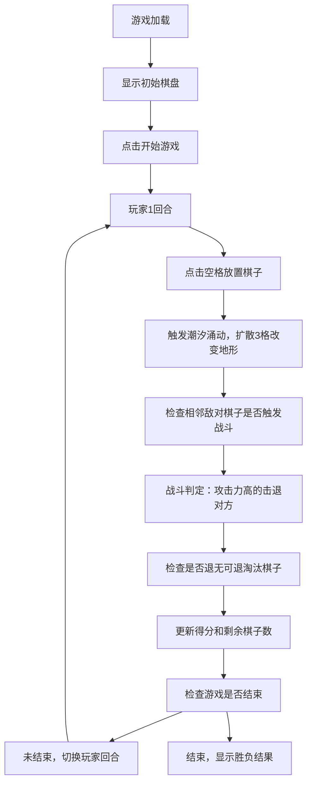

## 1. 产品概述

「潮汐棋盘」是一款基于浏览器的双人策略对战游戏，玩家在6x6动态地形棋盘上轮流放置棋子，通过潮汐涌动机制改变地形，利用地形优势进行对战，最终以占领棋子数量决定胜负。解决了传统棋盘游戏缺乏动态地形与实时环境交互的问题。

- 核心玩法：放置棋子触发潮汐涌动改变地形，利用地形高低差进行攻防
- 目标用户：策略游戏爱好者，双人对战玩家
- 产品价值：提供具有动态环境交互的创新棋盘游戏体验

## 2. 核心功能

### 2.1 用户角色

| 角色 | 注册方式 | 核心权限 |
|------|----------|----------|
| 玩家1（蓝方） | 本地双人 | 放置蓝色浪花棋子，控制潮汐涌动 |
| 玩家2（金方） | 本地双人 | 放置金色漩涡棋子，控制潮汐涌动 |

### 2.2 功能模块

1. **游戏主界面**：6x6棋盘渲染、信息面板、控制按钮
2. **核心游戏逻辑**：棋子放置、潮汐扩散、地形变化、战斗判定、胜负计算
3. **动画特效系统**：水波纹扩散、棋子飘落、击退滑行、地形溶解
4. **游戏状态管理**：回合控制、计分、剩余棋子、游戏重置

### 2.3 页面详情

| 页面名称 | 模块名称 | 功能描述 |
|----------|----------|----------|
| 游戏主页面 | 棋盘区域 | 6x6格子棋盘，显示地形高度和棋子位置，响应鼠标点击放置棋子 |
| 游戏主页面 | 信息面板 | 显示当前回合数、双方得分、剩余棋子数 |
| 游戏主页面 | 控制按钮 | 开始游戏、重置游戏按钮，悬停和点击反馈动画 |
| 游戏主页面 | 特效层 | 水波纹、棋子飘落、击退滑行、地形溶解等动画效果 |

## 3. 核心流程

## 4. 用户界面设计

### 4.1 设计风格

- **主色调**：深海蓝 `#0B2D4E` → 暖沙黄 `#E8D5B7` 垂直渐变背景
- **强调色**：湖蓝 `#3A7CA5`（边框、按钮、分隔线）
- **地形色**：高地 `#8B5E3C`、中地 `#C9A96E`、低地 `#A4D1E1`
- **玩家色**：玩家1蓝 `#4FC3F7→#1E88E5` 径向渐变，玩家2金 `#FFD54F→#F9A825` 径向渐变
- **按钮风格**：圆角6px，背景`#3A7CA5`，悬停变亮`#5B9CBD`，点击缩小0.95倍，过渡0.2s
- **整体风格**：海洋潮汐主题，发光边框，半透明面板，流畅动画

### 4.2 页面设计概述

| 页面名称 | 模块名称 | UI元素 |
|----------|----------|--------|
| 游戏主页面 | 棋盘区域 | 6x6格子（80px边长，响应式缩小至60px），发光边框1.5px，地形颜色填充，发光棋子（28px直径，6px模糊光晕） |
| 游戏主页面 | 信息面板 | 半透明`#00000050`背景，宽240px，显示回合数、得分、剩余棋子，顶部两个控制按钮 |
| 游戏主页面 | 分隔元素 | 棋盘与面板间0.5px发光分隔线`#3A7CA5`，透明度40% |
| 游戏主页面 | 动画特效 | 水波纹扩散（白到透明0.6s）、棋子飘落（上方落下）、击退滑行（ease-out 0.3s）、地形溶解（mask-image 0.5s） |

### 4.3 响应式

- **桌面端（≥768px）**：棋盘与面板横向排列，格子80px
- **移动端（<768px）**：面板移至棋盘下方，格子缩小至60px
- **触摸优化**：点击区域适配移动端操作

### 4.4 性能要求

- 动画帧率稳定30fps以上
- 棋子移动和攻击判定响应时间≤0.2秒
- Canvas渲染优化，避免不必要的重绘

