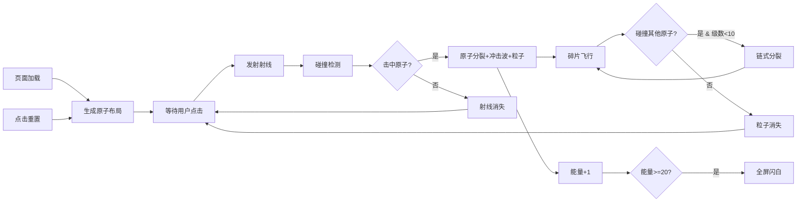

## 1. 产品概述

「分子链爆」是一款模拟宇宙射线在分子结构中发生链式反应的交互式沙盒游戏。玩家通过点击画布释放射线，观察原子被击中后分裂并触发连锁爆发的动态过程，体验物理链式反应的视觉美感。

- 核心玩法：点击发射射线 → 击中原子 → 原子分裂 → 碎片触发连锁反应 → 累计能量
- 目标用户：对物理模拟、粒子特效感兴趣的休闲玩家
- 产品价值：提供沉浸式的物理链式反应视觉体验，寓教于乐

## 2. 核心功能

### 2.1 功能模块

| 模块名称 | 核心功能 |
|---------|---------|
| 原子生成系统 | 随机生成80-150个原子，呈分子结构（六边形/簇状）排列，带分子骨架连线 |
| 射线发射系统 | 点击画布从边缘射入明亮射线，带拖尾效果，动画持续0.5秒 |
| 碰撞响应系统 | 原子被击中时爆发冲击波，碎裂成4-6个粒子飞散，显示能量符号 |
| 链式反应系统 | 碎片飞行中碰撞其他原子触发连锁分裂，最多10级，半径逐级递增 |
| 能量计数系统 | 右上角显示能量计数器，5级时闪烁变色，20能量时全屏闪白 |
| 重置系统 | 右下角重置按钮，点击重新生成原子布局并重置计数器 |

### 2.2 页面详情

| 页面名称 | 模块名称 | 功能描述 |
|---------|---------|---------|
| 游戏主界面 | 画布渲染 | 全屏Canvas，深色科技蓝黑渐变背景，绘制原子、骨架线、射线、粒子特效 |
| 游戏主界面 | 能量计数器 | 右上角显示当前能量，动态视觉反馈 |
| 游戏主界面 | 重置按钮 | 右下角圆角矩形按钮，悬停变色效果 |
| 游戏主界面 | 加载动画 | 页面加载时的入场动画 |

## 3. 核心流程

用户打开页面 → 原子生成与布局 → 等待用户点击 → 发射射线 → 碰撞检测 → 原子分裂（冲击波+粒子+能量符号） → 碎片飞行 → 链式碰撞触发 → 能量累加 → 视觉反馈（闪烁/闪白） → 点击重置 → 重新开始

## 4. 用户界面设计

### 4.1 设计风格

- **主题方向**：科技感、深邃宇宙风
- **主色调**：深邃蓝黑渐变 `#0A0A2E` → `#1A1A4A`
- **强调色**：暖色 `#FF4500`（橙红）、冷色 `#1E90FF`（道奇蓝）、亮橙 `#FF8C00`、亮青 `#E0FFFF`
- **原子颜色**：从 `#FF4500` 到 `#1E90FF` 渐变随机选取
- **骨架线**：半透明白色 `alpha 0.2-0.5`，反应中变为 `#FF8C00`
- **按钮样式**：圆角矩形，背景 `#333`，文字 `#FFF`，悬停 `#FF4500`
- **字体**：现代无衬线字体，数字采用等宽字体

### 4.2 视觉特效

- **射线**：明亮细线 `#E0FFFF`，宽度2px，拖尾效果
- **冲击波**：白色圆环，宽度3px，alpha从0.8淡出到0，持续0.3秒
- **原子浮动**：振幅3px，周期2秒的缓慢浮动
- **分裂动画**：瞬间放大1.5倍再缩小到0
- **能量符号**：闪电⚡、火焰🔥、星辰✧ 随机显示，旋转缩小消失（0.4秒）
- **计数器闪烁**：5级时背景从 `#FFD700` 渐变到 `#FF4500`，数字闪烁
- **全屏闪白**：透明度0.3降到0，持续0.6秒

### 4.3 页面设计

| 区域 | 元素 | 位置 | 样式 |
|-----|------|------|------|
| 背景 | 渐变背景 | 全屏 | `#0A0A2E` → `#1A1A4A` 径向渐变 |
| 主体 | Canvas画布 | 全屏 | 占满视口，响应式 |
| 右上角 | 能量计数器 | fixed, top: 20px, right: 20px | 圆角矩形，数字醒目 |
| 右下角 | 重置按钮 | fixed, bottom: 20px, right: 20px | 圆角矩形，悬停效果 |

### 4.4 响应式

- 桌面优先，Canvas自适应视口尺寸
- 窗口resize时重新计算画布尺寸和原子布局
- 按钮和计数器使用固定定位，适配不同屏幕

### 4.5 性能要求

- 帧率稳定55FPS以上
- 碎片粒子上限300个，超限淘汰最早生成的
- 链式反应最多10级，防止无限循环
