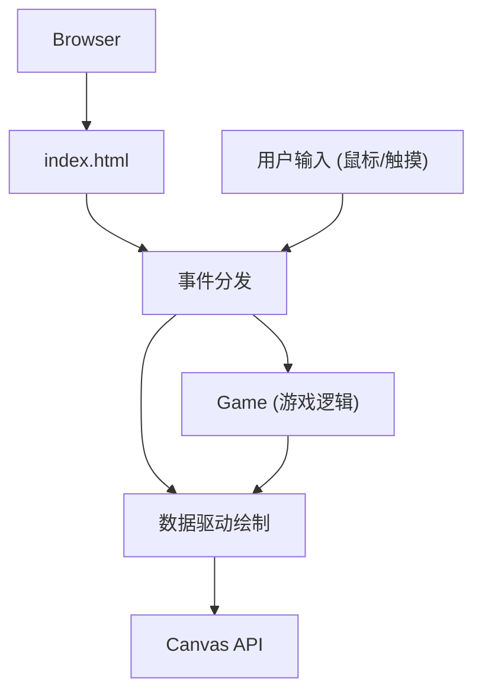

## 1. 架构设计



## 2. 技术描述

- **前端**：TypeScript + Canvas 2D + Vite
- **构建工具**：Vite（支持HMR热更新）
- **语言**：TypeScript（严格模式，ES2020目标）
- **无后端**：纯前端本地双人游戏

## 3. 文件结构

| 文件 | 职责 |
|------|------|
| `package.json` | 依赖管理：typescript、vite，脚本：npm run dev |
| `index.html` | 入口页面，渐变背景，`<div id="app">` 容器 |
| `tsconfig.json` | TypeScript配置，严格模式，ES2020 |
| `vite.config.js` | Vite构建配置，HMR支持 |
| `src/game.ts` | 核心游戏逻辑：棋盘状态、棋子管理、潮汐扩散、战斗判定、胜负计算，导出Game类 |
| `src/renderer.ts` | 渲染引擎：棋盘绘制、棋子渲染、特效动画（水波纹/溶解/滑行），接收Game数据 |
| `src/main.ts` | 入口文件：初始化Game和Renderer，绑定事件，启动游戏循环 |

## 4. 数据模型

### 4.1 核心类型定义

```typescript
// 地形高度枚举
enum TerrainHeight {
  LOW = 0,    // 低地
  MEDIUM = 1, // 中地
  HIGH = 2    // 高地
}

// 玩家枚举
enum Player {
  NONE = 0,
  PLAYER1 = 1, // 蓝色浪花
  PLAYER2 = 2  // 金色漩涡
}

// 格子状态
interface Cell {
  x: number;
  y: number;
  terrain: TerrainHeight;
  piece: Player;
  terrainAnimProgress: number; // 地形溶解动画进度
}

// 棋子动画状态
interface PieceAnimation {
  x: number;
  y: number;
  player: Player;
  type: 'drop' | 'knockback' | 'idle';
  progress: number;
  startX?: number;
  startY?: number;
  endX?: number;
  endY?: number;
}

// 水波纹特效
interface RippleEffect {
  x: number;
  y: number;
  progress: number;
  radius: number;
}

// 游戏状态
interface GameState {
  board: Cell[][];
  currentPlayer: Player;
  round: number;
  scores: Record<Player, number>;
  remainingPieces: Record<Player, number>;
  isGameOver: boolean;
  winner: Player;
  animations: PieceAnimation[];
  ripples: RippleEffect[];
}
```

### 4.2 核心算法

1. **潮汐扩散算法**：从放置点向曼哈顿距离≤3的格子扩散，地形高度+1（循环：低→中→高→低）
2. **战斗判定算法**：检查相邻格子是否有敌对棋子，且中间地形为高地，比较攻击力（基础1 + 高地加成1 - 低地减益1）
3. **击退算法**：计算击退方向，若目标格子越界或有己方棋子则淘汰，否则移动棋子

## 5. 性能优化

1. **Canvas分层**：静态棋盘层 + 动态棋子/特效层，减少重绘区域
2. **脏矩形渲染**：仅重绘发生变化的格子区域
3. **requestAnimationFrame**：使用浏览器原生动画循环，稳定帧率
4. **对象池**：复用动画对象，避免频繁GC
5. **离屏Canvas**：预渲染棋盘格子，提升渲染效率

