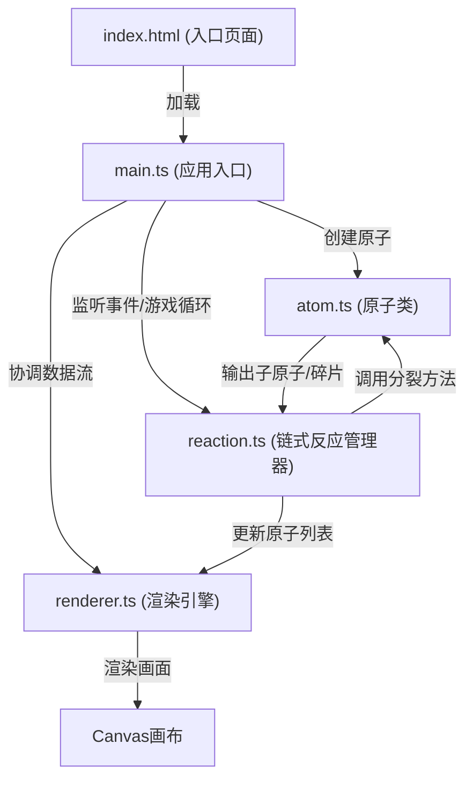

## 1. 架构设计

本项目为纯前端Canvas游戏，采用模块化架构，各模块职责分明，数据流向清晰。



**调用关系说明：**
- `main.ts` → `atom.ts`: 调用 `createAtoms()` 生成初始原子布局
- `main.ts` → `reaction.ts`: 调用 `handleRayImpact()` 处理射线碰撞，调用 `update()` 更新反应状态
- `main.ts` → `renderer.ts`: 调用 `render()` 渲染每一帧画面
- `reaction.ts` → `atom.ts`: 调用 `atom.split()` 触发原子分裂，获取碎片列表
- `renderer.ts` ← `reaction.ts`: 读取 `atoms`、`fragments`、`shockwaves` 等状态进行渲染

**数据流向：**
1. 用户点击 → `main.ts` 捕获坐标 → 创建射线对象
2. 射线更新 → `reaction.ts` 检测碰撞 → 命中原子
3. 原子分裂 → `atom.split()` 返回碎片 → `reaction.ts` 管理链式反应
4. 状态更新 → `renderer.ts` 读取所有状态 → 绘制到Canvas

## 2. 技术描述

- **构建工具**: Vite 5.x（支持HMR）
- **开发语言**: TypeScript 5.x（严格模式，目标ES2020）
- **渲染技术**: HTML5 Canvas 2D API
- **状态管理**: 无第三方库，采用模块内部状态 + 单向数据流
- **无后端、无数据库**，纯前端运行

### 项目初始化命令（Windows）
```
npm init vite-init@latest -y . "--" --template vanilla-ts --force
```

### 依赖配置
| 依赖 | 版本 | 用途 |
|-----|------|------|
| typescript | ^5.0.0 | TypeScript编译 |
| vite | ^5.0.0 | 构建工具与开发服务器 |

## 3. 文件结构

```
project/
├── package.json              # 项目配置与依赖
├── vite.config.js            # Vite构建配置
├── tsconfig.json             # TypeScript配置（严格模式）
├── index.html                # 入口页面
└── src/
    ├── main.ts               # 应用入口，游戏循环与事件协调
    ├── atom.ts               # 原子类定义与分裂逻辑
    ├── reaction.ts           # 链式反应管理器
    └── renderer.ts           # Canvas渲染引擎
```

### 各文件职责

#### [package.json](file:///c:/Users/Administrator/Desktop/VersionFastPro/tasks/auto56/package.json)
- 定义项目元信息、依赖（typescript、vite）
- 启动脚本：`npm run dev`
- 构建脚本：`npm run build`

#### [vite.config.js](file:///c:/Users/Administrator/Desktop/VersionFastPro/tasks/auto56/vite.config.js)
- 基础Vite配置，支持HMR
- 配置端口、服务器选项

#### [tsconfig.json](file:///c:/Users/Administrator/Desktop/VersionFastPro/tasks/auto56/tsconfig.json)
- 严格模式：`strict: true`
- 目标：`ES2020`
- 模块：`ESNext`
- 类型检查严格化

#### [index.html](file:///c:/Users/Administrator/Desktop/VersionFastPro/tasks/auto56/index.html)
- 入口HTML，深色渐变背景
- 加载动画（CSS实现）
- 挂载 `<canvas>` 元素与UI元素（计数器、重置按钮）
- 引入 `src/main.ts`

#### [src/main.ts](file:///c:/Users/Administrator/Desktop/VersionFastPro/tasks/auto56/src/main.ts)
- 初始化Canvas、设置尺寸
- 初始化游戏状态：调用 `atom.createAtoms()` 生成原子
- 事件监听：鼠标点击（发射射线）、窗口resize、重置按钮点击
- 游戏主循环（requestAnimationFrame）：
  - 调用 `reaction.update(dt)` 更新物理状态
  - 调用 `renderer.render()` 渲染画面
- 协调各模块间数据流

#### [src/atom.ts](file:///c:/Users/Administrator/Desktop/VersionFastPro/tasks/auto56/src/atom.ts)
- 定义 `Atom` 类：
  - 属性：`x, y, radius, color, state, floatOffset, splitLevel`
  - 方法：`update(dt)`（浮动动画）、`split(hitPoint)`（分裂，返回碎片列表）
- 定义 `Fragment` 类：
  - 属性：`x, y, vx, vy, radius, color, life, createdAt`
  - 方法：`update(dt)`（位置更新）
- 导出 `createAtoms(count, width, height)`：生成分子结构布局的原子
- 导出 `createMolecularBonds(atoms)`：生成原子间连线信息

#### [src/reaction.ts](file:///c:/Users/Administrator/Desktop/VersionFastPro/tasks/auto56/src/reaction.ts)
- 定义 `ReactionManager` 类：
  - 属性：`atoms`, `fragments`, `rays`, `shockwaves`, `energySymbols`, `energy`, `maxChainLevel`, `currentMaxLevel`
  - 方法：
    - `launchRay(startX, startY, targetX, targetY)`：创建射线
    - `handleRayImpact(ray)`：检测射线与原子碰撞
    - `triggerSplit(atom, hitPoint, level)`：触发原子分裂，递归处理链式反应
    - `checkFragmentCollisions()`：检测碎片与原子碰撞
    - `update(dt)`：更新所有对象状态，限制粒子数量≤300
    - `reset()`：重置所有状态
- 管理链式反应级数（≤10级），每级分裂半径+5px

#### [src/renderer.ts](file:///c:/Users/Administrator/Desktop/VersionFastPro/tasks/auto56/src/renderer.ts)
- 定义 `Renderer` 类：
  - 属性：`ctx`, `width`, `height`, `frameCount`, `fps`
  - 方法：
    - `clear()`：绘制渐变背景
    - `drawBonds(bonds, reactionProgress)`：绘制分子骨架线
    - `drawAtoms(atoms)`：绘制原子（含浮动动画）
    - `drawRays(rays)`：绘制射线（含拖尾）
    - `drawFragments(fragments)`：绘制碎片粒子
    - `drawShockwaves(shockwaves)`：绘制冲击波
    - `drawEnergySymbols(symbols)`：绘制旋转能量符号
    - `drawEnergyCounter(energy, level)`：绘制能量计数器
    - `drawFlashWhite(alpha)`：绘制全屏闪白
    - `render(reactionState, dt)`：统一渲染入口
- 帧率管理与性能监控

## 4. 核心数据结构

### Atom 原子
```typescript
interface Atom {
  id: number;
  x: number;
  y: number;
  baseX: number;
  baseY: number;
  radius: number;           // 8-20px
  color: string;            // #FF4500 到 #1E90FF 渐变
  state: 'idle' | 'splitting' | 'split';
  floatOffset: number;      // 浮动动画相位
  splitScale: number;       // 分裂动画缩放
  chainLevel: number;       // 被触发时的链级
}
```

### Fragment 碎片
```typescript
interface Fragment {
  id: number;
  x: number;
  y: number;
  vx: number;               // 50-100 px/s
  vy: number;
  radius: number;
  color: string;
  life: number;             // 剩余寿命（秒）
  createdAt: number;        // 创建时间戳
  chainLevel: number;       // 所属链级
}
```

### Ray 射线
```typescript
interface Ray {
  startX: number;
  startY: number;
  endX: number;
  endY: number;
  progress: number;         // 0-1 动画进度
  duration: number;         // 0.5秒
  trail: Array<{x, y, alpha}>;
}
```

### Shockwave 冲击波
```typescript
interface Shockwave {
  x: number;
  y: number;
  radius: number;
  maxRadius: number;
  alpha: number;
  duration: number;         // 0.3秒
  progress: number;
}
```

### EnergySymbol 能量符号
```typescript
interface EnergySymbol {
  x: number;
  y: number;
  symbol: '⚡' | '🔥' | '✧';
  rotation: number;
  scale: number;
  alpha: number;
  duration: number;         // 0.4秒
  progress: number;
}
```

## 5. 性能优化策略

1. **粒子数量控制**：`fragments` 数组使用FIFO策略，超过300时删除最早的
2. **链式反应限制**：最大10级，每级半径递增，防止无限循环
3. **碰撞检测优化**：使用空间分区或距离筛选减少检测次数
4. **渲染优化**：
   - 离屏Canvas缓存静态背景
   - 尽量减少 `ctx.save()`/`ctx.restore()` 调用
   - 批量绘制同类型元素
5. **帧率控制**：使用 `requestAnimationFrame` + `dt` 时间步长，避免高刷屏过快
