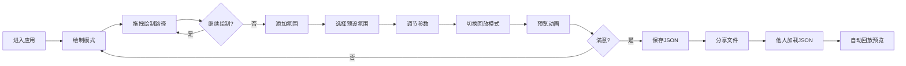

## 1. 产品概述

「尘音寻迹」是一款浏览器端交互式迷路途经回放应用，解决数字空间中离线路径导航难以保留行走感官记忆和情感氛围的问题。

- 核心功能：用户在虚拟地图上绘制步行路径，赋予各段氛围参数（颜色、音符、粒子），生成30秒自动回放动画，保存为可分享的JSON文件
- 目标用户：旅行爱好者、徒步探索者、城市漫游者、艺术创作者
- 市场价值：将冷冰冰的坐标数据转化为带有情感温度的"路径记忆"，为数字旅行提供新的表达方式

## 2. 核心功能

### 2.1 用户角色
| 角色 | 注册方式 | 核心权限 |
|------|---------|---------|
| 访客用户 | 无需注册，直接使用 | 绘制路径、设置氛围、回放射效、保存/加载JSON文件 |

### 2.2 功能模块
1. **主画布区域**：虚拟地图画布、路径绘制、路径发光渲染、粒子系统、氛围图标
2. **顶部导航栏**：LOGO标题、绘制模式按钮、回放模式按钮
3. **左侧控制面板**：粒子密度滑块、回放速度滑块、作者信息输入框
4. **右侧操作面板**：添加氛围按钮、四种氛围预设选择器、路径段列表
5. **底部工具栏**：保存路径按钮、加载路径按钮、路径名称显示

### 2.3 页面详情
| 页面名称 | 模块名称 | 功能描述 |
|---------|---------|---------|
| 主应用页 | 虚拟地图画布 | 柔白色背景(#F5F0E8)，占视口宽85%高90%，支持鼠标/触控绘制 |
| 主应用页 | 路径绘制系统 | 按住拖拽绘制蓝色发光轨迹(#4A90D9)，线宽3px，0.3秒平滑尾迹，松开暂停 |
| 主应用页 | 氛围赋予系统 | 四种预设氛围（森林/海洋/暮色/火山），每段路径可设置独立氛围 |
| 主应用页 | 回放动画系统 | 2倍速逐段亮起，两侧发散对应氛围粒子，5秒生命周期，结束渐隐 |
| 主应用页 | 参数调节面板 | 粒子密度(30-150，默认80)、回放速度(0.5x-3x，默认1x)，实时生效 |
| 主应用页 | 保存与加载 | JSON格式导出/导入，包含坐标、氛围、参数，支持文件分享 |
| 主应用页 | 模式切换 | 绘制/回放双模式切换，加载文件后自动进入回放预览 |

## 3. 核心流程

### 3.1 主用户流程
用户进入应用 → 默认绘制模式 → 鼠标拖拽绘制路径段 → 点击"添加氛围"选择预设 → 继续绘制下一段 → 调节粒子密度和回放速度 → 切换到回放模式预览效果 → 满意后点击"保存路径"下载JSON → 分享JSON文件给他人 → 他人通过"加载路径"查看回放

### 3.2 流程图

## 4. 用户界面设计

### 4.1 设计风格
- **主色调**：深灰蓝背景(#1A2332)，柔白画布(#F5F0E8)，主色蓝(#4A90D9)，辅色绿(#6BCB77)
- **氛围色**：森林绿(#6BCB77)、海洋蓝(#4A90D9)、暮色橙(#FF8C42)、火山红(#FF6B6B)
- **按钮样式**：圆角6px，透明背景，悬停半透明白(#FFFFFF20)，激活态主色蓝(#4A90D9)
- **保存/加载按钮**：渐变色(#4A90D9→#6BCB77)，点击缩放0.95按压动画0.2秒
- **滑块样式**：轨道高4px，滑块圆形直径16px，主色蓝(#4A90D9)
- **字体**：LOGO标题#A8D8EA色，24px字号，0.5秒淡入动画
- **布局**：桌面端三栏式（左控制栏+中央画布+右操作栏），移动端左栏折叠到底部
- **整体风格**：圆角8px，半透明毛玻璃(#FFFFFF08)，边缘模糊4px，悬停提升至#FFFFFF15

### 4.2 页面设计概述
| 页面名称 | 模块名称 | UI元素 |
|---------|---------|--------|
| 主应用页 | 顶部导航栏 | LOGO标题(淡入动画)、绘制按钮、回放按钮(状态高亮) |
| 主应用页 | 左侧面板 | 毛玻璃卡片、粒子密度滑块(带数值显示)、回放速度滑块(带倍率)、作者输入框 |
| 主应用页 | 中央画布 | 柔白背景圆角、发光路径线条、浮动粒子、氛围音符图标 |
| 主应用页 | 右侧面板 | 毛玻璃卡片、添加氛围按钮、四个氛围卡片(颜色+图标+名称)、路径段列表 |
| 主应用页 | 底部工具栏 | 保存按钮(渐变)、加载按钮(渐变)、路径名称标签、加载提示 |

### 4.3 响应式设计
- 桌面优先设计，视口<768px时触发移动端布局
- 左侧控制面板折叠至底部工具栏，横向滑动
- 画布自动调整宽高比，保持视觉中心
- 右侧氛围面板改为可展开抽屉
- 滑块和按钮增大触控区域(最小44px)

### 4.4 性能设计
- Canvas 2D渲染，主动画循环requestAnimationFrame
- 粒子池复用，最大150个粒子，对象池避免GC
- 路径点500+时使用线段抽稀算法
- 离屏Canvas预渲染氛围图标
- JSON文件压缩，目标<500KB
