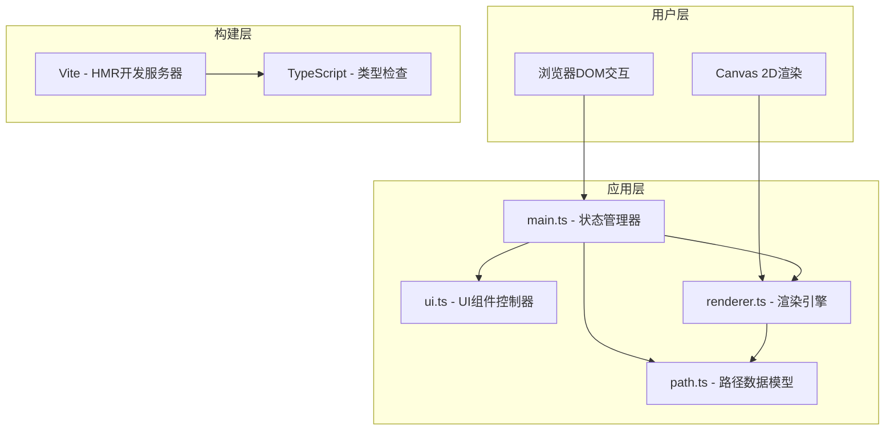
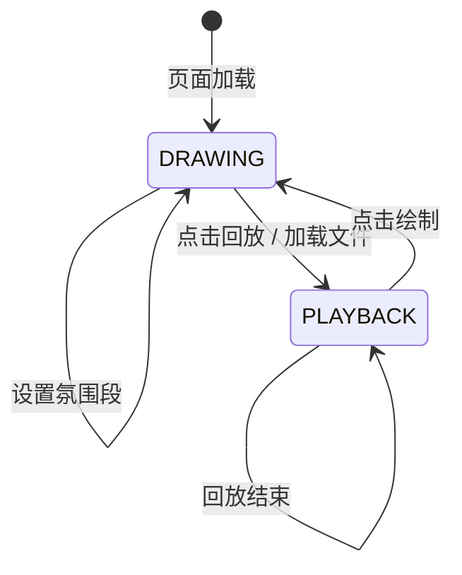

## 1. 架构设计



## 2. 技术描述
- **前端框架**：原生TypeScript + HTML5 Canvas（无UI框架，轻量高性能）
- **构建工具**：Vite 5.x（HMR热更新，极速开发体验）
- **语言**：TypeScript 5.x（严格模式，ES2020目标）
- **渲染方案**：Canvas 2D Context（路径绘制、粒子系统、发光效果）
- **状态管理**：main.ts中的AppState类集中管理
- **后端**：无（纯前端应用，数据本地存储）
- **数据格式**：JSON序列化/反序列化，Blob下载

## 3. 文件结构定义
| 文件路径 | 职责描述 |
|---------|---------|
| package.json | 项目依赖、启动脚本(npm run dev) |
| vite.config.js | Vite基础配置、HMR支持 |
| tsconfig.json | TypeScript严格模式、ES2020 |
| index.html | 入口页面、DOM结构、全局样式 |
| src/main.ts | 应用入口、状态管理、渲染循环、模式切换 |
| src/path.ts | 路径数据模型：Point/AtmosphereSegment/PathMemory类 |
| src/renderer.ts | 渲染核心：发光路径、粒子系统、氛围图标、Canvas绘制 |
| src/ui.ts | UI组件：滑块、按钮、面板、DOM事件、保存/加载逻辑 |

## 4. 数据模型

### 4.1 核心类型定义
```typescript
interface Point {
    x: number;          // 画布坐标X (0-1标准化)
    y: number;          // 画布坐标Y (0-1标准化)
    timestamp: number;  // 绘制时的相对时间戳(ms)
    pressure?: number;  // 可选：触控压感
}

type AtmosphereType = 'forest' | 'ocean' | 'dusk' | 'volcano';

interface AtmospherePreset {
    type: AtmosphereType;
    name: string;
    color: string;       // 主色：#6BCB77 / #4A90D9 / #FF8C42 / #FF6B6B
    iconGlyph: string;   // 图标标识：note / wave / star / lava
}

interface AtmosphereSegment {
    startIndex: number;  // 在points数组中的起始索引
    endIndex: number;    // 结束索引(闭区间)
    atmosphere: AtmosphereType;
}

interface PathMemory {
    version: string;           // 文件版本："1.0"
    name: string;              // 路径名称
    author: string;            // 作者名
    createdAt: number;         // 创建时间戳
    points: Point[];           // 坐标点序列
    segments: AtmosphereSegment[];  // 氛围段列表
    particleDensity: number;   // 粒子密度(30-150，默认80)
    playbackSpeed: number;     // 回放速度(0.5-3，默认1)
}
```

### 4.2 序列化约束
- Point坐标标准化为0-1范围，基于画布尺寸反算实际像素
- 时间戳相对起点，单位ms，目标总时长约30秒(30000ms)
- JSON文件目标大小：单条500点路径<100KB，极限500KB以内
- 校验逻辑：points.length >= 2，segments连续且无重叠，数值范围合法

## 5. 渲染系统架构

### 5.1 渲染分层


### 5.2 关键算法
- **发光尾迹**：shadowBlur + 多层叠加模拟辉光，0.3s延迟插值平滑
- **粒子系统**：对象池模式，极坐标发射方向，生命周期插值透明度
- **路径插值**：Catmull-Rom样条将离散点转化为平滑曲线
- **线段抽稀**：Douglas-Peucker算法，500+点时启用
- **碰撞检测**：粒子边界回收，超出画布80px即复用

### 5.3 性能预算
- 单帧渲染<16ms（60fps目标），保证30fps最低
- 路径绘制：主线程，每帧处理<5ms
- 粒子更新：主线程，最多150个，每帧<3ms
- GC暂停：通过对象池控制，<5ms/次
- 内存占用：<100MB

## 6. 状态机定义

### 6.1 应用模式


### 6.2 状态字段
```typescript
interface AppState {
    mode: 'drawing' | 'playback';
    isDrawing: boolean;           // 鼠标是否按住绘制中
    currentPathStart: number;     // 当前绘制段起始索引
    playbackTime: number;         // 回放进度(ms)
    playbackTotalTime: number;    // 回放总时长
    isPlaybackComplete: boolean;  // 回放是否结束
    fadeOutTime: number;          // 结束渐隐计时
}
```
