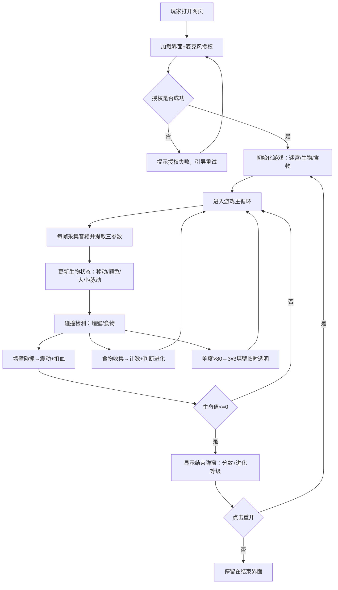

## 1. 产品概述

「声波进化岛」是一款基于浏览器的声控互动游戏，玩家通过操控麦克风输入的声音参数（响度、频率、节奏）驱动一个发光虚拟生物在迷宫中生存、觅食和进化。

- **目标用户**：游戏爱好者、创意交互体验探索者、声音艺术爱好者
- **核心价值**：将声音输入转化为可视化的游戏体验，探索声音与生命体行为的联动美学，兼具娱乐性与教育性

---

## 2. 核心功能

### 2.1 用户角色

| 角色 | 注册方式 | 核心权限 |
|------|----------|----------|
| 游戏玩家 | 无需注册，直接打开网页即可 | 授予麦克风权限后开始游戏、暂停/恢复、重开 |

### 2.2 功能模块

1. **游戏主界面**：Canvas 画布、HUD 信息面板、背景深空渐变、加载提示
2. **音频输入系统**：麦克风授权、实时音频流捕获、响度/频率/节奏三参数提取
3. **虚拟生物系统**：外观渲染（发光球体+粒子拖尾）、行为驱动（声音→移动/颜色/大小/脉动）、生命值、进化等级
4. **迷宫环境系统**：9×9 网格迷宫、墙壁生成、食物分布、障碍物、碰撞检测、响度触发临时通道
5. **进化与计分系统**：食物收集计数、同色进化判定、进化特效、最终分数统计
6. **游戏流程控制**：开始/暂停/结束状态切换、游戏结束弹窗

### 2.3 页面详情

| 页面名称 | 模块名称 | 功能描述 |
|----------|----------|----------|
| 游戏主页面 | 加载状态层 | 深空背景+加载动画+麦克风授权按钮，授权后进入游戏 |
| 游戏主页面 | Canvas 游戏区 | 居中渲染迷宫、生物、食物、粒子特效、墙体震动/透明动画 |
| 游戏主页面 | 左上 HUD 面板 | 音频三参数条形图（响度/频率/节奏）、生命值动态血条、食物计数徽章、进化等级徽章 |
| 游戏主页面 | 结束弹窗 | 游戏结束遮罩层，显示最终收集食物总数、进化等级、「重新开始」按钮 |

---

## 3. 核心流程

玩家打开网页 → 看到加载界面与麦克风授权按钮 → 点击允许使用麦克风 → 系统开始捕获音频流 → 游戏主循环启动（迷宫生成/生物放置/食物分布）→ 玩家通过说话/哼唱控制生物移动（响度→速度、频率→颜色、节奏→脉动）→ 生物在迷宫中移动并收集食物 → 收集 10 个同色食物触发进化（外观变化+属性提升）→ 撞墙扣血/自然消耗/红色食物补血 → 生命值归零 → 显示结束弹窗与最终分数 → 玩家可点击重开。

---

## 4. 用户界面设计

### 4.1 设计风格

- **主色调**：深空蓝紫渐变背景（`#0A0A2E` → `#1C1C5E`）
- **辅助色**：
  - 迷宫网格线：淡蓝 `#4FC3F7`（透明度 0.6）
  - 生物颜色：随频率在色环平滑变化（低频红紫、中频绿蓝、高频黄青）
  - 食物颜色：红（生命）/ 蓝（速度）/ 金（技能）
- **发光效果**：所有 UI 元素带 text-shadow / box-shadow 微光，悬停亮度提高 20%
- **字体**：使用 Google Fonts `Orbitron`（科幻等宽标题）+ `Rajdhani`（正文字体）
- **布局风格**：深色沉浸式全屏，Canvas 居中，HUD 左上悬浮，响应式最小 800×600

### 4.2 页面设计概览

| 页面名称 | 模块名称 | UI 元素 |
|----------|----------|---------|
| 主页面 | 加载层 | 居中「声波进化岛」标题 + 呼吸动画光点 + 「点击授权麦克风」按钮（悬浮发光） |
| 主页面 | 游戏画布 | 9×9 网格迷宫（半透明发光线条）、中心生物（发光球体+渐变粒子拖尾）、随机食物球 |
| 主页面 | HUD 面板 | 半透明深色卡片背景，三行条形图（响度/频率/节奏）带数值标签，血条（绿→红渐变随值变化），食物三色计数圆点徽章，进化等级水晶徽章（带数字） |
| 主页面 | 结束弹窗 | 毛玻璃遮罩 + 居中卡片，标题「进化终止」，分数大字显示，进化等级徽章，「重新进化」按钮 |

### 4.3 响应式设计

- 桌面优先（≥1024×768），Canvas 自适应窗口大小，保持正方形比例
- 最小支持 800×600：HUD 字号缩小、条形图变窄
- 窗口 resize 时重算迷宫格子尺寸与 Canvas 尺寸

### 4.4 动画与交互

- 生物：呼吸脉动（按节奏 BPM）、颜色渐变（按频率 Hz）、缩放（按响度）、粒子拖尾
- 墙壁：碰撞震动（闪烁红光 0.3s）、大声触发临时透明（fade out → 2s → fade in）
- HUD：血条变化时平滑过渡、食物数增加时弹跳动画、进化时徽章光晕脉冲
- 按钮：悬停发光增强 + 轻微上浮（translateY(-2px)）
