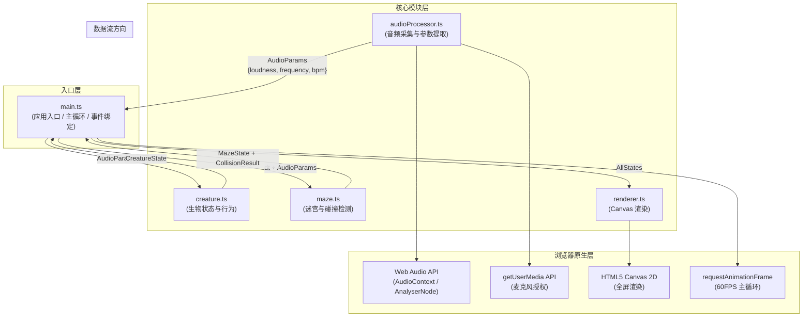

## 1. 架构设计



**调用关系说明：**
1. `main.ts` 作为唯一协调者，**不**允许模块间互相直接调用
2. 数据单向流动：Audio → Main → Creature/Maze → Main → Renderer
3. 每帧循环：`main.ts` 拉取音频参数 → 更新生物 + 迷宫 → 收集状态 → 送入渲染器

---

## 2. 技术栈描述

- **构建工具**：Vite @5（内置 HMR、ESBuild 编译 TS）
- **语言**：TypeScript @5（严格模式 `strict: true`，目标 ES2020）
- **渲染**：HTML5 Canvas 2D Context（原生，无第三方库）
- **音频**：Web Audio API (`AudioContext` + `AnalyserNode` + `getByteTimeDomainData` / `getByteFrequencyData`)
- **麦克风**：`navigator.mediaDevices.getUserMedia({ audio: true })`
- **第三方依赖**：`typescript`、`vite`（**无任何 UI / 游戏框架**，纯手写 Canvas + TS）
- **初始化方式**：手动创建项目文件结构（不使用脚手架）

---

## 3. 项目文件结构与职责

```
auto60/
├── package.json              # 依赖：typescript、vite；脚本：npm run dev
├── vite.config.js            # Vite 基础配置（根目录、HMR 启用）
├── tsconfig.json             # 严格模式 strict:true，target ES2020，module ESNext
├── index.html                # 入口页面：深色渐变背景、加载层、HUD DOM、Canvas、结束弹窗
└── src/
    ├── main.ts               # 应用入口：初始化、主循环、事件、协调各模块
    ├── audioProcessor.ts     # 音频处理：麦克风授权 + 响度/频率/节奏计算
    ├── creature.ts           # 虚拟生物：位置、生命值、进化、行为更新
    ├── maze.ts               # 迷宫：网格、墙壁、食物、碰撞、临时透明
    └── renderer.ts           # 渲染器：迷宫/生物/粒子/HUD 全部 Canvas 绘制
```

**调用关系与数据流向：**

| 文件 | 被调用时机 | 输出 / 接口 | 接收数据 |
|------|------------|-------------|----------|
| `audioProcessor.ts` | 每帧由 `main.ts` 调用 `getParams()` | `AudioParams { loudness, frequency, bpm }` | 无（内部使用 Web Audio） |
| `creature.ts` | 每帧由 `main.ts` 调用 `update(dt, params, maze)` | `CreatureState`（位置、颜色、大小、生命值、进化、粒子） | 音频参数、迷宫引用（用于碰撞） |
| `maze.ts` | 每帧由 `main.ts` 调用 `update(dt, params, creaturePos)` | `MazeState`（网格、食物、墙体透明）、碰撞结果 | 音频参数（响度>80触发墙体透明）、生物位置 |
| `renderer.ts` | 每帧由 `main.ts` 调用 `render(state: AllState)` | 无（副作用：绘制到 Canvas） | CreatureState + MazeState + AudioParams |
| `main.ts` | 入口执行一次 | 无（协调者） | 所有模块输出 |

---

## 4. 核心类型定义（TypeScript）

```typescript
// ===== audioProcessor.ts =====
export interface AudioParams {
  loudness: number;      // 0-100，归一化响度
  frequency: number;     // Hz，主频
  bpm: number;           // 0-240，节奏估计
}

// ===== creature.ts =====
export type FoodColor = 'red' | 'blue' | 'gold';
export interface Particle {
  x: number; y: number;
  vx: number; vy: number;
  life: number; maxLife: number;
  color: string;
}
export interface CreatureState {
  x: number; y: number;          // 迷宫坐标系（格坐标，非像素）
  hp: number;                    // 0-100
  size: number;                  // 20-60 px
  color: { h: number; s: number; l: number }; // HSL，按频率映射
  evolutionLevel: number;        // 0+
  evolutionCounts: Record<FoodColor, number>; // 各色食物累积数
  pulsePhase: number;            // 呼吸动画相位
  slowUntil: number;             // 撞墙减速结束时间戳（ms）
  particles: Particle[];         // 拖尾粒子池（≤200）
}

// ===== maze.ts =====
export type CellType = 0 | 1; // 0=通道 1=墙壁
export interface FoodItem {
  gx: number; gy: number;       // 网格坐标
  color: FoodColor;
  pulse: number;                // 动画相位
}
export interface WallState {
  gx: number; gy: number;
  transparentUntil: number;     // 临时透明结束时间戳
  flashUntil: number;           // 碰撞闪烁结束时间戳
}
export interface MazeState {
  grid: CellType[][];           // 9x9
  foods: FoodItem[];
  walls: Map<string, WallState>; // key = `${gx},${gy}`
  totalFoodCollected: number;
}
export interface CollisionResult {
  hitWall: boolean;
  ateFood: FoodItem | null;
}
```

---

## 5. 性能约束与关键算法

| 约束项 | 目标值 | 实现策略 |
|--------|--------|----------|
| 帧率 | 稳定 60 FPS | 使用 `requestAnimationFrame`，单次更新逻辑 < 10ms，渲染 < 10ms |
| 音频延迟 | < 50 ms | `AnalyserNode` fftSize=1024，smoothingTimeConstant=0.6，不做 FFT 后处理缓冲 |
| 粒子数 | ≤ 200 | 粒子池复用，超过上限时删除最旧粒子（`particles.shift()`） |
| 节奏检测 | 低开销 | 采用峰值计数法（时域过零率 + 滑动窗口 1s），不做自相关 FFT |
| 迷宫生成 | 一次性 | 首帧生成，使用 DFS 回溯法生成完美迷宫，之后不重新生成 |
| 碰撞检测 | O(1) | 生物位置 → 网格坐标 → 直接访问 `grid[gy][gx]` 判定墙壁 |

---

## 6. 构建与运行

| 命令 | 作用 |
|------|------|
| `npm install` | 安装 typescript + vite |
| `npm run dev` | 启动 Vite 开发服务器（HMR），默认端口 5173 |
| `npm run build` | 生产构建（可选，非必需） |
