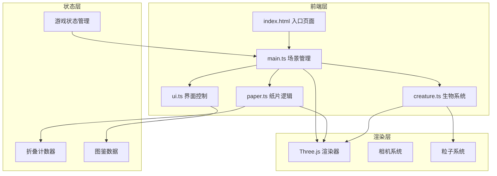

## 1. 架构设计

## 2. 技术说明

- 前端：TypeScript + Three.js + Vite
- 初始化工具：Vite
- 后端：无
- 数据库：无，所有数据存储在内存中

## 3. 文件结构定义

| 文件路径 | 职责 |
|----------|------|
| package.json | 项目依赖（three、typescript、vite、@types/three、cuid）和启动脚本 |
| vite.config.js | Vite基础构建配置，支持HMR |
| tsconfig.json | 严格模式，目标ES2020 |
| index.html | 入口页面，深蓝色渐变背景和加载动画 |
| src/main.ts | 应用入口，初始化场景、相机、渲染器，管理游戏状态循环 |
| src/paper.ts | 纸片折叠与拼接的物理逻辑，包括折叠线生成、顶点变换、相邻纸片吸附检测 |
| src/creature.ts | 折纸生物生成与动画系统，包括几何体组合、颜色渐变、浮动动画 |
| src/ui.ts | 用户界面控制，包括折叠按钮、拼接模式切换、进度条和生物图鉴 |

## 4. 核心模块设计

### 4.1 paper.ts 纸片系统

- `PaperSheet` 类：管理单个纸片的几何状态
  - `foldCount: number` — 折叠计数，最大值3，达到3后禁用折叠交互
  - `vertices: Vector3[]` — 当前多边形顶点
  - `foldLines: FoldLine[]` — 当前可折叠线列表
  - `fold(lineIndex: number)` — 沿指定折叠线折叠，foldCount++，达到3次后禁用
  - `generateFoldLines()` — 根据当前多边形顶点动态生成可折叠边
  - `isFoldable()` — 返回 foldCount < 3

- `FoldLine` 接口：定义折叠线属性
  - `startPoint: Vector3` — 折叠线起点
  - `endPoint: Vector3` — 折叠线终点
  - `normal: Vector3` — 折叠法线方向

- `SnapDetector` 类：吸附检测
  - `snapThreshold: number` — 吸附阈值，基于场景单位（0.5场景单位）
  - `detect(paperA, paperB)` — 检测两张纸片是否在吸附范围内
  - 吸附距离基于世界坐标系计算，确保视觉距离0.5时才触发

- 折叠线生成算法：
  - 初始正方形：生成对角线和边中点连线
  - 折叠后多边形：遍历当前顶点，对每条边计算中点，生成从中点到对边的折叠线
  - 动态适配复杂多边形，每次折叠后重新计算

### 4.2 creature.ts 生物系统

- `CreatureType` 枚举：鹤(CRANE)、狐狸(FOX)、龙(DRAGON)
- `StructureType` 枚举：六面体(HEXAHEDRON)、四面体(TETRAHEDRON)、星形(STAR)
- `CreatureManager` 类：
  - `unlockedCreatures: Map<CreatureType, Creature>` — 已解锁生物
  - `totalCreatures: number = 3` — 总生物数量
  - `identifyStructure(compound)` — 几何体拓扑分析识别结构类型
  - `unlockCreature(structureType)` — 解锁对应生物

- 拓扑分析算法：
  - 面数检测：统计复合体的面数（六面体=6面，四面体=4面）
  - 顶点连接关系：分析顶点邻接图，判断结构拓扑
  - 星形识别：检测是否有5个以上尖角顶点

- `Creature` 类：
  - 半透明彩虹色材质，透明度0.7
  - 粒子汇聚生成动画3秒
  - 专属动作动画：鹤拍翅、狐狸跳跃、龙喷火粒子

- 粒子系统：
  - 最大粒子数200个
  - 使用BufferGeometry + InstancedMesh实例化渲染
  - 金色光晕：圆形渐变，中心#FFD700，边缘透明

### 4.3 main.ts 场景管理

- Three.js场景初始化
- 透视相机，45度视角
- WebGL渲染器，抗锯齿
- 游戏主循环：60fps目标
- 事件系统：鼠标交互、拖拽
- 状态管理：纸片列表、已拼接结构、游戏阶段

### 4.4 ui.ts 界面控制

- 右侧磨砂玻璃面板
- 折叠按钮组
- 拼接模式切换
- 进度条（当前收集数/总数3）
- 生物图鉴网格
- 缩略模型：4秒旋转周期，60fps下每帧旋转2π/4/60 ≈ 0.026弧度
- 响应式：768px以下折叠为底部悬浮菜单

## 5. 性能约束

- 渲染帧率：60fps目标，折叠动画不低于55fps
- 粒子数量上限：200个
- 粒子渲染方式：BufferGeometry + InstancedMesh
- 动画过渡：ease-in-out，持续0.5秒
- 折叠动画：0.5秒
