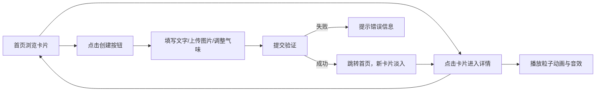

## 1. 产品概述

「气味档案馆」是一个沉浸式的虚拟气味体验平台，用户可以创建、浏览和分享个性化的气味卡片。每张卡片融合文字描述、氛围图片、气味调色盘、动态粒子效果与环境音效，为用户提供多感官的数字艺术创作体验。

- 主要用途：让用户以数字化方式记录、表达和分享对气味的想象与记忆
- 目标用户：喜欢艺术创作、氛围美学、感官体验的互联网用户
- 市场价值：填补数字感官体验领域的空白，提供独特的创作与分享平台

## 2. 核心功能

### 2.1 用户角色

| 角色 | 注册方式 | 核心权限 |
|------|----------|----------|
| 访客用户 | 无需注册 | 创建、浏览气味卡片 |

### 2.2 功能模块

1. **首页（卡片列表页）**：瀑布流卡片展示、卡片悬停效果、跳转详情、跳转创建页
2. **创建页**：文字描述输入、图片上传预览、5种基础气味比例滑块、实时调色盘预览、提交创建
3. **详情展示页**：大图展示、文字描述、气味调色盘圆环、粒子动画播放、环境音效播放、返回首页

### 2.3 页面详情

| 页面名称 | 模块名称 | 功能描述 |
|----------|----------|----------|
| 首页 | 瀑布流网格 | 三列布局展示所有卡片，200px宽自适应高度，间距12px |
| 首页 | 卡片缩略图 | 显示图片、标题、气味调色盘简图，悬停上浮4px + #D4A574描边 |
| 首页 | 创建入口按钮 | 位于页面顶部，点击跳转创建页 |
| 创建页 | 文字输入框 | 最多200字，带字数统计 |
| 创建页 | 图片上传区域 | 支持拖拽/点击上传，100px×100px圆形裁剪预览 |
| 创建页 | 气味滑块组 | 5个基础气味（玫瑰/檀木/海盐/松针/焚香），0-100整数，轨道颜色随值渐变 |
| 创建页 | 实时调色盘预览 | 直径120px圆形画布，扇形分割，1px白色边界线 |
| 创建页 | 提交按钮 | 验证文字与气味比例，成功后跳转首页，新卡片淡入 |
| 详情页 | 大图展示区 | 上传图片或径向渐变默认图 |
| 详情页 | 文字描述区 | 两端对齐，16px字号，行高1.6 |
| 详情页 | 圆环调色盘 | 扇区可点击弹出气味名称与比例 |
| 详情页 | 播放控制 | 触发200个粒子上升动画 + Web Audio合成环境音效，持续20秒 |
| 详情页 | 返回按钮 | 带缩小过渡动画返回列表页 |

## 3. 核心流程

用户打开应用进入首页浏览瀑布流卡片 → 点击卡片进入详情页，可播放粒子动画与音效 → 返回首页或点击创建按钮 → 在创建页填写文字、上传图片、调整气味比例 → 提交后新卡片出现在列表最前端 → 点击新卡片进入详情体验。

## 4. 用户界面设计

### 4.1 设计风格

- **主色调**：暖灰色背景 #F5F0EB，深棕色文字 #3E2723，白色卡片 #FFFFFF
- **强调色**：按钮与描边 #D4A574（悬停变深 #C49A6C）
- **气味色**：玫瑰 #FF6BCB、檀木 #8B5A2B、海盐 #B0E0E6、松针 #228B22、焚香 #A0522D
- **按钮样式**：圆角8px，#D4A574填充，悬停变深
- **卡片样式**：圆角12px，白色背景，浅灰阴影 0 2px 8px rgba(0,0,0,0.08)
- **字体**：正文使用系统字体栈 sans-serif，标题使用 Georgia 衬线体（24px加粗）
- **布局风格**：卡片式布局，居中内容区，顶部导航
- **细节设计**：悬停微交互、页面切换过渡动画、粒子动态效果

### 4.2 页面设计概述

| 页面名称 | 模块名称 | UI元素 |
|----------|----------|--------|
| 首页 | 顶部导航 | 创建按钮、品牌标题、Georgia字体 |
| 首页 | 瀑布流卡片 | 三列/两列/单列响应式，缩略图、标题、扇形调色盘简图 |
| 首页 | 卡片悬停 | 上浮4px，#D4A574描边，过渡平滑 |
| 创建页 | 表单区域 | 垂直排列，统一间距和圆角风格 |
| 创建页 | 滑块组件 | 轨道颜色渐变对应气味色，数值显示 |
| 创建页 | 调色盘画布 | 圆形，扇形分割，白色边界线 |
| 详情页 | 深色背景 | #1A1A1A全屏深色背景 |
| 详情页 | 中央卡片 | 宽500px，内边距24px，居中展示 |
| 详情页 | 圆环调色盘 | 可交互扇区，悬停提示 |
| 详情页 | 粒子动画层 | 全屏Canvas，从底部升起的彩色粒子 |

### 4.3 响应式设计

- **桌面端（≥768px）**：三列瀑布流，卡片宽200px
- **平板端（480px-767px）**：两列瀑布流，卡片宽45%
- **移动端（<480px）**：单列布局，创建页和详情页控件垂直堆叠
- **详情页中央卡片**：移动端自适应宽度，保留最小可读性

### 4.4 动效与交互

- **页面切换**：卡片从列表点击到详情展开使用 scale + opacity 过渡，持续0.4秒，返回时反向
- **新卡片入场**：淡入动画持续0.3秒
- **粒子动画**：200个粒子从底部升起，大小2-6px正弦变化，颜色从调色盘随机选取，持续20秒
- **悬停效果**：所有可交互元素均有平滑过渡（0.2-0.3秒）
- **音效**：Web Audio API合成，暖色对应低频，冷色对应高频，轻缓白噪音/环境音
