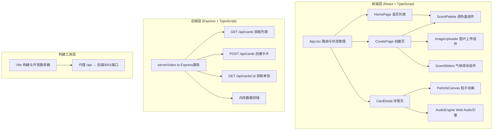
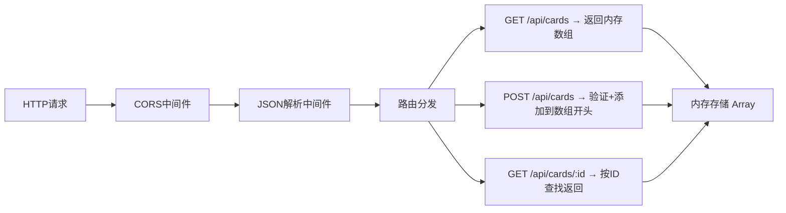
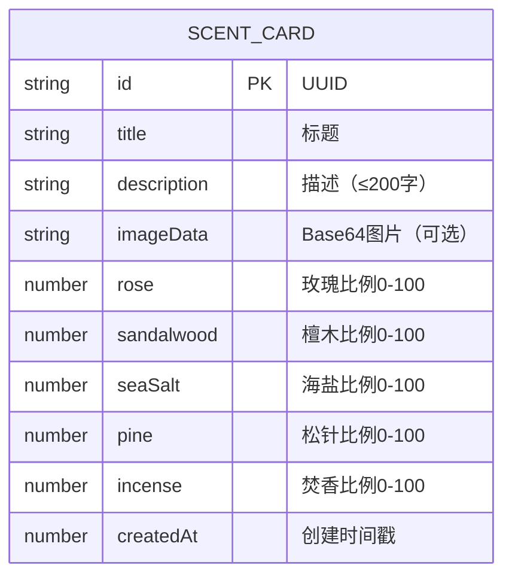

## 1. 架构设计



## 2. 技术描述

- **前端框架**：React 18 + TypeScript 严格模式
- **构建工具**：Vite（配置代理到后端3001端口）
- **状态管理**：React useState/useContext（App.tsx中央状态管理）
- **样式方案**：原生CSS（CSS Modules风格，不使用Tailwind，按用户需求的精确颜色值实现）
- **动画实现**：CSS Transitions + Canvas 2D API（粒子动画）
- **音频实现**：Web Audio API（合成环境音效）
- **后端框架**：Express 4 + TypeScript
- **数据存储**：内存数组（运行时存储，不持久化）
- **跨域处理**：cors 中间件
- **ID生成**：uuid 库

## 3. 路由定义

| 前端路由 | 页面组件 | 用途 |
|----------|----------|------|
| / | HomePage | 首页，展示所有气味卡片瀑布流 |
| /create | CreatePage | 创建新气味卡片 |
| /card/:id | CardDetail | 展示单张卡片详情，播放动画与音效 |

后端API路由：

| 方法 | 路由 | 用途 |
|------|------|------|
| GET | /api/cards | 获取所有卡片列表 |
| POST | /api/cards | 创建新卡片 |
| GET | /api/cards/:id | 获取单张卡片详情 |

## 4. API定义

### 类型定义

```typescript
// 基础气味枚举
interface BaseScent {
  name: string;      // 中文名称：玫瑰、檀木、海盐、松针、焚香
  key: string;       // 英文key：rose, sandalwood, seaSalt, pine, incense
  color: string;     // 十六进制颜色
}

// 气味比例
interface ScentRatio {
  rose: number;        // 0-100
  sandalwood: number;  // 0-100
  seaSalt: number;     // 0-100
  pine: number;        // 0-100
  incense: number;     // 0-100
}

// 气味卡片
interface ScentCard {
  id: string;
  title: string;           // 从描述提取前20字作为标题
  description: string;     // 200字以内
  imageData?: string;      // base64图片数据，可选
  scentRatios: ScentRatio;
  createdAt: number;
}

// 创建卡片请求
interface CreateCardRequest {
  description: string;
  imageData?: string;
  scentRatios: ScentRatio;
}
```

### 响应格式

```typescript
// 成功响应
interface ApiResponse<T> {
  success: boolean;
  data: T;
}

// 错误响应
interface ApiError {
  success: boolean;
  error: string;
}
```

## 5. 服务器架构



后端采用单层架构（Controller即Handler），数据存储于内存数组，无需数据库。

## 6. 数据模型

### 6.1 数据模型定义



### 6.2 项目文件结构

```
.
├── package.json
├── vite.config.js
├── tsconfig.json
├── index.html
├── src/
│   ├── App.tsx              # 主容器，路由与状态管理
│   ├── HomePage.tsx         # 首页瀑布流
│   ├── CreatePage.tsx       # 创建页
│   ├── CardDetail.tsx       # 详情页
│   ├── types.ts             # 共享类型定义
│   └── styles.css           # 全局样式
└── server/
    └── index.ts             # Express后端
```

## 7. 性能优化策略

- **首页加载**：卡片缩略图懒加载，瀑布流使用CSS columns实现避免重排
- **粒子动画**：使用 requestAnimationFrame + Canvas 2D，离屏粒子池复用，目标60FPS
- **页面切换**：使用CSS transform（GPU加速）而非修改布局属性
- **内存管理**：粒子动画结束后清理Canvas上下文和定时器，避免内存泄漏
- **音频合成**：Web Audio API节点在停止后正确断开连接与清理
