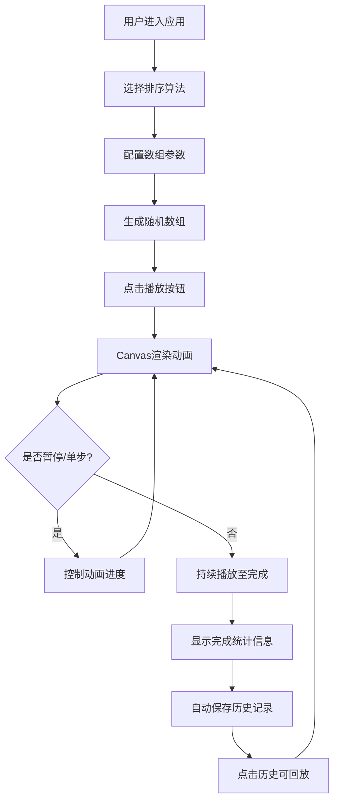

## 1. 产品概述

「排序剧场」是一个面向编程学习者的沉浸式排序算法可视化学习平台，通过动态可视化交互帮助学生直观理解冒泡、选择、插入三种经典排序算法的执行过程和数据变化规律。

- 核心价值：将抽象的排序算法转化为具象的视觉动画，降低学习门槛，提升学习兴趣
- 目标用户：计算机专业学生、编程初学者、算法爱好者

## 2. 核心功能

### 2.1 用户角色
| 角色 | 注册方式 | 核心权限 |
|------|----------|----------|
| 访客用户 | 无需注册 | 使用所有可视化功能、查看历史记录、回放排序动画 |

### 2.2 功能模块
1. **算法选择与配置模块**：算法类型选择、数组长度设置、数值范围设置、随机生成
2. **可视化渲染模块**：Canvas 柱状图渲染、比较/交换高亮动画、已排序区域标记、平滑过渡效果
3. **播放控制模块**：播放/暂停、单步前进/后退、速度调节、进度条显示
4. **统计信息模块**：实时操作类型显示、比较/交换次数统计、已排序元素计数、完成后总览
5. **历史记录模块**：自动保存排序记录、历史列表展示、点击回放功能

### 2.3 页面详情
| 页面名称 | 模块名称 | 功能描述 |
|----------|----------|----------|
| 主应用页 | 控制面板 | 算法选择下拉框、数组配置滑块、播放控制按钮组、速度调节滑块、统计信息卡片 |
| 主应用页 | Canvas 可视化区域 | 动态柱状图渲染、动画播放、状态高亮显示、网格背景 |
| 主应用页 | 历史记录侧边栏 | 历史记录列表展示、点击回放动画 |

## 3. 核心流程

用户进入应用 → 选择排序算法类型 → 配置数组参数（长度/范围）→ 点击生成随机数组 → 点击播放按钮开始可视化 → 观察排序过程（可暂停/单步调试）→ 排序完成查看统计信息 → 历史记录自动保存 → 可点击历史记录回放

## 4. 用户界面设计

### 4.1 设计风格
- 主色调：深蓝渐变 (#1a1a2e → #16213e)
- 辅助色：柱子蓝色 (#4a90e2)、比较高亮黄色 (#ffd700)、交换高亮橙色 (#ff8c00)、已排序绿色 (#4caf50)
- 按钮渐变：#0f3460 → #533483
- 文字颜色：#e0e0e0（浅灰色）
- 字体：标题使用 'Orbitron' 科技感字体，正文使用 'Roboto Mono' 等宽字体
- 布局：左侧 320px 控制面板 + 右侧自适应 Canvas 区域
- 卡片：圆角 12px，柔和阴影 (0 4px 20px rgba(0,0,0,0.3))
- 按钮：圆角 8px，悬停上浮 2px 并亮度提升 15%

### 4.2 页面设计概述
| 页面名称 | 模块名称 | UI 元素 |
|----------|----------|----------|
| 主应用页 | 控制面板 | 渐变按钮、自定义滑块、圆角卡片、统计数值动画、标签分组 |
| 主应用页 | Canvas 区域 | 动态柱状图、网格背景、脉冲光晕、平滑过渡动画、状态色高亮 |
| 主应用页 | 历史记录 | 列表项卡片、时间戳显示、算法标签、点击交互效果 |

### 4.3 响应式设计
- 桌面端（≥768px）：左右布局，左侧控制面板 320px，右侧 Canvas 自适应
- 移动端（<768px）：上下堆叠布局，控制面板在上宽度 100%，Canvas 在下最小高度 400px
- 触摸优化：按钮最小尺寸 44px，滑块增加触摸区域

### 4.4 动效设计
- 页面加载：深蓝渐变背景 + 旋转加载动画
- 柱子交换：300ms 平滑位置过渡，requestAnimationFrame 驱动
- 比较高亮：亮黄色闪烁效果
- 已排序标记：绿色渐入动画
- 按钮悬停：上浮 2px + 亮度提升 + 阴影增强
- 历史记录点击：轻微缩放反馈
- 进度条：平滑填充动画
