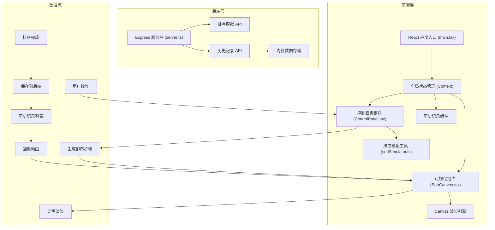
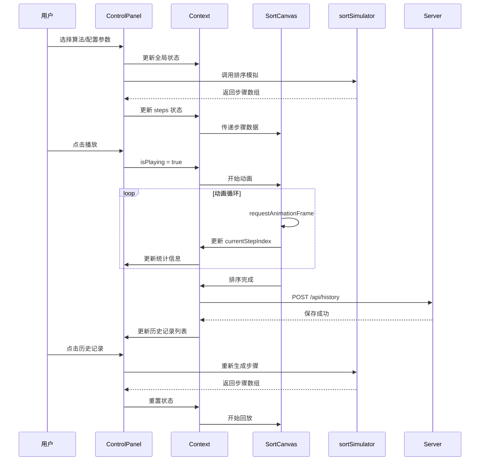

## 1. 架构设计



## 2. 技术描述

- **前端框架**：React@18 + TypeScript@5
- **构建工具**：Vite@5 + @vitejs/plugin-react@4
- **后端服务**：Express@4 + TypeScript@5
- **跨域处理**：cors@2
- **唯一标识**：uuid@9
- **数据存储**：后端内存存储（无需数据库）
- **HTTP 客户端**：原生 fetch API

## 3. 项目文件结构

```
auto64/
├── package.json              # 项目依赖和启动脚本
├── vite.config.js            # Vite 配置（代理到后端 3001 端口）
├── tsconfig.json             # TypeScript 配置（严格模式）
├── index.html                # 入口页面
├── server/
│   └── server.ts             # Express 后端服务
└── src/
    ├── main.tsx              # React 应用入口
    ├── components/
    │   ├── SortCanvas.tsx    # Canvas 可视化组件
    │   └── ControlPanel.tsx  # 控制面板组件
    └── utils/
        └── sortSimulator.ts  # 排序算法模拟工具
```

## 4. 类型定义

### 4.1 核心数据类型

```typescript
// 排序步骤类型
type StepType = 'compare' | 'swap' | 'sorted';

interface SortStep {
  type: StepType;
  indices: number[];      // 涉及的元素索引
  array: number[];        // 当前数组状态
  compareCount: number;   // 累计比较次数
  swapCount: number;      // 累计交换次数
  sortedCount: number;    // 已排序元素数量
}

// 排序结果
interface SortResult {
  algorithm: string;
  initialArray: number[];
  steps: SortStep[];
  totalComparisons: number;
  totalSwaps: number;
  totalTime: number;      // 毫秒
}

// 历史记录
interface HistoryRecord {
  id: string;
  algorithm: string;
  initialArray: number[];
  totalSteps: number;
  totalTime: number;
  timestamp: number;
}

// 全局状态
interface SortState {
  algorithm: 'bubble' | 'selection' | 'insertion';
  arrayLength: number;
  valueRange: [number, number];
  currentArray: number[];
  steps: SortStep[];
  currentStepIndex: number;
  isPlaying: boolean;
  speed: number;          // 0.5 - 5 倍速
  history: HistoryRecord[];
}
```

## 5. API 定义

### 5.1 排序模拟 API

**POST /api/simulate**
- 请求体：
  ```typescript
  {
    algorithm: 'bubble' | 'selection' | 'insertion',
    array: number[]
  }
  ```
- 响应：
  ```typescript
  {
    success: boolean,
    data: SortResult
  }
  ```

### 5.2 历史记录 API

**GET /api/history**
- 响应：
  ```typescript
  {
    success: boolean,
    data: HistoryRecord[]
  }
  ```

**POST /api/history**
- 请求体：
  ```typescript
  {
    algorithm: string,
    initialArray: number[],
    totalSteps: number,
    totalTime: number
  }
  ```
- 响应：
  ```typescript
  {
    success: boolean,
    data: HistoryRecord
  }
  ```

**GET /api/history/:id**
- 响应：
  ```typescript
  {
    success: boolean,
    data: HistoryRecord
  }
  ```

## 6. 数据流向图



## 7. 性能优化策略

1. **Canvas 渲染优化**：
   - 使用 requestAnimationFrame 驱动动画
   - 仅重绘变化区域，避免全量重绘
   - 离屏 Canvas 预渲染静态元素（网格线）

2. **算法模拟优化**：
   - 前端预生成所有步骤，避免后端请求延迟
   - 步骤数据增量更新，减少状态切换开销
   - 大数据量时使用 Web Worker 后台计算

3. **React 性能优化**：
   - 使用 useMemo 缓存计算结果
   - 使用 useCallback 避免不必要的重渲染
   - React.memo 包裹子组件

4. **动画性能**：
   - 柱子交换使用 CSS transform 而非 top/left
   - 300ms 交换动画使用缓动函数 easeInOutQuad
   - 帧率控制在 30-60fps，根据设备性能自适应
