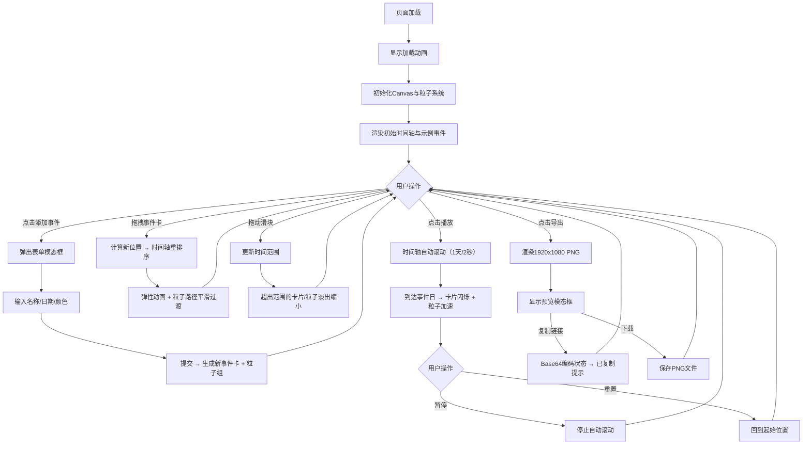

## 1. 产品概述

「时间涟漪」是一款浏览器交互式应用，用户通过拖拽时间轴上的彩色事件卡，实时生成由波纹和粒子轨迹描绘的个人时间线可视化。应用将抽象的时间记忆转化为富有动感的视觉艺术，为用户提供沉浸式的回忆与创造体验。

- 核心价值：将个人时间记忆以粒子艺术形式可视化呈现，兼具实用工具与审美表达双重属性
- 目标用户：设计师、创作者、普通用户 —— 所有希望以独特方式记录与分享人生节点的人群

## 2. 核心功能

### 2.1 功能模块

1. **主画布区域**：粒子系统渲染、事件卡可视化、时间轴渲染
2. **时间线编辑**：添加事件、拖拽排序、弹性动画
3. **粒子系统**：正弦波轨迹、颜色渐变、生命周期管理、平滑过渡
4. **时间范围筛选**：双滑块控件、动态显隐、淡出动画
5. **播放模式**：自动滚动、事件闪烁、粒子加速、暂停/重置
6. **导出分享**：PNG导出（1920x1080）、Base64编码分享链接、预览模态窗口

### 2.2 页面详情

| 页面名称 | 模块名称 | 功能描述 |
|-----------|-------------|---------------------|
| 主页面 | 加载动画 | 深色渐变背景 + 旋转涟漪加载动画，资源准备完成后淡出 |
| 主页面 | 顶部时间轴 | 水平细线 + 彩色事件卡，可拖拽排序，弹性归位动画 |
| 主页面 | 添加事件按钮 | 圆形浮动按钮（左），点击弹出模态表单（事件名称、日期、颜色） |
| 主页面 | 中央画布 | 粒子垂直下落 → 正弦波右漂，颜色透明度渐变，生命周期8秒 |
| 主页面 | 底部双滑块 | 日期范围筛选，渐变轨道，动态显隐带淡出动画 |
| 主页面 | 控制按钮栏 | 播放/暂停/重置、导出按钮，悬浮微交互 |
| 主页面 | 导出模态窗口 | PNG预览图、复制分享链接按钮、已复制提示（3秒自动消失） |

## 3. 核心流程

主用户流程：用户打开应用 → 看到初始时间轴（含示例事件）→ 点击添加按钮创建事件 → 拖拽卡片重新排序（触发粒子路径过渡动画）→ 拖动滑块筛选时间范围 → 点击播放自动浏览时间线 → 点击导出保存PNG或复制分享链接。

## 4. 用户界面设计

### 4.1 设计风格

**整体方向**：深邃科技感 + 有机流动感。深色宇宙背景中漂浮着彩色粒子涟漪，如星河般梦幻。

- 主色调：`#58A6FF`（科技蓝），强调色：`#F78166`（日落橙），次文本：`#8B949E`
- 背景渐变：`#0D1117` → `#161B22`（垂直，底部略亮增强纵深感）
- 时间轴：`#30363D` 2px水平线 + 微光晕
- 事件卡：圆角8px，阴影 `0 2px 8px rgba(0,0,0,0.3)`，悬浮时 `0 4px 16px rgba(0,0,0,0.5)` + 上移2px
- 按钮：圆角12px，悬浮 0.3s 背景色过渡（透明 → rgba(255,255,255,0.1)）
- 滑块渐变：`#4A90D9` → `#D14C8B`（蓝紫粉过渡）
- 动画曲线：统一 `cubic-bezier(0.4, 0, 0.2, 1)`（Material Design标准缓动）
- 字体：使用 Google Fonts **Space Grotesk**（标题，几何未来感）+ **JetBrains Mono**（日期数字），避免 AI 常用的 Inter 字体

### 4.2 页面设计概览

| 页面名称 | 模块名称 | UI元素设计说明 |
|-----------|-------------|-------------|
| 主页面 | 加载动画 | 同心圆涟漪由中心向外扩散（3圈），配合渐变文字"时间涟漪"淡入，总时长1.8秒 |
| 主页面 | 顶部时间轴区 | 高120px，距上40px。水平线位于y=80px处。事件卡80x40px，文字居中，日期缩小显示在底部 |
| 主页面 | 添加事件按钮 | 圆形φ36px → 悬浮φ40px，`#1F6FEB`背景，白色+号（SVG，线宽3px），位于时间轴左侧距边24px |
| 主页面 | 中央粒子区 | 高300px，半透明网格底纹（极淡#1C2128 1px线，间距40px）增强空间感 |
| 主页面 | 底部控制区 | 高80px，双滑块占宽度70%居中，下方按钮行（播放/重置/导出）水平排列间距12px |
| 主页面 | 事件表单模态框 | 毛玻璃效果 `backdrop-filter: blur(12px)`，背景`rgba(13,17,23,0.85)`，圆角16px，表单字段间距16px |
| 主页面 | 导出模态框 | 预览图带内阴影，链接输入框只读，复制按钮带成功动效（✓图标弹出） |

### 4.3 响应式设计

- 桌面端（≥600px）：画布占视口80%居中，最小宽600px，高500px；事件卡80x40px，每卡30粒子
- 移动端（<600px）：画布占视口95%，事件卡缩小到60x30px（字号缩小），每卡20粒子，按钮行适配触摸（44x44px最小区域）
- 时间轴水平滚动：事件过多时支持触摸/鼠标横向滚动，滚动条隐藏
- 滑块控件：移动端滑块圆点扩大到24px，增大触摸命中区

### 4.4 性能优化设计

- 粒子池上限500，FIFO淘汰（超出时移除最早粒子，避免数组反复分配）
- 离屏Canvas：静态背景（网格、时间轴线）预渲染，减少每帧绘制量
- requestAnimationFrame分层：UI操作（滑块）独立于粒子循环，保持30+FPS
- DOM节流：拖拽事件用requestAnimationFrame包裹，DOM操作延迟≤50ms
- 粒子渲染优化：使用arc批量绘制，颜色切换按组排序，减少context状态切换
