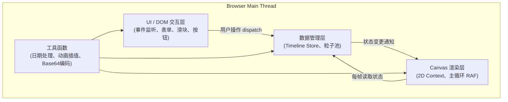

## 1. 架构设计

纯前端单页应用（SPA），无后端依赖。采用分层架构：UI/DOM层负责交互与表单，Canvas渲染层负责粒子与视觉，数据管理层负责事件状态。



## 2. 技术描述

> 注：用户明确指定了项目结构与技术栈，故采用纯 TypeScript + Canvas 实现，不引入 React/Vue 框架以保持轻量。

- **构建工具**：Vite 5.x（HMR热更新、ESM原生支持、极速冷启动）
- **语言**：TypeScript 5.x（严格模式 strict:true，目标 ES2020）
- **渲染引擎**：HTML5 Canvas 2D API（无第三方图形库）
- **样式方案**：原生 CSS + CSS Variables（主题色系统）
- **动画系统**：
  - DOM动画：CSS Transition/Animation（缓动曲线统一）
  - Canvas动画：requestAnimationFrame + 自定义插值器（lerp/easeInOutCubic）
- **无额外依赖**：仅 typescript + vite，其余全部原生实现，保持包体最小

## 3. 目录结构与文件职责

```
auto65/
├── package.json              # 依赖与脚本 (typescript, vite)
├── vite.config.js            # Vite基础配置 (HMR, server.port=5173)
├── tsconfig.json             # TS严格模式, target=ES2020, module=ESNext
├── index.html                # 入口页：深色渐变背景 + 加载动画 + 字体引入
└── src/
    ├── main.ts               # ★ 应用入口：Canvas初始化、全局事件、主循环启动
    ├── timeline.ts           # 时间线数据管理：事件CRUD、排序、时间槽计算
    ├── particle.ts           # 粒子系统：粒子池、运动物理、生命周期、渲染
    ├── types.ts              # (新增) 全局类型定义：Event, Particle, FilterRange 等
    ├── renderer.ts           # (新增) Canvas渲染器：分层绘制、离屏缓存、导出高分辨率
    ├── animation.ts          # (新增) 动画工具：lerp、弹性函数、缓动曲线
    ├── dateUtils.ts          # (新增) 日期工具：格式化、差值、按天步进
    └── styles.css            # (新增) 样式表：主题变量、按钮、滑块、模态框
```

**核心文件关联**：
- [main.ts](file:///...)：组装 timeline + particle + renderer，注册DOM事件，启动RAF循环
- [timeline.ts](file:///...)：EventBus式发布订阅，事件变更后通知订阅者（main.ts监听）
- [particle.ts](file:///...)：依赖timeline的sortedEvents，维护上限500的粒子池，FIFO淘汰

## 4. 数据模型与核心类型定义

```typescript
// src/types.ts

export interface TimelineEvent {
  id: string;                    // UUID v4
  name: string;                  // 事件名称 (≤12字，超出省略)
  date: Date;                    // 日期 (精确到日，时间部分置0)
  color: string;                 // HEX颜色标签 (#RRGGBB)
  // UI状态
  position: number;              // 当前X坐标 (px，相对于canvas左边界)
  targetPosition: number;        // 目标X坐标 (排序后应在的位置)
  isDragging: boolean;           // 是否正在被拖拽
  dragOffsetX: number;           // 拖拽时鼠标相对卡片左上角的偏移
  bounceProgress: number;        // 弹性动画进度 (0~1，1=完成)
  bounceCount: number;           // 弹性次数 (需轻弹2次后停止)
  flashProgress: number;         // 播放模式下闪烁进度 (0~1)
  visibility: number;            // 可见度 (0~1，用于筛选淡出)
  cardScale: number;             // 卡片缩放 (用于筛选缩放到0的动画)
}

export interface Particle {
  id: number;                    // 自增ID (用于FIFO)
  eventId: string;               // 关联的事件ID
  // 运动学
  x: number;
  y: number;
  startX: number;                // 初始X (粒子从卡片下落的起点)
  targetStartX: number;          // 目标初始X (拖拽排序后平滑过渡的目标)
  transitionProgress: number;    // 过渡动画进度 (0~1，插值startX→targetStartX)
  age: number;                   // 存活时间 (秒)
  maxAge: number;                // 生命周期 (固定8秒)
  // 正弦波参数
  fallDuration: number;          // 下落阶段时长 (秒)
  waveAmplitude: number;         // 振幅 (30~60px随机)
  waveFrequency: number;         // 频率 (周期2~3秒 → ω = 2π/T)
  wavePhase: number;             // 初始相位
  driftSpeed: number;            // 水平右漂速度 (px/秒)
  // 外观
  size: number;                  // 当前大小 (4→1线性缩小)
  opacity: number;               // 当前透明度 (1→0.2)
  color: string;                 // HEX颜色
  fadeProgress: number;          // 筛选淡出进度 (0=可见, 1=消失)
}

export interface FilterRange {
  minDate: Date;                 // 左滑块值
  maxDate: Date;                 // 右滑块值
}

export interface PlaybackState {
  isPlaying: boolean;
  currentDate: Date;             // 当前播放位置
  startDate: Date;               // 起始日期（最早事件）
  daysPerStep: number;           // 固定1天/步
  stepIntervalMs: number;        // 固定2000ms/步
  lastStepTime: number;          // 上次步进时间戳
  boostEventId: string | null;   // 当前处于加速状态的事件ID
  boostRemaining: number;        // 加速剩余秒数
}

export interface EncodedState {
  events: Array<{n: string; d: string; c: string}>;  // n=name, d=ISO日期, c=color
  v: number;                                          // schema版本
}
```

## 5. 核心算法与逻辑说明

### 5.1 时间轴排序与位置计算

```
算法：事件位置分配
输入：sortedEvents (按date升序)，canvasWidth，padding
输出：每个event.position = targetPosition

1. paddingL = 80 (左侧留给添加按钮)，paddingR = 40
2. totalWidth = canvasWidth - paddingL - paddingR
3. 若事件数 ≤ 1：所有卡片居中 → position = paddingL + totalWidth/2 - cardWidth/2
4. 否则：
   a. dateMin = 最早日期，dateMax = 最晚日期
   b. 若 dateMin == dateMax：均匀分布 position[i] = paddingL + i * (totalWidth/(n-1))
   c. 否则 按日期间距线性映射：
      position[i] = paddingL + (date[i] - dateMin) / (dateMax - dateMin) * (totalWidth - cardWidth)
5. 弹性归位动画（t ∈ [0, 1]，总0.4s）：
   每次轻弹 = 正弦波 overshoot，2次弹完
   offset(t) = A * exp(-4t) * sin(4π t)
   其中 A = 8px (最大回弹幅度)
   → 当前position = lerp(拖拽释放位置, targetPosition, easeInOutCubic(t)) + offset(t)
```

### 5.2 粒子运动物理

```
每帧更新 (dt 为距上帧秒数)：

1. 先更新 transitionProgress（拖拽排序触发，总1.5s）
   if transitionProgress < 1:
     startX = lerp(startX, targetStartX, easeInOutCubic(transitionProgress))
     transitionProgress = min(1, transitionProgress + dt / 1.5)

2. age += dt，若 age ≥ maxAge → 标记移除

3. 计算 fadeOpacity = 1 - fadeProgress (用于筛选缩小淡出)

4. 位置计算 (分两阶段)：
   if age < fallDuration:
     // 阶段1：垂直下落 (从卡片底部落到画布中心)
     t = age / fallDuration
     startFallY = cardBottomY = 120px
     endFallY = canvasCenterY = 250px
     y = lerp(startFallY, endFallY, easeInQuad(t))
     x = startX
   else:
     // 阶段2：正弦波向右漂移
     tWave = age - fallDuration
     y = 250 + sin(wavePhase + waveFrequency * tWave) * waveAmplitude
     x = startX + driftSpeed * tWave

5. 外观随寿命线性插值：
   size = lerp(4, 1, age / maxAge)
   opacity = lerp(1, 0.2, age / maxAge) * fadeOpacity
   size *= (1 - fadeProgress)  // 筛选时同步缩到0
```

### 5.3 粒子池FIFO管理

```
维护数组 pool: Particle[]，常量 MAX_PARTICLES = 500
新增粒子时：
  while pool.length ≥ MAX_PARTICLES:
    pool.shift()  // 移除最早的 (FIFO)
  pool.push(newParticle)

每帧生成策略：
  for each visibleEvent:
    baseSpawnRate = 1 / 0.8  // 每0.8秒1个（正常）
    if playback.boostEventId == event.id:
      spawnRate = 2 / 1  // 加速：每帧2个（由调用方每帧spawn 2次）
    按dt累积时间，达阈值则spawn
```

### 5.4 导出PNG与分享链接编码

```
导出 (1920×1080)：
1. 创建离屏 canvas，width=1920, height=1080
2. 获取 ctx，scale(1920/currentWidth, 1080/currentHeight)
3. 重绘完整场景：背景渐变 → 网格 → 时间轴 → 事件卡 → 所有粒子
4. toDataURL('image/png') → 返回 dataURL
5. 生成 <a download="timeline-ripples.png" href=dataURL> 触发下载

分享链接编码：
1. 提取事件必要字段 → EncodedState 结构
2. JSON.stringify → UTF-8字符串
3. 编码为 Base64 (使用 btoa + encodeURIComponent 兼容中文)
4. 组装：window.location.origin + window.location.pathname + "#s=" + encodedStr
5. 粘贴到剪贴板：navigator.clipboard.writeText(url)
6. URL解析（页面加载时）：读取 hash 中 s= 参数 → 解码还原事件
```

## 6. 性能指标保障措施

| 指标 | 目标 | 实现方案 |
|------|------|---------|
| 粒子上限 | ≤ 500 | 数组池+FIFO，每次新增前检查移除 |
| 滑块拖动FPS | ≥ 30 | 滑块移动只更新数据，不阻塞RAF；渲染层每帧读取最新状态 |
| DOM操作延迟 | ≤ 50ms | 拖拽监听用rAF节流；批量DOM变更前合并（DocumentFragment/模板字符串重绘） |
| 重绘优化 | — | 静态元素（网格、时间轴线）预渲染到离屏canvas，每帧drawImage一次 |
| 内存泄漏防护 | — | 粒子池固定上限；所有定时器/监听器在unsubscribe时集中清理 |
| 高DPI适配 | Retina清晰 | canvas尺寸 = CSS尺寸 × devicePixelRatio，ctx.scale(dpr, dpr) |
