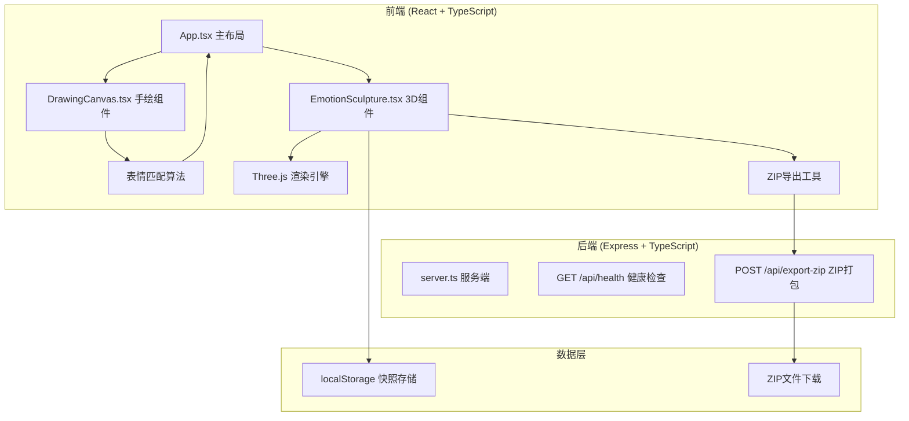
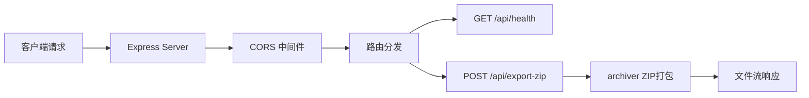
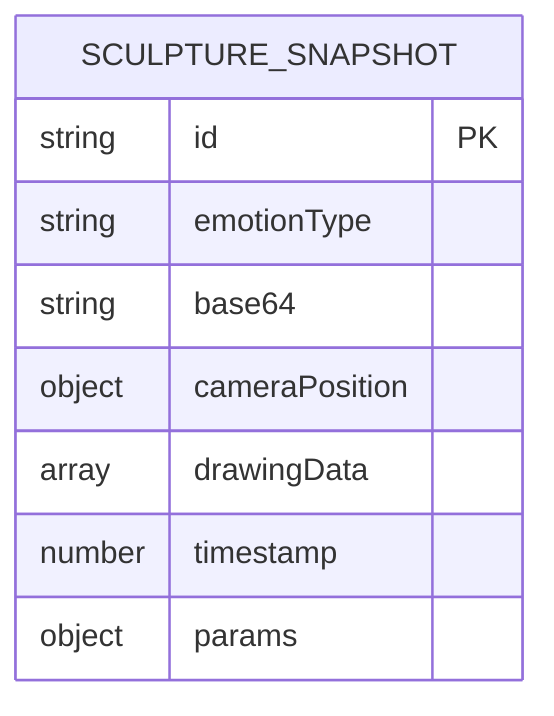

## 1. 架构设计


## 2. 技术描述
- **前端**：React@18 + TypeScript + Vite + Three.js + TailwindCSS@3 + Zustand
- **后端**：Express@4 + TypeScript + archiver（ZIP打包）
- **构建工具**：Vite@5，HMR热更新，端口3000代理到3001
- **状态管理**：Zustand 全局状态管理
- **3D渲染**：Three.js r160+，OrbitControls 视角控制
- **数据存储**：localStorage（最大50条历史记录）

## 3. 路由定义
| 路由 | 用途 |
|-------|---------|
| / | 主应用页面（手绘+3D展示） |
| /api/health | 健康检查接口 |
| /api/export-zip | ZIP导出接口 |

## 4. API 定义

### 4.1 类型定义
```typescript
interface SculptureSnapshot {
  id: string;
  emotionType: 'smile' | 'cry' | 'angry' | 'heart' | 'surprise';
  base64: string;
  cameraPosition: { x: number; y: number; z: number };
  drawingData: number[][];
  timestamp: number;
  params: {
    size: number;
    detailLevel: number;
    saturation: number;
  };
}

interface ExportZipRequest {
  snapshots: SculptureSnapshot[];
}

interface ExportZipResponse {
  success: boolean;
  downloadUrl?: string;
  error?: string;
}
```

### 4.2 API接口
- **GET /api/health**
  - 响应：`{ status: 'ok', timestamp: number }`

- **POST /api/export-zip**
  - 请求体：`{ snapshots: SculptureSnapshot[] }`
  - 响应：ZIP文件流（application/zip）

## 5. 服务端架构图


## 6. 数据模型

### 6.1 数据模型定义


### 6.2 数据结构说明
```typescript
// 表情类型枚举
type EmotionType = 'smile' | 'cry' | 'angry' | 'heart' | 'surprise';

// 绘制点数据
interface DrawPoint {
  x: number;
  y: number;
  pressure: number;
  timestamp: number;
}

// 雕塑参数
interface SculptureParams {
  size: number;           // 尺寸 0.5-2.0
  detailLevel: number;    // 细节层级 1-5
  saturation: number;     // 饱和度 0.5-1.0
}

// 快照数据（localStorage存储）
interface SculptureSnapshot {
  id: string;
  emotionType: EmotionType;
  base64: string;         // base64编码的PNG图片
  cameraPosition: { x: number; y: number; z: number };
  drawingData: DrawPoint[][];  // 原始绘制路径
  timestamp: number;
  params: SculptureParams;
}

// 全局应用状态
interface AppState {
  currentEmotion: EmotionType | null;
  currentParams: SculptureParams;
  snapshots: SculptureSnapshot[];
  selectedSnapshotId: string | null;
  isTransitioning: boolean;
}
```
