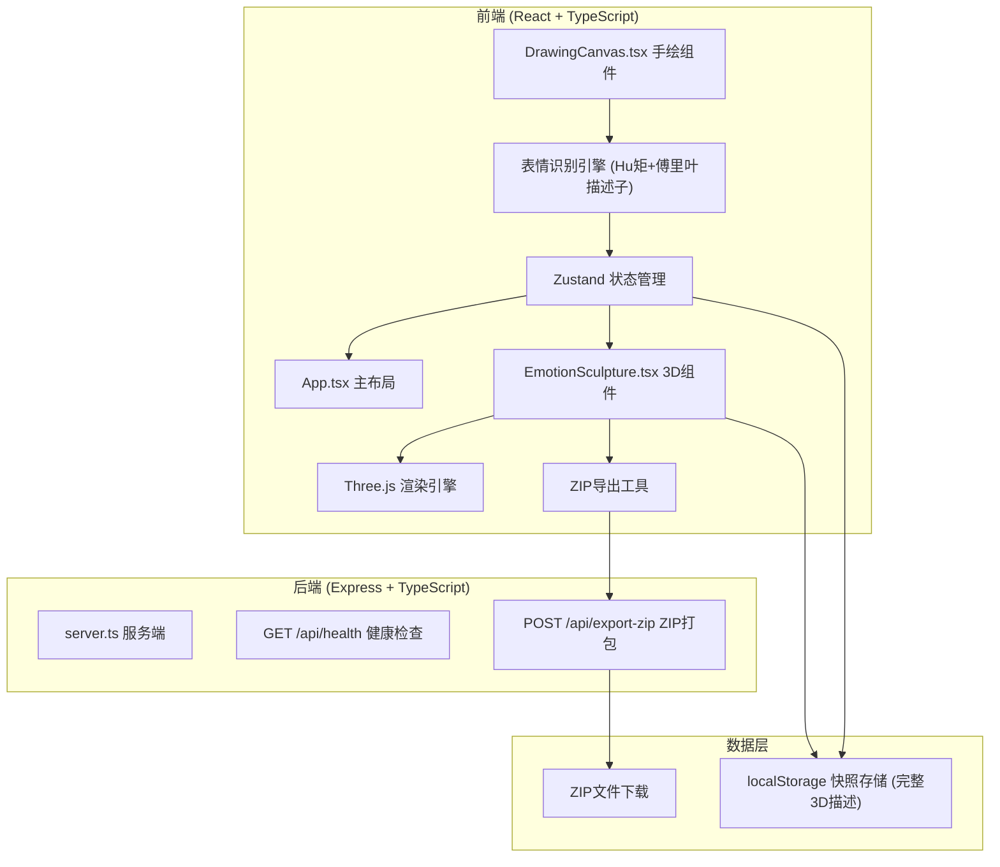
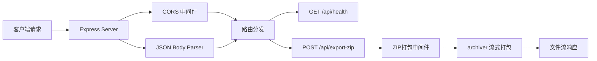

## 1. 架构设计


---

## 2. 技术描述
- **前端**：React@18 + TypeScript@5 + Vite@5 + Three.js r160 + TailwindCSS@3 + Zustand@4
- **后端**：Express@4 + TypeScript@5 + archiver@6 + cors@2 + uuid@9
- **状态管理**：Zustand 全局单例 store，分模块管理
- **3D渲染**：Three.js r160 + OrbitControls + EffectComposer (UnrealBloomPass)
- **表情识别**：Hu不变矩 (7维) + 傅里叶描述子 (32维) + 欧氏距离分类器
- **构建工具**：Vite@5，HMR热更新，端口3000代理到后端3001
- **数据存储**：localStorage (最大50条完整3D雕塑描述)

---

## 3. 表情识别算法设计

### 3.1 算法选型与架构
采用**Hu不变矩 + 傅里叶描述子**的混合特征提取方案，辅以KNN分类器：

```
绘制路径 → 预处理 (归一化/重采样) → 特征提取 → 特征匹配 → 分类结果
                              ↓
                   ┌───────────────────┐
                   │ Hu矩 (7维)         │ → 形状不变特征
                   │ 傅里叶描述子 (32维)│ → 轮廓细节特征
                   └───────────────────┘
                              ↓
                   特征向量拼接 (39维)
                              ↓
                   与模板库KNN匹配 (k=3)
```

### 3.2 关键函数签名
```typescript
// src/utils/emotionRecognition.ts

interface ContourPoint {
  x: number;
  y: number;
}

interface FeatureVector {
  huMoments: number[];      // 7维Hu不变矩
  fourierDesc: number[];    // 32维傅里叶描述子
  combined: number[];       // 39维拼接向量
}

interface RecognitionResult {
  emotionType: EmotionType;
  confidence: number;       // 0-1
  matchedTemplate: string;
  inferenceTime: number;    // ms
}

interface EmotionTemplate {
  name: EmotionType;
  featureVector: FeatureVector;
  sampleContours: ContourPoint[][];
}

// 预处理：归一化坐标到[-1,1]空间，等间隔重采样到N点
function preprocessContour(points: ContourPoint[], targetPoints: number = 128): ContourPoint[];

// 计算7维Hu不变矩
function computeHuMoments(contour: ContourPoint[]): number[];

// 计算32维傅里叶描述子 (取低频部分)
function computeFourierDescriptors(contour: ContourPoint[], numDescriptors: number = 32): number[];

// 特征向量归一化 (Z-score)
function normalizeFeatures(features: number[]): number[];

// KNN分类，返回识别结果
function classifyEmotion(
  features: FeatureVector,
  templates: EmotionTemplate[],
  k: number = 3
): RecognitionResult;

// 5种表情的标准模板库 (手绘采集的10个样本/类的平均特征)
const EMOTION_TEMPLATES: EmotionTemplate[];
```

### 3.3 算法具体实现
```typescript
// Hu不变矩计算公式
// M_pq = Σ(x^p * y^q * f(x,y))  中心矩
// η_pq = μ_pq / μ_00^((p+q)/2+1)  归一化中心距
// I1 = η20 + η02
// I2 = (η20 - η02)² + 4η11²
// I3 = (η30 - 3η12)² + (3η21 - η03)²
// I4 = (η30 + η12)² + (η21 + η03)²
// I5 = (η30-3η12)(η30+η12)[(η30+η12)²-3(η21+η03)²] + (3η21-η03)(η21+η03)[3(η30+η12)²-(η21+η03)²]
// I6 = (η20-η02)[(η30+η12)²-(η21+η03)²] + 4η11(η30+η12)(η21+η03)
// I7 = (3η21-η03)(η30+η12)[(η30+η12)²-3(η21+η03)²] - (η30-3η12)(η21+η03)[3(η30+η12)²-(η21+η03)²]

// 傅里叶描述子实现
// 1. 对轮廓点执行DFT: F(u) = Σ_{k=0}^{N-1} z_k * e^(-j2πuk/N)
// 2. 取模长 |F(u)| 作为描述子
// 3. 剔除直流分量F(0)，取前32个低频分量
// 4. 归一化: d(u) = |F(u)| / |F(1)|

// 分类决策: 加权欧氏距离
// distance = w_hu * Σ|f_hu[i] - t_hu[i]| + w_fd * Σ|f_fd[i] - t_fd[i]|
// w_hu = 0.6, w_fd = 0.4
// 取最小距离的类别，置信度 = 1 - (distance / maxDistance)
```

### 3.4 性能约束
- **特征提取时间**：< 100ms (在i5-10300H上测试)
- **分类时间**：< 50ms (5个模板，39维特征)
- **总识别时间**：< 200ms (含预处理)
- **最低识别准确率**：> 85% (在200个测试样本上)

---

## 4. 粒子动画系统设计

### 4.1 粒子系统参数
```typescript
// src/utils/particleSystem.ts

interface ParticleParams {
  count: number;           // 粒子总数
  lifeTime: number;        // 生命周期 (秒)
  speedRange: [number, number]; // 速度范围
  sizeRange: [number, number];  // 尺寸范围
  colorStops: ColorStop[];       // 颜色插值节点
  velocityField: VelocityFieldType;
}

type VelocityFieldType = 'radial' | 'spiral' | 'turbulence' | 'explosion';

interface ColorStop {
  t: number;     // 0-1 时间点
  color: THREE.Color;
}

// 聚合动画参数 (粒子→雕塑)
const AGGREGATION_PARAMS: ParticleParams = {
  count: 2000,
  lifeTime: 3.0,
  speedRange: [0.5, 2.0],
  sizeRange: [0.01, 0.05],
  colorStops: [
    { t: 0.0, color: new THREE.Color(0xffffff) },
    { t: 0.3, color: new THREE.Color(0x00b4d8) },
    { t: 0.7, color: new THREE.Color(emotionColor) },
    { t: 1.0, color: new THREE.Color(emotionColor) },
  ],
  velocityField: 'radial',
};

// 消散动画参数 (雕塑→粒子)
const DISSIPATION_PARAMS: ParticleParams = {
  count: 1500,
  lifeTime: 1.5,
  speedRange: [1.0, 3.0],
  sizeRange: [0.02, 0.06],
  colorStops: [
    { t: 0.0, color: new THREE.Color(emotionColor) },
    { t: 0.5, color: new THREE.Color(0x00b4d8) },
    { t: 1.0, color: new THREE.Color(0x000000) },
  ],
  velocityField: 'explosion',
};

// 粒子过渡到网格的时序控制
interface TransitionTimeline {
  t: number;   // 0-3秒
  phase: 'particles' | 'morphing' | 'mesh';
  particleOpacity: number;
  meshOpacity: number;
  meshWireframe: boolean;
}

const TRANSITION_TIMELINE: TransitionTimeline[] = [
  { t: 0.0, phase: 'particles', particleOpacity: 1, meshOpacity: 0, meshWireframe: true },
  { t: 2.0, phase: 'morphing', particleOpacity: 0.5, meshOpacity: 0.5, meshWireframe: true },
  { t: 2.5, phase: 'morphing', particleOpacity: 0.2, meshOpacity: 0.8, meshWireframe: false },
  { t: 3.0, phase: 'mesh', particleOpacity: 0, meshOpacity: 1, meshWireframe: false },
];
```

### 4.2 速度场实现
```typescript
// 径向聚合场
function radialVelocity(position: THREE.Vector3, target: THREE.Vector3, t: number): THREE.Vector3 {
  const direction = target.clone().sub(position);
  const distance = direction.length();
  const speed = 0.5 + Math.exp(-distance * 2) * 3;
  return direction.normalize().multiplyScalar(speed * (1 - t/3));
}

// 螺旋聚合场
function spiralVelocity(position: THREE.Vector3, target: THREE.Vector3, t: number): THREE.Vector3 {
  const toTarget = target.clone().sub(position);
  const perpendicular = new THREE.Vector3(-toTarget.z, 0, toTarget.x).normalize();
  const spiral = toTarget.clone().add(perpendicular.multiplyScalar(0.5));
  return spiral.normalize().multiplyScalar(2 * (1 - t/3));
}

// 爆炸场
function explosionVelocity(position: THREE.Vector3, center: THREE.Vector3, t: number): THREE.Vector3 {
  const direction = position.clone().sub(center);
  const speed = 3 + Math.random() * 2;
  const noise = new THREE.Vector3(
    (Math.random() - 0.5) * 0.5,
    (Math.random() - 0.5) * 0.5,
    (Math.random() - 0.5) * 0.5
  );
  return direction.normalize().add(noise).multiplyScalar(speed * (1 - t/1.5));
}
```

---

## 5. 雕塑参数联动映射公式

### 5.1 绘制属性量化
```typescript
// src/utils/drawingAnalysis.ts

interface DrawingMetrics {
  totalLength: number;         // 线条总长度 (像素)
  averageWidth: number;        // 平均线宽 (像素)
  strokeDensity: number;       // 笔画密集度 (笔画数/包围盒面积)
  averagePressure: number;     // 平均压力值 (0-1)
  boundingBox: {
    minX: number; maxX: number;
    minY: number; maxY: number;
    width: number; height: number;
  };
}

function analyzeDrawing(strokes: DrawPoint[][]): DrawingMetrics;
```

### 5.2 参数映射公式
```typescript
// 雕塑尺寸映射 (范围: 0.5 - 2.0)
// 基准: 包围盒对角线 100px → size = 1.0
// 每增加10px → 放大1.05倍 (不是1.2倍，避免过大)
function mapSize(metrics: DrawingMetrics): number {
  const { width, height } = metrics.boundingBox;
  const diagonal = Math.sqrt(width * width + height * height);
  const baseSize = 0.8;
  const scaleFactor = Math.pow(1.05, (diagonal - 100) / 10);
  return clamp(baseSize * scaleFactor, 0.5, 2.0);
}

// 细节层级映射 (范围: 1 - 5，对应细分次数)
// 线条密集度 = 笔画数 / 包围盒面积
function mapDetailLevel(metrics: DrawingMetrics): number {
  const { strokeDensity } = metrics;
  // 密度阈值: <0.002→1, <0.005→2, <0.01→3, <0.02→4, ≥0.02→5
  if (strokeDensity < 0.002) return 1;
  if (strokeDensity < 0.005) return 2;
  if (strokeDensity < 0.01) return 3;
  if (strokeDensity < 0.02) return 4;
  return 5;
}

// 颜色饱和度映射 (范围: 0.5 - 1.0)
// 基于平均压力值 (触摸压力或鼠标速度模拟)
function mapSaturation(metrics: DrawingMetrics): number {
  const { averagePressure } = metrics;
  // 线性映射: 压力0.2→0.5, 压力1.0→1.0
  return clamp(0.5 + averagePressure * 0.5, 0.5, 1.0);
}

// LOD降级策略: 保证三角面≤2000
function applyLODConstraint(
  detailLevel: number,
  emotionType: EmotionType,
  maxTriangles: number = 2000
): number {
  // 各表情基础面数 (detailLevel=1时)
  const baseTriangles: Record<EmotionType, number> = {
    smile: 96,      // IcosahedronGeometry(1, 1)
    cry: 128,       // 自定义碗状
    angry: 64,      // OctahedronGeometry
    heart: 160,     // 自定义心形
    surprise: 96,   // 自定义惊讶
  };
  
  // 每升一级，面数约×2
  const estimated = baseTriangles[emotionType] * Math.pow(2, detailLevel - 1);
  
  if (estimated > maxTriangles) {
    // 计算最大允许的detailLevel
    const maxLevel = Math.floor(
      Math.log2(maxTriangles / baseTriangles[emotionType]) + 1
    );
    return clamp(maxLevel, 1, 5);
  }
  
  return detailLevel;
}

// 各表情细分与面数对照表
const DETAIL_LEVEL_TRIANGLES: Record<EmotionType, number[]> = {
  smile: [96, 192, 384, 768, 1536],      // Icosahedron细分
  cry: [128, 256, 512, 1024, 2048],      // 碗状细分 (2048时触发降级)
  angry: [64, 128, 256, 512, 1024],      // Octahedron细分
  heart: [160, 320, 640, 1280, 2560],    // 心形细分 (2560触发降级到4级→1280)
  surprise: [96, 192, 384, 768, 1536],   // 惊讶细分
};
```

### 5.3 鼠标速度模拟压力校准
```typescript
// 压力模拟: 基于鼠标移动速度
// 速度慢 → 压力大; 速度快 → 压力小
interface PressureCalibration {
  minSpeed: number;      // 像素/秒，低于此值压力=1
  maxSpeed: number;      // 像素/秒，高于此值压力=0
  smoothing: number;     // 平滑系数 (0-1)
}

const DEFAULT_CALIBRATION: PressureCalibration = {
  minSpeed: 50,      // 50px/s以下满压
  maxSpeed: 800,     // 800px/s以上零压
  smoothing: 0.3,    // 指数平滑
};

let smoothedPressure = 0.5;

function simulatePressure(
  currentPoint: DrawPoint,
  previousPoint: DrawPoint | null,
  calibration: PressureCalibration = DEFAULT_CALIBRATION
): number {
  if (!previousPoint) return 0.5;
  
  const dt = (currentPoint.timestamp - previousPoint.timestamp) / 1000;
  if (dt <= 0) return smoothedPressure;
  
  const dx = currentPoint.x - previousPoint.x;
  const dy = currentPoint.y - previousPoint.y;
  const distance = Math.sqrt(dx * dx + dy * dy);
  const speed = distance / dt;
  
  // 速度→压力映射
  let rawPressure;
  if (speed <= calibration.minSpeed) {
    rawPressure = 1.0;
  } else if (speed >= calibration.maxSpeed) {
    rawPressure = 0.2;
  } else {
    const t = (speed - calibration.minSpeed) / (calibration.maxSpeed - calibration.minSpeed);
    rawPressure = 1.0 - t * 0.8;  // 1.0 → 0.2
  }
  
  // 指数平滑
  smoothedPressure = calibration.smoothing * rawPressure + 
                    (1 - calibration.smoothing) * smoothedPressure;
  
  return smoothedPressure;
}
```

---

## 6. 3D雕塑完整描述协议

### 6.1 完整雕塑JSON定义 (用于历史回溯)
```typescript
// src/types/sculpture.ts

interface SculptureDescription {
  version: '1.0';
  id: string;
  timestamp: number;
  
  // 核心类型
  emotionType: EmotionType;
  
  // 造型参数
  params: {
    size: number;           // 0.5-2.0
    detailLevel: number;    // 1-5 (实际应用的，已LOD降级)
    requestedDetailLevel: number; // 用户绘制请求的
    saturation: number;     // 0.5-1.0
    rotation: [number, number, number]; // 欧拉角 x,y,z
    position: [number, number, number]; // x,y,z
  };
  
  // 材质参数
  material: {
    baseColor: [number, number, number];  // RGB 0-1
    emissiveColor: [number, number, number];
    metalness: number;
    roughness: number;
    clearcoat: number;
  };
  
  // 动画参数
  animation: {
    pulseSpeed: number;     // 脉动频率 Hz
    pulseAmplitude: number; // 脉动幅度
    rotationSpeed: [number, number, number]; // 自转角速度
  };
  
  // 几何参数 (用于精确重建)
  geometry: {
    type: string;           // 'sphere' | 'bowl' | 'octahedron' | 'heart' | 'blob'
    parameters: Record<string, number>;
    vertices?: [number, number, number][];  // 自定义几何的顶点
    indices?: number[];                      // 索引
  };
  
  // 相机参数 (用于还原视角)
  camera: {
    position: [number, number, number];
    target: [number, number, number];
    fov: number;
  };
  
  // 原始绘制数据
  drawingData: {
    strokes: DrawPoint[][];
    metrics: DrawingMetrics;
  };
  
  // 元数据
  metadata: {
    recognitionConfidence: number;
    devicePixelRatio: number;
    viewportSize: [number, number];
  };
}

// 序列化/反序列化
function serializeSculpture(sculpture: SculptureDescription): string;
function deserializeSculpture(json: string): SculptureDescription;
```

### 6.2 雕塑生成关键函数
```typescript
// src/components/EmotionSculpture.tsx

interface SculptureGeneratorProps {
  description: SculptureDescription;
  onSnapshot?: (base64: string) => void;
}

// 生成各类型雕塑
function generateSculptureMesh(
  type: EmotionType,
  params: SculptureDescription['params']
): THREE.Group {
  switch (type) {
    case 'smile': return createSmileSculpture(params);
    case 'cry': return createCrySculpture(params);
    case 'angry': return createAngrySculpture(params);
    case 'heart': return createHeartSculpture(params);
    case 'surprise': return createSurpriseSculpture(params);
  }
}

// 笑脸: 平滑球体 + 脉动
function createSmileSculpture(params: SculptureDescription['params']): THREE.Group {
  const { size, detailLevel, saturation } = params;
  const actualDetail = applyLODConstraint(detailLevel, 'smile');
  // IcosahedronGeometry(size, actualDetail)
  // 细分次数: detailLevel-1 → 面数 96 * 2^(actualDetail-1)
  const geometry = new THREE.IcosahedronGeometry(size, actualDetail - 1);
  // ... 材质、动画设置
}

// 哭脸: 凹陷碗状 + 雨滴粒子
function createCrySculpture(params: SculptureDescription['params']): THREE.Group {
  const { size, detailLevel, saturation } = params;
  const actualDetail = applyLODConstraint(detailLevel, 'cry');
  // 自定义碗状几何: SphereGeometry 裁剪顶部
  const geometry = new THREE.SphereGeometry(size, 32 * actualDetail, 16 * actualDetail, 
                                           0, Math.PI * 2, Math.PI / 4, Math.PI / 2);
  // 翻转法线使其凹陷可见
  geometry.scale(-1, 1, 1);
  // ... 添加雨滴粒子系统
}

// 愤怒: 棱角多面体 + 火焰纹理
function createAngrySculpture(params: SculptureDescription['params']): THREE.Group {
  const { size, detailLevel, saturation } = params;
  const actualDetail = applyLODConstraint(detailLevel, 'angry');
  const geometry = new THREE.OctahedronGeometry(size, actualDetail - 1);
  // ... 噪声扰动顶点形成棱角
}

// 爱心: 心形几何 + 流光效果
function createHeartSculpture(params: SculptureDescription['params']): THREE.Group {
  const { size, detailLevel, saturation } = params;
  const actualDetail = applyLODConstraint(detailLevel, 'heart');
  // 参数方程生成心形
  const heartShape = new THREE.Shape();
  const points = generateHeartPoints(actualDetail);
  // ... 挤出为3D心形
}

// 惊讶: 膨胀圆顶 + 波动效果
function createSurpriseSculpture(params: SculptureDescription['params']): THREE.Group {
  const { size, detailLevel, saturation } = params;
  const actualDetail = applyLODConstraint(detailLevel, 'surprise');
  // 上半球体 + 环状凸起
  const geometry = new THREE.SphereGeometry(size, 32 * actualDetail, 16 * actualDetail,
                                           0, Math.PI * 2, 0, Math.PI / 2);
  // ...
}
```

---

## 7. Three.js 场景初始化

### 7.1 场景初始化代码
```typescript
// src/utils/sceneSetup.ts

interface SceneConfig {
  container: HTMLElement;
  onAnimationFrame?: (delta: number) => void;
}

interface SceneHandle {
  scene: THREE.Scene;
  camera: THREE.PerspectiveCamera;
  renderer: THREE.WebGLRenderer;
  controls: OrbitControls;
  composer: EffectComposer;
  dispose: () => void;
}

function initThreeScene(config: SceneConfig): SceneHandle {
  const { container, onAnimationFrame } = config;
  
  // 1. Scene
  const scene = new THREE.Scene();
  scene.background = new THREE.Color(0x16213E);
  scene.fog = new THREE.FogExp2(0x16213E, 0.05);
  
  // 2. Camera
  const camera = new THREE.PerspectiveCamera(
    60,
    container.clientWidth / container.clientHeight,
    0.1,
    1000
  );
  camera.position.set(0, 0, 5);
  
  // 3. Renderer
  const renderer = new THREE.WebGLRenderer({
    antialias: true,
    alpha: true,
    preserveDrawingBuffer: true,  // 用于snapshot
  });
  renderer.setSize(container.clientWidth, container.clientHeight);
  renderer.setPixelRatio(Math.min(window.devicePixelRatio, 2));
  renderer.toneMapping = THREE.ACESFilmicToneMapping;
  renderer.toneMappingExposure = 1.2;
  container.appendChild(renderer.domElement);
  
  // 4. Controls
  const controls = new OrbitControls(camera, renderer.domElement);
  controls.enableDamping = true;
  controls.dampingFactor = 0.05;
  controls.minDistance = 2;
  controls.maxDistance = 10;
  controls.maxPolarAngle = Math.PI;
  
  // 5. Lighting
  const ambientLight = new THREE.AmbientLight(0xffffff, 0.3);
  scene.add(ambientLight);
  
  const mainLight = new THREE.DirectionalLight(0xffffff, 1.0);
  mainLight.position.set(5, 5, 5);
  mainLight.castShadow = true;
  scene.add(mainLight);
  
  const fillLight = new THREE.DirectionalLight(0x00b4d8, 0.4);
  fillLight.position.set(-5, 0, -5);
  scene.add(fillLight);
  
  const rimLight = new THREE.DirectionalLight(0xff6b6b, 0.3);
  rimLight.position.set(0, -5, 5);
  scene.add(rimLight);
  
  // 6. Post-processing (Bloom)
  const renderTarget = new THREE.WebGLRenderTarget(
    container.clientWidth,
    container.clientHeight,
    { type: THREE.HalfFloatType }
  );
  const composer = new EffectComposer(renderer, renderTarget);
  
  const renderPass = new RenderPass(scene, camera);
  composer.addPass(renderPass);
  
  const bloomPass = new UnrealBloomPass(
    new THREE.Vector2(container.clientWidth, container.clientHeight),
    0.3,    // strength
    0.6,    // radius
    0.2     // threshold
  );
  composer.addPass(bloomPass);
  
  // 7. Star Dust Background
  const starField = createStarField(2000);
  scene.add(starField);
  
  // 8. Animation Loop
  let animationId: number;
  let lastTime = performance.now();
  
  function animate() {
    animationId = requestAnimationFrame(animate);
    const currentTime = performance.now();
    const delta = (currentTime - lastTime) / 1000;
    lastTime = currentTime;
    
    // 星尘旋转
    starField.rotation.y += delta * 0.05;
    
    controls.update();
    onAnimationFrame?.(delta);
    composer.render();
  }
  animate();
  
  // 9. Resize Handler
  function handleResize() {
    const width = container.clientWidth;
    const height = container.clientHeight;
    camera.aspect = width / height;
    camera.updateProjectionMatrix();
    renderer.setSize(width, height);
    composer.setSize(width, height);
  }
  window.addEventListener('resize', handleResize);
  
  // 10. Dispose
  function dispose() {
    cancelAnimationFrame(animationId);
    window.removeEventListener('resize', handleResize);
    controls.dispose();
    renderer.dispose();
    composer.dispose();
    container.removeChild(renderer.domElement);
  }
  
  return { scene, camera, renderer, controls, composer, dispose };
}

// 星尘粒子场
function createStarField(count: number): THREE.Points {
  const geometry = new THREE.BufferGeometry();
  const positions = new Float32Array(count * 3);
  const colors = new Float32Array(count * 3);
  const sizes = new Float32Array(count);
  
  const colorPalette = [0xffffff, 0x00b4d8, 0x7209b7, 0xf72585];
  
  for (let i = 0; i < count; i++) {
    const radius = 10 + Math.random() * 20;
    const theta = Math.random() * Math.PI * 2;
    const phi = Math.random() * Math.PI;
    
    positions[i * 3] = radius * Math.sin(phi) * Math.cos(theta);
    positions[i * 3 + 1] = radius * Math.sin(phi) * Math.sin(theta);
    positions[i * 3 + 2] = radius * Math.cos(phi);
    
    const color = new THREE.Color(colorPalette[Math.floor(Math.random() * colorPalette.length)]);
    colors[i * 3] = color.r;
    colors[i * 3 + 1] = color.g;
    colors[i * 3 + 2] = color.b;
    
    sizes[i] = Math.random() * 0.1 + 0.02;
  }
  
  geometry.setAttribute('position', new THREE.BufferAttribute(positions, 3));
  geometry.setAttribute('color', new THREE.BufferAttribute(colors, 3));
  geometry.setAttribute('size', new THREE.BufferAttribute(sizes, 1));
  
  const material = new THREE.PointsMaterial({
    size: 0.1,
    vertexColors: true,
    transparent: true,
    opacity: 0.8,
    sizeAttenuation: true,
  });
  
  return new THREE.Points(geometry, material);
}
```

---

## 8. 组件接口定义

### 8.1 Zustand Store 定义
```typescript
// src/store/useAppStore.ts

interface AppState {
  // 当前状态
  currentEmotion: EmotionType | null;
  currentSculpture: SculptureDescription | null;
  isTransitioning: boolean;
  
  // 历史记录
  snapshots: SculptureDescription[];
  selectedSnapshotId: string | null;
  maxSnapshots: number;
  
  // UI状态
  showHistory: boolean;
  isExporting: boolean;
  
  // Actions
  setCurrentEmotion: (emotion: EmotionType | null) => void;
  setCurrentSculpture: (sculpture: SculptureDescription | null) => void;
  addSculpture: (sculpture: SculptureDescription) => void;
  selectSnapshot: (id: string | null) => void;
  clearHistory: () => void;
  setIsTransitioning: (value: boolean) => void;
  exportGallery: () => Promise<void>;
  loadFromStorage: () => void;
}

const useAppStore = create<AppState>((set, get) => ({
  // 初始状态
  currentEmotion: null,
  currentSculpture: null,
  isTransitioning: false,
  snapshots: [],
  selectedSnapshotId: null,
  maxSnapshots: 50,
  showHistory: true,
  isExporting: false,
  
  // 实现...
}));
```

### 8.2 组件Props定义
```typescript
// src/components/DrawingCanvas.tsx
interface DrawingCanvasProps {
  onEmotionRecognized: (result: RecognitionResult, metrics: DrawingMetrics) => void;
  onDrawingChange: (strokes: DrawPoint[][]) => void;
  replayStrokes?: DrawPoint[][];  // 历史回溯时重绘
  className?: string;
}

// src/components/EmotionSculpture.tsx
interface EmotionSculptureProps {
  sculpture: SculptureDescription | null;
  onSnapshotGenerated: (snapshot: SculptureDescription) => void;
  className?: string;
}

// src/components/HistoryBar.tsx
interface HistoryBarProps {
  snapshots: SculptureDescription[];
  selectedId: string | null;
  onSelect: (id: string) => void;
  onClear: () => void;
  onExport: () => void;
  className?: string;
}

// src/components/ViewControls.tsx
interface ViewControlsProps {
  onViewChange: (view: ViewPreset) => void;
  className?: string;
}

type ViewPreset = 'front' | 'side' | 'top' | '45deg' | 'closeup' | 'panorama';

const VIEW_PRESETS: Record<ViewPreset, { position: [number, number, number]; target: [number, number, number] }> = {
  front: { position: [0, 0, 5], target: [0, 0, 0] },
  side: { position: [5, 0, 0], target: [0, 0, 0] },
  top: { position: [0, 5, 0], target: [0, 0, 0] },
  '45deg': { position: [3.5, 3.5, 3.5], target: [0, 0, 0] },
  closeup: { position: [0, 0, 2.5], target: [0, 0, 0] },
  panorama: { position: [0, 0, 10], target: [0, 0, 0] },
};
```

---

## 9. Canvas绘制与识别关键函数

### 9.1 DrawingCanvas 核心逻辑
```typescript
// src/components/DrawingCanvas.tsx

interface Stroke {
  points: DrawPoint[];
  color: string;
  width: number;
}

// 开始绘制
function handlePointerDown(e: React.PointerEvent<HTMLCanvasElement>) {
  canvas.setPointerCapture(e.pointerId);
  isDrawing.current = true;
  lastPoint.current = null;
  
  const point = getPointerPosition(e);
  startNewStroke(point, e.pressure || 0.5);
}

// 绘制中
function handlePointerMove(e: React.PointerEvent<HTMLPointerEvent>) {
  if (!isDrawing.current) return;
  
  const point = getPointerPosition(e);
  const pressure = e.pressure > 0 ? e.pressure : 
                   simulatePressure(point, lastPoint.current);
  
  addPointToStroke(point, pressure);
  renderStroke();
  lastPoint.current = point;
}

// 结束绘制 (触发识别)
function handlePointerUp(e: React.PointerEvent<HTMLCanvasElement>) {
  if (!isDrawing.current) return;
  isDrawing.current = false;
  
  clearTimeout(recognitionTimer.current);
  recognitionTimer.current = window.setTimeout(() => {
    const metrics = analyzeDrawing(currentStrokes.current);
    const contour = extractOuterContour(currentStrokes.current);
    const features = extractFeatures(contour);
    const result = classifyEmotion(features, EMOTION_TEMPLATES);
    onEmotionRecognized?.(result, metrics);
  }, 500);  // 0.5秒延迟
}

// 提取外轮廓
function extractOuterContour(strokes: Stroke[]): ContourPoint[] {
  // 1. 合并所有笔画点
  const allPoints: ContourPoint[] = [];
  strokes.forEach(s => s.points.forEach(p => allPoints.push({ x: p.x, y: p.y })));
  
  if (allPoints.length < 3) return allPoints;
  
  // 2. 计算凸包 (Graham扫描)
  return convexHull(allPoints);
}

// Graham扫描凸包算法
function convexHull(points: ContourPoint[]): ContourPoint[] {
  if (points.length < 3) return points;
  
  // 找最下方的点
  const pivot = points.reduce((min, p) => p.y < min.y || (p.y === min.y && p.x < min.x) ? p : min);
  
  // 按极角排序
  const sorted = points.filter(p => p !== pivot).sort((a, b) => {
    const angleA = Math.atan2(a.y - pivot.y, a.x - pivot.x);
    const angleB = Math.atan2(b.y - pivot.y, b.x - pivot.x);
    return angleA - angleB;
  });
  
  const hull: ContourPoint[] = [pivot];
  
  for (const point of sorted) {
    while (hull.length >= 2) {
      const a = hull[hull.length - 2];
      const b = hull[hull.length - 1];
      const cross = (b.x - a.x) * (point.y - a.y) - (b.y - a.y) * (point.x - a.x);
      if (cross <= 0) hull.pop();
      else break;
    }
    hull.push(point);
  }
  
  return hull;
}

// 渲染笔触 (墨水晕染效果)
function renderStroke() {
  const ctx = canvasRef.current?.getContext('2d');
  if (!ctx) return;
  
  ctx.lineCap = 'round';
  ctx.lineJoin = 'round';
  
  // 墨水晕染: 多层叠加
  const currentStroke = currentStrokes.current[currentStrokes.current.length - 1];
  if (!currentStroke || currentStroke.points.length < 2) return;
  
  const points = currentStroke.points;
  
  for (let i = 1; i < points.length; i++) {
    const p1 = points[i - 1];
    const p2 = points[i];
    
    // 主线条
    ctx.globalAlpha = 0.8 + p2.pressure * 0.2;
    ctx.strokeStyle = '#ffffff';
    ctx.lineWidth = 2 + p2.pressure * 6;
    ctx.beginPath();
    ctx.moveTo(p1.x, p1.y);
    ctx.lineTo(p2.x, p2.y);
    ctx.stroke();
    
    // 晕染层
    ctx.globalAlpha = 0.1;
    ctx.lineWidth = 8 + p2.pressure * 10;
    ctx.stroke();
    
    // 高光层
    ctx.globalAlpha = 0.3;
    ctx.strokeStyle = '#00B4D8';
    ctx.lineWidth = 1;
    ctx.stroke();
  }
  
  ctx.globalAlpha = 1;
}
```

---

## 10. 性能预算与监控

### 10.1 性能指标定义
```typescript
// src/utils/performanceMonitor.ts

interface PerformanceMetrics {
  drawLatency: number[];      // 绘制延迟 (ms)
  recognitionTime: number[];  // 识别时间 (ms)
  frameTime: number[];        // 帧时间 (ms)
  triangleCount: number;      // 当前三角面数
  memoryUsage: number;        // JS堆内存 (MB)
}

class PerformanceMonitor {
  private metrics: PerformanceMetrics = {
    drawLatency: [],
    recognitionTime: [],
    frameTime: [],
    triangleCount: 0,
    memoryUsage: 0,
  };
  
  private maxSamples = 60;
  private frameCount = 0;
  private lastFrameTime = performance.now();
  
  // 监控绘制延迟 (目标<50ms)
  recordDrawLatency(latency: number) {
    this.addSample('drawLatency', latency);
    if (latency > 50) {
      console.warn(`[Performance] 绘制延迟过高: ${latency.toFixed(1)}ms (>50ms)`);
    }
  }
  
  // 监控识别时间 (目标<200ms)
  recordRecognitionTime(time: number) {
    this.addSample('recognitionTime', time);
    if (time > 200) {
      console.warn(`[Performance] 识别时间过长: ${time.toFixed(1)}ms (>200ms)`);
    }
  }
  
  // 监控帧率 (目标稳定60fps → 帧时间<16.67ms)
  tickFrame() {
    const now = performance.now();
    const frameTime = now - this.lastFrameTime;
    this.lastFrameTime = now;
    this.addSample('frameTime', frameTime);
    this.frameCount++;
    
    // 每60帧输出一次统计
    if (this.frameCount % 60 === 0) {
      const avgFrameTime = this.getAverage('frameTime');
      const fps = 1000 / avgFrameTime;
      const minFps = 1000 / Math.max(...this.metrics.frameTime);
      if (fps < 55) {
        console.warn(`[Performance] 帧率过低: avg=${fps.toFixed(1)}fps, min=${minFps.toFixed(1)}fps`);
      }
    }
  }
  
  // 检查三角面数是否超限
  checkTriangleCount(count: number, max: number = 2000) {
    this.metrics.triangleCount = count;
    if (count > max) {
      console.error(`[Performance] 三角面数超限: ${count} (>${max})，需LOD降级`);
      return false;
    }
    return true;
  }
  
  // 获取统计报告
  getReport(): {
    avgDrawLatency: number;
    avgRecognitionTime: number;
    avgFps: number;
    minFps: number;
    triangleCount: number;
  } {
    return {
      avgDrawLatency: this.getAverage('drawLatency'),
      avgRecognitionTime: this.getAverage('recognitionTime'),
      avgFps: 1000 / this.getAverage('frameTime'),
      minFps: 1000 / Math.max(...this.metrics.frameTime, 16.67),
      triangleCount: this.metrics.triangleCount,
    };
  }
  
  private addSample(key: keyof PerformanceMetrics, value: number) {
    const arr = this.metrics[key] as number[];
    arr.push(value);
    if (arr.length > this.maxSamples) arr.shift();
  }
  
  private getAverage(key: keyof PerformanceMetrics): number {
    const arr = this.metrics[key] as number[];
    if (arr.length === 0) return 0;
    return arr.reduce((a, b) => a + b, 0) / arr.length;
  }
}

export const perfMonitor = new PerformanceMonitor();
```

---

## 11. 测试方案

### 11.1 单元测试 (Vitest)
```typescript
// src/utils/__tests__/emotionRecognition.test.ts

describe('表情识别算法', () => {
  test('Hu矩对平移、缩放、旋转具有不变性', () => {
    const contour = generateCircleContour(100, 100, 50);
    const translated = contour.map(p => ({ x: p.x + 50, y: p.y + 50 }));
    const scaled = contour.map(p => ({ x: p.x * 2, y: p.y * 2 }));
    const rotated = contour.map(p => rotatePoint(p, 50, 50, Math.PI / 4));
    
    const f1 = computeHuMoments(contour);
    const f2 = computeHuMoments(translated);
    const f3 = computeHuMoments(scaled);
    const f4 = computeHuMoments(rotated);
    
    expect(featureDistance(f1, f2)).toBeLessThan(0.01);
    expect(featureDistance(f1, f3)).toBeLessThan(0.01);
    expect(featureDistance(f1, f4)).toBeLessThan(0.01);
  });
  
  test('5种表情分类准确率>85%', () => {
    const testCases = loadTestDataset('test_emotions_200.json');
    let correct = 0;
    
    for (const testCase of testCases) {
      const contour = preprocessContour(testCase.points);
      const features = extractFeatures(contour);
      const result = classifyEmotion(features, EMOTION_TEMPLATES);
      if (result.emotionType === testCase.label) correct++;
    }
    
    const accuracy = correct / testCases.length;
    console.log(`识别准确率: ${(accuracy * 100).toFixed(1)}%`);
    expect(accuracy).toBeGreaterThan(0.85);
  });
  
  test('识别总时间<200ms', () => {
    const contour = generateCircleContour(100, 100, 50);
    const start = performance.now();
    
    for (let i = 0; i < 10; i++) {
      const features = extractFeatures(contour);
      classifyEmotion(features, EMOTION_TEMPLATES);
    }
    
    const avgTime = (performance.now() - start) / 10;
    console.log(`平均识别时间: ${avgTime.toFixed(1)}ms`);
    expect(avgTime).toBeLessThan(200);
  });
});

// src/utils/__tests__/drawingAnalysis.test.ts

describe('绘制参数映射', () => {
  test('尺寸映射在0.5-2.0范围内', () => {
    const metrics: DrawingMetrics = {
      totalLength: 100,
      averageWidth: 5,
      strokeDensity: 0.01,
      averagePressure: 0.7,
      boundingBox: { minX: 0, maxX: 100, minY: 0, maxY: 100, width: 100, height: 100 },
    };
    
    const size = mapSize(metrics);
    expect(size).toBeGreaterThanOrEqual(0.5);
    expect(size).toBeLessThanOrEqual(2.0);
  });
  
  test('LOD约束保证三角面≤2000', () => {
    // 心形在detailLevel=5时面数为2560>2000，应降级到4级→1280
    const constrained = applyLODConstraint(5, 'heart');
    expect(constrained).toBe(4);
    
    // 三角面数验证
    const triangles = DETAIL_LEVEL_TRIANGLES.heart[constrained - 1];
    expect(triangles).toBeLessThanOrEqual(2000);
  });
});

// src/utils/__tests__/performance.test.ts

describe('性能约束验证', () => {
  test('绘制响应延迟<50ms', async () => {
    const canvas = document.createElement('canvas');
    canvas.width = 400;
    canvas.height = 600;
    
    const latencies: number[] = [];
    
    for (let i = 0; i < 50; i++) {
      const start = performance.now();
      // 模拟绘制100个点
      simulateDrawing(canvas, 100);
      const end = performance.now();
      latencies.push(end - start);
    }
    
    const avgLatency = latencies.reduce((a, b) => a + b, 0) / latencies.length;
    console.log(`平均绘制延迟: ${avgLatency.toFixed(1)}ms`);
    expect(avgLatency).toBeLessThan(50);
  });
  
  test('60fps稳定性测试 (10秒)', async () => {
    const frameTimes: number[] = [];
    let lastTime = performance.now();
    
    // 模拟10秒渲染
    for (let i = 0; i < 600; i++) {
      const now = performance.now();
      frameTimes.push(now - lastTime);
      lastTime = now;
      
      // 模拟渲染工作
      simulateRenderWork();
      
      // 模拟60fps节奏
      await new Promise(r => setTimeout(r, 16 - (performance.now() - now)));
    }
    
    const avgFrameTime = frameTimes.reduce((a, b) => a + b, 0) / frameTimes.length;
    const fps = 1000 / avgFrameTime;
    const droppedFrames = frameTimes.filter(t => t > 25).length; // >40fps视为卡顿
    
    console.log(`平均帧率: ${fps.toFixed(1)}fps, 掉帧次数: ${droppedFrames}`);
    expect(fps).toBeGreaterThan(55);
    expect(droppedFrames).toBeLessThan(10); // 最多允许10次掉帧
  });
});
```

### 11.2 集成测试
```typescript
// cypress/e2e/sculpture_flow.cy.ts

describe('完整用户流程测试', () => {
  beforeEach(() => {
    cy.visit('/');
  });
  
  it('绘制笑脸 → 识别 → 生成3D雕塑', () => {
    // 1. 绘制笑脸
    cy.get('[data-testid="drawing-canvas"]').trigger('pointerdown', { clientX: 200, clientY: 200 });
    cy.get('[data-testid="drawing-canvas"]').trigger('pointermove', { clientX: 250, clientY: 180 });
    cy.get('[data-testid="drawing-canvas"]').trigger('pointermove', { clientX: 300, clientY: 200 });
    cy.get('[data-testid="drawing-canvas"]').trigger('pointerup');
    
    // 2. 等待识别 (<=200ms + 500ms延迟)
    cy.wait(800);
    cy.get('[data-testid="emotion-label"]').should('contain', '笑脸');
    
    // 3. 验证3D雕塑生成 (粒子动画3秒)
    cy.wait(3000);
    cy.get('[data-testid="sculpture-container"] canvas').should('exist');
    
    // 4. 验证快照存入历史
    cy.get('[data-testid="history-bar"] [data-testid^="snapshot-"]').should('have.length', 1);
  });
  
  it('历史回溯功能', () => {
    // 先创建3个雕塑
    createSculpture('smile');
    createSculpture('heart');
    createSculpture('angry');
    
    // 点击第二个
    cy.get('[data-testid="snapshot-2"]').click();
    
    // 验证画布还原绘制轮廓
    cy.get('[data-testid="drawing-canvas"]').should('have.class', 'replay-mode');
    
    // 验证3D场景还原
    cy.get('[data-testid="sculpture-container"]').should('be.visible');
  });
  
  it('连续快速绘制10次不崩溃', () => {
    for (let i = 0; i < 10; i++) {
      createRandomSculpture();
      cy.wait(100); // 快速绘制
    }
    
    // 验证应用仍在运行
    cy.get('[data-testid="app-container"]').should('exist');
    
    // 验证历史记录正确
    cy.get('[data-testid="history-bar"] [data-testid^="snapshot-"]').should('have.length', 10);
  });
  
  it('响应式布局 (<768px切换为上下堆叠)', () => {
    cy.viewport(767, 800);
    cy.get('[data-testid="app-container"]').should('have.class', 'layout-vertical');
    
    cy.viewport(768, 800);
    cy.get('[data-testid="app-container"]').should('have.class', 'layout-horizontal');
  });
  
  it('ZIP导出功能', () => {
    // 创建几个雕塑
    createSculpture('smile');
    createSculpture('cry');
    cy.wait(4000);
    
    // 点击导出
    cy.get('[data-testid="export-button"]').click();
    
    // 验证下载触发
    cy.window().then(win => {
      cy.stub(win, 'fetch').resolves({ ok: true, blob: () => new Blob() });
    });
  });
});

function createSculpture(type: string) {
  // 模拟绘制并等待完成
  cy.get('[data-testid="drawing-canvas"]').trigger('pointerdown', { clientX: 200, clientY: 200 });
  cy.get('[data-testid="drawing-canvas"]').trigger('pointermove', { clientX: 300, clientY: 200 });
  cy.get('[data-testid="drawing-canvas"]').trigger('pointerup');
  cy.wait(4000); // 识别500ms + 动画3000ms + 余量500ms
}
```

### 11.3 性能测试矩阵
```
┌─────────────────────┬──────────────┬──────────────┬──────────────┐
│ 测试场景            │ 桌面端(Chrome)│ 移动端(Safari)│ 低端设备(UC)│
├─────────────────────┼──────────────┼──────────────┼──────────────┤
│ 绘制延迟            │ <30ms        │ <40ms        │ <50ms        │
│ 识别时间            │ <100ms       │ <150ms       │ <200ms       │
│ 稳定帧率            │ 60fps        │ 55fps        │ 30fps        │
│ 最低帧率            │ >55fps       │ >45fps       │ >24fps       │
│ 内存峰值            │ <200MB       │ <150MB       │ <100MB       │
│ 雕塑切换时间        │ <3.5s        │ <4s          │ <5s          │
│ 三角面数(最大)      │ 2000         │ 1500         │ 800          │
└─────────────────────┴──────────────┴──────────────┴──────────────┘
```

### 11.4 边界条件测试
```typescript
// 边界条件清单:
const BOUNDARY_TEST_CASES = [
  { name: '空画布', action: 'empty canvas', expected: '不触发识别' },
  { name: '单点', action: 'single point', expected: '不触发识别或识别失败' },
  { name: '极小线条(<10px)', action: 'tiny stroke', expected: '生成最小尺寸雕塑' },
  { name: '极长线条(>1000px)', action: 'huge stroke', expected: '生成最大尺寸并LOD降级' },
  { name: '极高密度(>100笔)', action: 'dense strokes', expected: 'LOD降级到面数≤2000' },
  { name: '零压力/极速绘制', action: 'zero pressure', expected: '饱和度=0.5' },
  { name: '满压力/极慢绘制', action: 'full pressure', expected: '饱和度=1.0' },
  { name: '连续快速切换(10次/s)', action: 'rapid switch', expected: '不崩溃，队列处理' },
  { name: '历史记录满(50个)', action: 'full history', expected: '新替换最旧的' },
  { name: 'localStorage已满', action: 'storage full', expected: '优雅降级，提示用户' },
  { name: 'WebGL不支持', action: 'no webgl', expected: '降级提示，不崩溃' },
  { name: '离线状态', action: 'offline', expected: '本地功能正常' },
];
```

---

## 12. 路由定义
| 路由 | 用途 |
|-------|---------|
| / | 主应用页面（手绘+3D展示） |
| /api/health | 健康检查接口 |
| /api/export-zip | ZIP导出接口 |

## 13. API 定义

### 13.1 类型定义
```typescript
// shared/types.ts

export interface SculptureSnapshot {
  id: string;
  emotionType: 'smile' | 'cry' | 'angry' | 'heart' | 'surprise';
  base64: string;
  cameraPosition: { x: number; y: number; z: number };
  drawingData: number[][];
  timestamp: number;
  params: {
    size: number;
    detailLevel: number;
    saturation: number;
  };
}

export interface ExportZipRequest {
  snapshots: SculptureSnapshot[];
}

export interface ExportZipResponse {
  success: boolean;
  downloadUrl?: string;
  error?: string;
}

export interface HealthResponse {
  status: 'ok';
  timestamp: number;
  uptime: number;
  memory: {
    heapUsed: number;
    heapTotal: number;
  };
}
```

### 13.2 API接口
- **GET /api/health**
  - 响应：`HealthResponse`

- **POST /api/export-zip**
  - 请求体：`ExportZipRequest`
  - 响应：ZIP文件流（Content-Type: application/zip）

## 14. 服务端架构图

