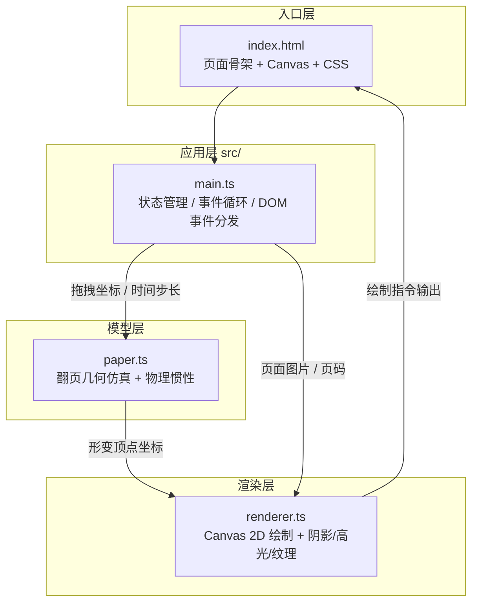

## 1. 架构设计



**数据流向**：
1. DOM 事件（mouse/touch/resize） → `main.ts` 捕获并归一化
2. `main.ts` 将位置、速度、时间步长传入 `paper.ts` 的翻页模型
3. `paper.ts` 输出页面四角顶点的实时坐标（含贝塞尔弯曲控制点）
4. `renderer.ts` 接收坐标 + 当前页/背面页图片，合成最终帧绘制到 Canvas
5. `requestAnimationFrame` 循环由 `main.ts` 驱动

## 2. 技术说明

| 层 | 技术选型 | 说明 |
|----|----------|------|
| 构建工具 | Vite 5.x | HMR 热更新，原生 ESM |
| 语言 | TypeScript 5.x | strict 模式，target ES2020 |
| 渲染 | Canvas 2D API | 直接操作像素与路径，性能可控 |
| 样式 | 原生 CSS | 背景渐变、加载动画、缩略图导航样式 |
| 物理模拟 | 自研轻量模型 | 贝塞尔曲线几何 + 线性衰减惯性 + 0.3 弹性系数 |

**核心依赖**（仅用户指定）：
- `typescript`
- `vite`

## 3. 文件结构

```
auto69/
├── index.html              # 入口：深黑渐变背景 + Canvas + CSS 样式内嵌
├── package.json            # 依赖与脚本（npm run dev）
├── vite.config.js          # Vite 基础配置（HMR 开启）
├── tsconfig.json           # strict + target ES2020
└── src/
    ├── main.ts             # 应用入口：状态机、事件监听、RAF 循环
    ├── paper.ts            # 翻页模型：几何形变、惯性、回弹物理
    └── renderer.ts         # 渲染：形变路径、阴影、折痕高光、纸纹理
```

**模块调用关系**：
- `main.ts` → 引入 `paper.ts`（创建 `PageFlipper` 实例）
- `main.ts` → 引入 `renderer.ts`（创建 `CanvasRenderer` 实例）
- `paper.ts` → 纯函数/类，无外部依赖，输出 `DeformedPage` 坐标结构
- `renderer.ts` → 仅依赖 Canvas 2D API + 传入的图片与坐标

## 4. 核心数据结构

```ts
// paper.ts 输出结构
interface DeformedPage {
  // 四角在画布上的坐标
  topLeft: Point;
  topRight: Point;
  bottomLeft: Point;
  bottomRight: Point;
  // 弯折贝塞尔曲线控制点
  foldControl: Point;
  foldStart: Point;
  foldEnd: Point;
  // 当前翻页进度 0..1 (0=未翻, 1=翻完)
  progress: number;
  // 当前翻页方向 'next' | 'prev'
  direction: 'next' | 'prev';
}

// main.ts 内部画廊状态
interface GalleryState {
  images: HTMLImageElement[];
  currentPage: number;
  isDragging: boolean;
  isFlipping: boolean;
  angularVelocity: number;
}
```

## 5. 性能策略

- **图片预缩放**：加载后按画布尺寸生成离屏缓存 Canvas，避免每帧缩放
- **RAF 节流**：统一由单一 `requestAnimationFrame` 驱动模型更新 + 渲染
- **缩略图懒生成**：上传图片后异步生成 60x60 缩略图存入 `WeakMap`
- **脏矩形**（可选）：仅重绘翻页涉及的区域，静态页跳过 Canvas 绘制
