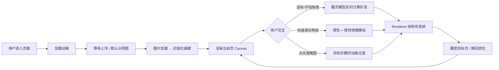

## 1. 产品概述

「纸页画廊」是一款面向自由插画师的数字画册浏览应用，通过模拟实体画册的翻页体验，让访问者以鼠标拖拽或手指滑动的方式浏览数字画作。

- **目标用户**：自由插画师、数字艺术家、个人作品集访客
- **核心价值**：以极具沉浸感的纸质翻页动画提升作品展示品质，复刻翻阅实体画册的仪式感

## 2. 核心功能

### 2.1 功能模块

1. **画廊画布区域**：主视窗，承载翻页动画绘制、页码显示、翻页提示箭头
2. **图片加载模块**：支持点击上传 / 拖拽上传，自动排列为画册页面
3. **翻页物理引擎**：贝塞尔曲线几何形变、惯性滑动、弹性回弹
4. **缩略图导航条**：底部缩略图列表，悬停放大、点击跳转

### 2.2 页面详情

| 页面名称 | 模块名称 | 功能描述 |
|----------|----------|----------|
| 主页面 | 加载动画 | 深黑渐变背景 + 居中加载指示器 |
| 主页面 | Canvas 画布 | 绘制纸张翻页动画、阴影、折痕高光、页码 |
| 主页面 | 翻页提示箭头 | 左右两侧半透明箭头，hover 渐显 |
| 主页面 | 缩略图导航条 | 底部 60x60px 缩略图，悬停放大 1.2 倍，点击跳转 |
| 主页面 | 图片上传入口 | 拖拽热区 + 点击上传按钮 |

## 3. 核心流程

## 4. 用户界面设计

### 4.1 设计风格

- **主题色**：深黑径向渐变背景 `#0A0A0A → #1C1C1C`，页面纯白 `#FFFFFF`
- **点缀色**：折痕高光渐变 `橙黄 → 暗橙`
- **字体**：浅灰色无衬线字体，页码透明度 0.6
- **动效**：全部交互使用 `ease-out` 0.25s 缓动，箭头渐隐渐显 0.3s
- **纹理**：纸页使用 `filter: contrast(1.2)` + 噪点遮罩模拟纸纤维

### 4.2 页面设计概览

| 页面名称 | 模块名称 | UI 元素 |
|----------|----------|---------|
| 主页面 | 背景层 | 径向渐变深黑色，居中加载旋转器 |
| 主页面 | 画布层 | 居中纸张，带纸纤维纹理，四角圆角，翻折处橙黄高光 |
| 主页面 | 交互层 | 左右翻页箭头（hover 0→0.4），拖拽热区覆盖整张画布 |
| 主页面 | 导航层 | 底部缩略图横向滚动条，60x60px，悬停 1.2 倍放大 |
| 主页面 | 页码 | 右下角浅灰色 `页码 / 总页数`，透明度 0.6 |

### 4.3 响应式与触控

- 桌面端：鼠标拖拽翻页，点击缩略图跳转
- 移动端：Touch 事件模拟手指滑动，画布自适应屏幕尺寸
- 性能目标：翻页 ≥ 30FPS，缩略图响应 < 100ms
