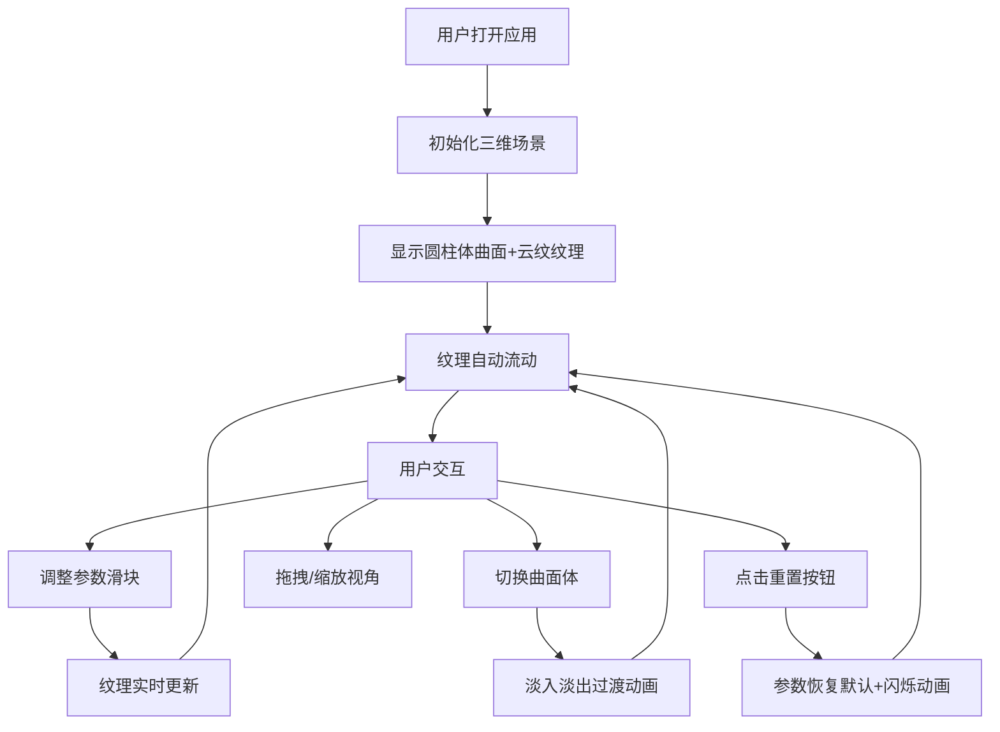

## 1. 产品概述

「云纹织机」是一款基于浏览器的交互式三维可视化工具，让数据艺术家和创意设计师通过调整参数实时生成具有中国传统云纹图案的动态织锦，观察纹理在三维曲面上的流动与变形。

- 核心价值：将传统云纹艺术与现代三维可视化技术结合，提供直观的参数化创作体验
- 目标用户：数字艺术家、设计师、创意编程爱好者
- 产品定位：轻量级、高性能的浏览器端三维纹理生成工具

## 2. 核心功能

### 2.1 功能模块

1. **三维曲面展示**：圆柱体、球体、环形结三种曲面体，云纹纹理在表面流动
2. **参数控制面板**：旋度、密度、色彩偏移、流动速度四个核心参数滑块
3. **曲面体切换**：三种几何形态切换，带淡入淡出过渡动画
4. **视角交互**：鼠标拖拽旋转、滚轮缩放、阻尼平滑效果
5. **重置功能**：一键恢复默认参数，带闪烁动画效果

### 2.2 页面详情

| 页面名称 | 模块名称 | 功能描述 |
|----------|----------|----------|
| 主页面 | 三维场景 | 深空背景，漂浮的曲面体，动态云纹纹理流动 |
| 主页面 | 参数面板 | 左侧固定面板，四个参数滑块，数值实时显示 |
| 主页面 | 曲面切换 | 三个切换按钮，带过渡动画 |
| 主页面 | 重置按钮 | 顶部重置按钮，恢复默认参数 |

## 3. 核心流程

用户打开应用 → 看到深空背景中的圆柱体曲面，云纹纹理在表面流动 →
通过左侧面板调整参数（旋度/密度/色彩偏移/流动速度）→ 纹理实时更新 →
点击曲面切换按钮 → 曲面体淡入淡出切换 →
鼠标拖拽旋转视角/滚轮缩放 → 点击重置按钮 → 所有参数恢复默认

## 4. 用户界面设计

### 4.1 设计风格

- **主色调**：深紫色系（#1A1A2E 背景，#6C63FF 主色，#FF6584 强调色）
- **辅色调**：金色发光（#FFD700 文字发光效果）
- **按钮风格**：圆角矩形（8px），正常态#6C63FF、悬浮态#8B7FFF、点击态#5A52D5
- **滑块风格**：轨道高4px圆角，渐变从#2D2D44到#4A4A6E，滑块按钮直径16px圆形，颜色随参数值动态从#6C63FF渐变到#FF6584
- **字体**：思源宋体（标题），无衬线字体（正文）
- **布局风格**：左侧固定面板 + 全屏Canvas场景
- **整体风格**：神秘、优雅、东方美学与科技感结合

### 4.2 页面设计概述

| 页面名称 | 模块名称 | UI元素 |
|----------|----------|--------|
| 主页面 | 三维场景 | 深空背景，星点粒子，曲面体，动态纹理流动 |
| 主页面 | 参数面板 | 深灰半透明背景，圆角8px，标题发光效果，分隔线，滑块组，按钮组 |
| 主页面 | 响应式布局 | 桌面端左侧面板，移动端顶部折叠工具栏 |

### 4.3 响应式

- 桌面端（≥768px）：左侧固定参数面板（宽度280px），右侧全屏三维场景
- 移动端（<768px）：顶部工具栏（高度60px），点击展开参数面板，曲面体自适应视口大小

### 4.4 3D场景指引

- **环境**：深空背景，散布星点粒子，营造宇宙空间氛围
- **光照**：环境光 + 两盏方向光，突出曲面体积感和纹理细节
- **相机**：PerspectiveCamera，初始距离约8，视场角60度
- **视角控制**：OrbitControls，阻尼系数0.1，缩放范围1-10
- **动画**：纹理沿曲面流动（0.05弧度/帧），曲面体轻微漂浮
- **性能**：1920x1080分辨率下≥55fps，纹理生成≤50ms
