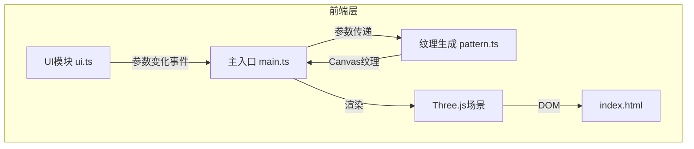

## 1. 架构设计



**数据流向说明：**
1. 用户通过UI滑块/按钮输入 → UI模块捕获事件 → 参数对象传递给main.ts
2. main.ts接收参数 → 调用pattern.ts生成/更新纹理
3. pattern.ts根据参数计算 → 输出Canvas纹理贴图 → 返回给main.ts
4. main.ts更新材质纹理 → 触发Three.js渲染
5. 主循环持续运行 → 更新纹理偏移 → 实现流动效果

## 2. 技术描述

- **前端框架**：原生 TypeScript + Three.js（无React/Vue框架，按用户需求使用原生DOM）
- **构建工具**：Vite 5.x（支持HMR热更新）
- **三维引擎**：Three.js 0.160+
- **类型定义**：@types/three
- **语言**：TypeScript（严格模式，目标ES2020）

## 3. 文件结构

```
auto7/
├── package.json              # 项目依赖和脚本
├── vite.config.js            # Vite构建配置
├── tsconfig.json             # TypeScript配置
├── index.html                # 入口HTML页面
└── src/
    ├── main.ts               # 应用主入口
    ├── pattern.ts            # 云纹纹理生成模块
    └── ui.ts                 # 参数面板UI模块
```

### 各文件职责和调用关系：

**package.json**
- 依赖：three、typescript、vite、@types/three
- 脚本：npm run dev 启动开发服务器

**vite.config.js**
- 基础Vite配置，支持HMR
- 配置端口、服务器选项

**tsconfig.json**
- 严格模式（strict: true）
- 目标ES2020
- 模块系统：ESNext

**index.html**
- 入口页面，全屏Canvas
- 左侧UI容器
- 加载src/main.ts

**src/main.ts**
- 初始化Three.js场景、相机、渲染器
- 创建OrbitControls控制器
- 管理主渲染循环（requestAnimationFrame）
- 处理参数变化事件 → 更新纹理
- 管理曲面体切换和过渡动画
- 管理重置动画

**src/pattern.ts**
- 云纹图案生成算法（基于Canvas 2D）
- 根据参数（旋度、密度、色彩偏移）生成程序化纹理
- 输出CanvasTexture供Three.js使用
- 纹理流动偏移计算

**src/ui.ts**
- 使用原生DOM创建参数面板
- 四个参数滑块（旋度、密度、色彩偏移、流动速度）
- 三个曲面切换按钮（圆柱、球体、环形结）
- 重置按钮
- 事件监听，参数变化时回调通知main.ts
- 响应式布局处理

## 4. 核心数据结构

### 参数对象类型

```typescript
interface PatternParams {
  curl: number;        // 旋度 0-100
  density: number;     // 密度 10-50
  colorShift: number;  // 色彩偏移 0-360
  flowSpeed: number;   // 流动速度 0-0.2
}

type SurfaceType = 'cylinder' | 'sphere' | 'torusKnot';
```

### 默认参数

```typescript
const DEFAULT_PARAMS: PatternParams = {
  curl: 50,
  density: 30,
  colorShift: 0,
  flowSpeed: 0.05
};

const DEFAULT_SURFACE: SurfaceType = 'cylinder';
```

## 5. 性能优化策略

1. **纹理生成优化**：
   - 使用离屏Canvas生成纹理
   - 参数变化时只重绘纹理，不重建几何体
   - 纹理尺寸控制在1024x1024以内

2. **渲染优化**：
   - 使用MeshStandardMaterial，合理设置材质属性
   - 避免每帧创建新对象，复用材质和纹理
   - 纹理偏移通过material.map.offset实现，无需重绘

3. **动画优化**：
   - 过渡动画使用requestAnimationFrame
   - 淡入淡出通过material.opacity实现
   - 避免频繁的几何体重建

4. **事件节流**：
   - 滑块输入可使用requestAnimationFrame节流
   - 确保纹理生成耗时≤50ms
