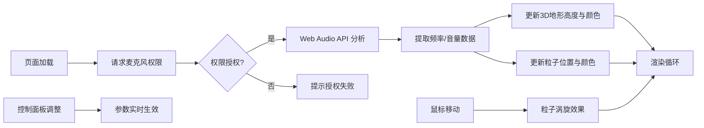

## 1. 产品概述

动态3D声纹地貌可视化应用是一款将实时音频转化为沉浸式3D视觉效果的交互工具。用户通过麦克风输入语音或音乐，系统实时分析音频频率与振幅，生成由彩色山脊和谷地组成的动态地形，配合悬浮粒子流和鼠标交互，让声音变得直观可见。

- **核心目标**：解决声音内容难以被直观感知和理解的问题，提供沉浸式的声-视转换体验
- **目标用户**：音乐爱好者、语音可视化创作者、教育演示场景用户
- **产品价值**：将抽象的音频信号转化为可交互的3D视觉艺术，兼具观赏性与教育意义

## 2. 核心功能

### 2.1 用户角色
| 角色 | 注册方式 | 核心权限 |
|------|----------|----------|
| 访客用户 | 无需注册，直接使用 | 访问所有可视化功能，调整控制面板参数 |

### 2.2 功能模块
1. **音频输入与分析模块**：麦克风音频采集、Web Audio API 实时频率分析、音量计算
2. **3D声纹地形模块**：基于频率数据生成动态网格地形、顶点颜色映射、呼吸动画、缓慢旋转
3. **粒子系统模块**：悬浮粒子流、音频能量驱动、鼠标涡旋交互
4. **控制面板模块**：音量增益、旋转速度、粒子数量、颜色主题切换
5. **波形可视化模块**：Canvas 2D 实时波形图、渐变发光效果

### 2.3 页面详情
| 页面名称 | 模块名称 | 功能描述 |
|----------|----------|----------|
| 主页 | 3D场景主体 | Three.js 渲染的声纹地形与粒子系统，占页面主体区域 |
| 主页 | 音量波形图 | 左下角 Canvas 2D 绘制的实时音量波形，带渐变发光效果 |
| 主页 | 控制面板 | 右侧浮动面板，包含增益、速度、粒子数、主题四项控制 |
| 主页 | 加载动画 | 页面初始加载时的过渡动画 |

## 3. 核心流程

用户打开应用 → 授权麦克风权限 → 音频流实时分析 → 频率数据驱动3D地形与粒子 → 用户通过控制面板调整参数 → 鼠标交互产生粒子涡旋效果

## 4. 用户界面设计

### 4.1 设计风格
- **设计基调**：深邃星空科技风，深色背景配合彩色声纹地形
- **主色调**：深蓝紫渐变背景 (#0B0B2B → #1A1A3E)
- **强调色**：低频红色、中频绿色、高频蓝色（HSL 120°→330°色环映射）
- **材质**：半透明毛玻璃面板 (backdrop-filter: blur(12px))
- **字体**：等宽字体 (Consolas, Monaco, 'Courier New', monospace)
- **圆角**：统一 8px 圆角
- **动效**：悬停缩放 (scale 1.05)、面板滑动过渡 (0.3s ease)

### 4.2 页面设计概述
| 页面名称 | 模块名称 | UI 元素 |
|----------|----------|---------|
| 主页 | 3D场景 | 居中的环形/矩形地形网格，缓慢旋转，顶点颜色随频率变化 |
| 主页 | 粒子系统 | 地形上方悬浮的彩色粒子，跟随音频波动，鼠标交互形成涡旋 |
| 主页 | 波形图 | 左下角 Canvas，渐变发光波形线，实时显示音量 |
| 主页 | 控制面板 | 右侧毛玻璃面板，4个控制项，展开/收起动画 |
| 主页 | 加载动画 | 居中的加载指示器，页面资源加载完成后淡出 |

### 4.3 响应式
- **桌面端优先**：控制面板固定右侧，波形图固定左下角
- **性能目标**：主流浏览器 (Chrome/Firefox) 帧率不低于 55 FPS
- **自适应**：3D场景自适应窗口大小，控制面板在小屏幕可收起

### 4.4 3D场景指引
- **环境**：深色星空渐变背景，无外部光源依赖，使用自发光材质
- **光照**：环境光 + 方向光，突出地形轮廓与粒子质感
- **相机**：PerspectiveCamera，45° 视场角，俯视角度观察地形
- **构图**：地形居中，粒子环绕上方，视觉焦点在地形中心
- **交互**：地形自动旋转，鼠标控制粒子涡旋，无 OrbitControls 拖拽
- **后处理**：轻微辉光效果增强视觉冲击力（性能允许范围内）
