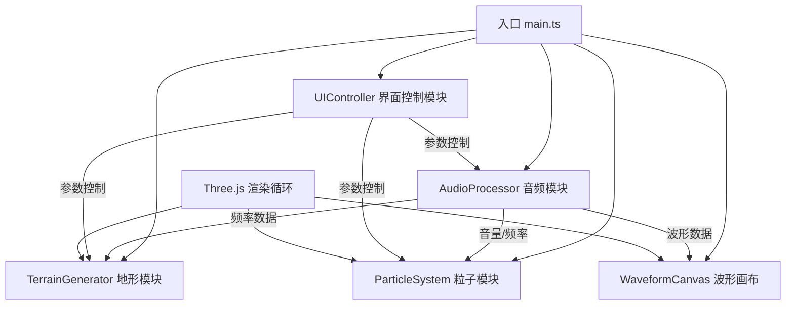

## 1. 架构设计



## 2. 技术描述

- **前端框架**：TypeScript + Three.js (原生，无 React/Vue)
- **构建工具**：Vite 5.x
- **音频处理**：Web Audio API (AnalyserNode)
- **3D渲染**：Three.js r160+
- **样式**：原生 CSS + CSS 变量
- **类型定义**：@types/three

## 3. 文件结构

```
.
├── package.json
├── vite.config.js
├── tsconfig.json
├── index.html
└── src/
    ├── main.ts              # 应用入口，渲染循环，模块协调
    ├── audioProcessor.ts    # 麦克风获取 + Web Audio API 分析
    ├── terrainGenerator.ts  # 3D 声纹地形生成与更新
    ├── particleSystem.ts    # 粒子系统与鼠标交互
    └── uiController.ts      # 控制面板 DOM 操作与事件绑定
```

## 4. 核心模块接口定义

### 4.1 AudioProcessor
```typescript
class AudioProcessor {
  constructor(fftSize?: number)
  async init(): Promise<void>           // 请求麦克风并初始化
  getFrequencyData(): Uint8Array        // 获取频率数据 (0-255)
  getVolume(): number                   // 获取平均音量 (0-1)
  getWaveformData(): Uint8Array         // 获取时域波形数据
  setGain(value: number): void          // 设置音量增益 (0-2)
  getFrequencyBins(): number            // 获取频段数量
  destroy(): void                       // 清理资源
}
```

### 4.2 TerrainGenerator
```typescript
class TerrainGenerator {
  constructor(scene: THREE.Scene, segments?: number)
  update(frequencyData: Uint8Array, volume: number, time: number): void
  setRotationSpeed(speed: number): void  // 设置旋转速度 (0-1)
  setColorTheme(theme: string): void     // 设置颜色主题
  getMesh(): THREE.Mesh                  // 获取地形网格
}
```

### 4.3 ParticleSystem
```typescript
class ParticleSystem {
  constructor(scene: THREE.Scene, count?: number)
  update(volume: number, frequencyData: Uint8Array, mouse: THREE.Vector2, time: number): void
  setCount(count: number): void          // 设置粒子数量 (100-500)
  setColorTheme(theme: string): void     // 设置颜色主题
}
```

### 4.4 UIController
```typescript
class UIController {
  constructor()
  onGainChange(callback: (value: number) => void): void
  onRotationSpeedChange(callback: (value: number) => void): void
  onParticleCountChange(callback: (value: number) => void): void
  onThemeChange(callback: (theme: string) => void): void
  setPanelVisible(visible: boolean): void
}
```

## 5. 性能优化策略

- **频率数据降采样**：128频段足够驱动视觉，避免过高 FFT 大小
- **顶点颜色更新**：使用 BufferGeometry 的 color attribute，每帧更新而非重建几何体
- **粒子系统**：使用 Points + BufferGeometry，避免实例化开销
- **渲染优化**：关闭阴影，使用自发光材质减少光照计算
- **帧率监控**：使用 requestAnimationFrame，保持 60 FPS 节奏
- **内存管理**：页面隐藏时暂停动画，恢复后继续

## 6. 颜色主题定义

| 主题名称 | 低频色 | 中频色 | 高频色 | 背景色 |
|----------|--------|--------|--------|--------|
| 默认 | 红色 HSL(0, 100%, 60%) | 绿色 HSL(120, 100%, 50%) | 蓝色 HSL(240, 100%, 60%) | 深紫渐变 |
| 霓虹 | 品红 HSL(300, 100%, 60%) | 青色 HSL(180, 100%, 50%) | 黄色 HSL(60, 100%, 60%) | 深蓝黑 |
| 冰雪 | 浅蓝 HSL(200, 80%, 70%) | 青色 HSL(180, 70%, 80%) | 白色 HSL(220, 30%, 95%) | 冰蓝渐变 |
| 熔岩 | 暗红 HSL(0, 90%, 40%) | 橙色 HSL(30, 100%, 50%) | 亮黄 HSL(50, 100%, 60%) | 深棕红 |
