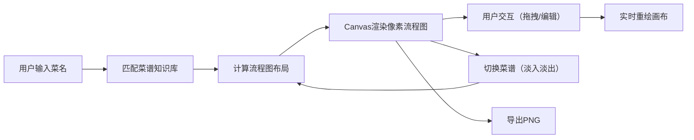

## 1. 产品概述

「像素食谱」是一款面向烹饪爱好者的创意工具，将传统文字菜谱转化为可视化的像素风交互流程图，让烹饪过程变得直观有趣。
- 核心价值：通过图形化方式降低菜谱理解门槛，用像素艺术风格增添烹饪乐趣
- 目标用户：烹饪爱好者、美食博主、想学习做菜的新手

## 2. 核心 Features

### 2.1 Feature Module

1. **首页/主界面**：菜谱搜索输入、Canvas流程图画布、右侧菜谱列表、底部功能按钮
2. **菜谱解析模块**：内置10道家常菜知识库，自动匹配并生成流程图结构
3. **交互编辑模块**：图标拖拽、双击编辑弹窗、16色调色板选择
4. **导出分享模块**：PNG导出功能、菜谱切换过渡动画

### 2.2 Page Details

| Page Name | Module Name | Feature description |
|-----------|-------------|---------------------|
| 主界面 | 菜谱搜索 | 输入菜名自动匹配内置菜谱，支持模糊搜索 |
| 主界面 | Canvas流程图 | 像素风原料图标、带箭头连线、闪烁动画、格子背景 |
| 主界面 | 右侧菜谱列表 | 预设10道菜谱，点击切换带淡入淡出动画 |
| 主界面 | 底部功能区 | 导出PNG按钮，透明背景导出 |
| 编辑弹窗 | 标签编辑 | 最多8个字符的文本标签修改 |
| 编辑弹窗 | 调色板 | 16色预设调色板，点击替换图标颜色 |

## 3. Core Process

用户输入菜名 → 系统匹配内置菜谱知识库 → 计算原料图标数量和步骤位置 → Canvas渲染像素风流程图（图标+连线+动画）→ 用户拖拽调整图标位置/双击编辑 → 点击右侧菜谱切换（淡入淡出）→ 点击导出按钮生成PNG

## 4. User Interface Design

### 4.1 Design Style

- **颜色主题**：暖橙米白复古像素风
  - 背景色：#F5DEB3（浅米色）
  - 线条边框：#D2691E（暖橙色）
  - 文字颜色：#8B4513（深棕色）
  - 调色板：16色预设（红、黄、绿、蓝等基础色）
- **字体**：像素字体（通过CSS @font-face加载Web像素字体）
- **按钮样式**：圆角矩形，带像素风斜角边框，悬停放大，点击按下效果
- **图标样式**：16x16像素图标，2px实线边框，鼠标悬停放大20%
- **特殊效果**：每2秒图标边框闪烁白色，浅米色格子纹理背景

### 4.2 Page Design Overview

| Page Name | Module Name | UI Elements |
|-----------|-------------|-------------|
| 主界面 | 顶部标题栏 | 像素字体"像素食谱"，居中显示，深棕色文字 |
| 主界面 | 搜索区域 | 像素风输入框，暖橙色边框，圆角设计 |
| 主界面 | Canvas画布 | 320px固定高度，宽度自适应，浅米色格子背景，自定义滚动条 |
| 主界面 | 右侧菜谱列表 | 垂直排列，每道菜名带像素图标，点击高亮 |
| 主界面 | 底部按钮区 | 导出PNG按钮，像素风斜角边框 |
| 编辑弹窗 | 弹窗容器 | 像素风边框，米白背景，居中显示 |
| 编辑弹窗 | 调色板 | 4x4网格排列16色块，选中带白色边框 |

### 4.3 Responsiveness

- **桌面端优先**：主内容区宽度自适应，高度固定320px
- **横向滚动**：流程图超出视口时出现自定义滚动条（12px宽，暖橙色滑块，米白色轨道）
- **触控优化**：图标拖拽支持触摸事件，点击区域不小于40x40px

### 4.4 性能要求

- 导出PNG响应时间 ≤ 800ms
- 拖拽图标帧率 ≥ 45FPS
- 所有CSS动画使用GPU加速属性（transform、opacity）
- Canvas渲染使用requestAnimationFrame循环
