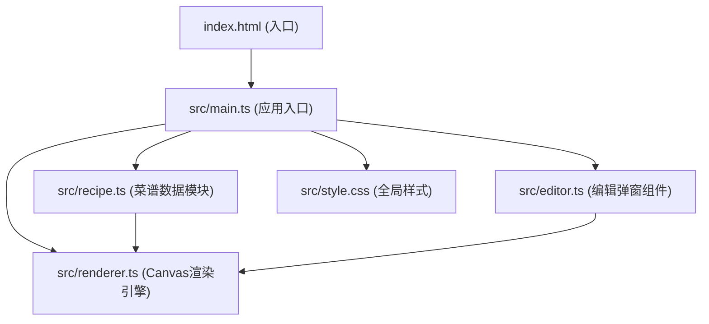

## 1. Architecture Design



## 2. Technology Description

- **前端框架**：原生 TypeScript + HTML5 Canvas
- **构建工具**：Vite 5.x（支持HMR热更新）
- **语言**：TypeScript 5.x（严格模式，目标ES2020）
- **样式**：原生CSS3（CSS变量、@font-face、GPU加速动画）
- **像素字体**：通过Google Fonts加载Press Start 2P或自定义像素字体
- **图标渲染**：Canvas 2D API绘制16x16像素图标
- **导出功能**：Canvas.toDataURL()生成PNG

## 3. 核心模块职责

### 3.1 src/recipe.ts - 菜谱数据模块

**数据结构定义**：
```typescript
interface Ingredient {
  name: string;
  color: string;
  x: number;
  y: number;
  id: string;
}

interface RecipeStep {
  from: string;
  to: string;
  action: string;
}

interface Recipe {
  name: string;
  ingredients: Ingredient[];
  steps: RecipeStep[];
}
```

**核心方法**：
- `getRecipeByName(name: string): Recipe | null` - 模糊匹配菜谱
- `calculateLayout(recipe: Recipe, canvasWidth: number): Ingredient[]` - 计算图标位置
- `getAllRecipes(): Recipe[]` - 获取所有菜谱列表

### 3.2 src/renderer.ts - Canvas渲染引擎

**核心职责**：
- 绘制浅米色格子纹理背景
- 绘制16x16像素原料图标（基础几何形状）
- 绘制带箭头的彩色像素连线
- 实现每2秒边框闪烁动画
- 处理图标悬停放大效果
- 导出PNG图片

**核心方法**：
- `render(recipe: Recipe, editState: EditState): void` - 主渲染循环
- `drawIcon(ingredient: Ingredient, isHovered: boolean, isFlashing: boolean): void` - 绘制单个图标
- `drawConnection(from: Ingredient, to: Ingredient): void` - 绘制连线
- `exportPNG(): string` - 导出透明背景PNG
- `getIconAtPosition(x: number, y: number): Ingredient | null` - 碰撞检测

### 3.3 src/editor.ts - 编辑弹窗组件

**核心职责**：
- 处理鼠标拖拽事件（格子对齐）
- 处理双击事件弹出编辑弹窗
- 管理16色调色板选择
- 通过事件回调通知Renderer更新

**核心方法**：
- `initDragHandlers(canvas: HTMLCanvasElement): void` - 初始化拖拽
- `showEditPopup(ingredient: Ingredient, x: number, y: number): void` - 显示编辑弹窗
- `hideEditPopup(): void` - 隐藏编辑弹窗

### 3.4 src/main.ts - 应用入口

**核心职责**：
- 初始化Canvas和UI事件监听
- 数据流向控制：获取菜谱 → 调用Renderer → 监听交互 → 更新画布
- 管理菜谱切换的淡入淡出动画
- 绑定导出按钮事件

## 4. 性能优化策略

1. **Canvas渲染优化**：
   - 使用离屏Canvas预渲染静态元素
   - 仅在数据变化时重绘，避免无效渲染
   - 使用requestAnimationFrame实现60FPS动画循环

2. **拖拽性能**：
   - 使用transform实现GPU加速
   - 减少重绘区域，仅更新被拖拽图标
   - 节流鼠标移动事件（但保持45FPS以上）

3. **动画优化**：
   - 所有CSS动画使用transform和opacity
   - 闪烁动画使用requestAnimationFrame精确控制
   - 菜谱切换使用CSS transition实现0.3秒淡入淡出

4. **导出优化**：
   - 临时隐藏UI元素后导出
   - 使用toBlob异步导出避免阻塞主线程
