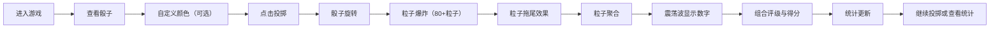

## 1. 产品概述

「星焰骰子」是一款在浏览器中运行的视觉化概率博弈游戏，以精美的粒子动画和星空主题为特色，让玩家体验掷骰子的乐趣与视觉冲击。

- 核心玩法：玩家拥有3颗可自定义颜色的魔法骰子，通过点击投掷按钮触发华丽的粒子爆炸动画，最终获得3个数字组合并根据组合类型获得得分
- 目标用户：喜欢休闲游戏、视觉特效和概率博弈的玩家
- 市场价值：提供沉浸式的视觉体验，将简单的掷骰子玩法升级为具有艺术感的互动体验

## 2. 核心特性

### 2.1 功能模块

1. **游戏主界面**：骰子展示区、投掷控制区、得分显示区
2. **骰子动画系统**：骰子旋转、爆炸粒子、拖尾效果、聚合动画、震荡波结果显示
3. **背景星云系统**：暗夜星空主题、流动星云粒子层
4. **统计面板**：最近20局结果分布柱状图、局数统计、历史记录保存
5. **自定义设置**：骰子颜色自定义

### 2.2 页面详情

| 页面名称 | 模块名称 | 功能描述 |
|-----------|-------------|---------------------|
| 主游戏页 | 骰子展示区 | 显示3颗骰子，支持自定义颜色，投掷时播放粒子爆炸动画 |
| 主游戏页 | 投掷控制区 | 投掷按钮，悬停微光扩散，点击弹性缩放反馈 |
| 主游戏页 | 结果显示区 | 以震荡波形式扩散显示数字，展示组合评级和得分 |
| 主游戏页 | 统计面板 | 横向柱状图展示最近20局结果分布，支持最小化/展开 |
| 主游戏页 | 背景星云 | 200个以内流动星云粒子，每帧更新，保证60fps |

## 3. 核心流程

玩家进入游戏 → 查看3颗魔法骰子（可自定义颜色） → 点击投掷按钮 → 骰子旋转并爆裂成80+发光粒子（带拖尾） → 粒子重新聚合为骰子面 → 震荡波扩散显示数字 → 系统判断组合类型并给出得分 → 统计面板更新 → 可继续投掷或查看历史统计

## 4. 界面设计

### 4.1 设计风格

- **主色调**：深紫 `#1A0A2E`（背景）与金橙 `#FF7B24`（强调色）的对比配色
- **整体风格**：暗夜星空主题，神秘魔幻氛围
- **骰子样式**：渐变光晕渲染，发光边缘效果
- **按钮样式**：圆角设计，悬停时微光扩散动画（0.2秒过渡），点击时弹性缩放（scale 0.9→1.1→1.0，持续0.3秒）
- **字体**：使用具有未来感的无衬线字体，数字使用等宽字体增强科技感
- **布局**：居中对称布局，骰子区位于视觉中心，统计面板位于右侧可折叠

### 4.2 页面设计概览

| 页面名称 | 模块名称 | UI元素 |
|-----------|-------------|-------------|
| 主游戏页 | 骰子展示区 | 3颗带渐变光晕的骰子，居中排列，间距均匀 |
| 主游戏页 | 投掷控制区 | 金橙色发光按钮，位于骰子下方居中 |
| 主游戏页 | 结果显示区 | 骰子下方，震荡波动画显示数字和组合评级 |
| 主游戏页 | 统计面板 | 右侧悬浮面板，横向柱状图，每根柱子弹入动画（stagger延迟0.05秒），柱顶显示数值 |
| 主游戏页 | 背景星云 | 深紫色渐变背景，200个以内缓慢流动的星云粒子 |

### 4.3 动画规格

| 动画类型 | 规格要求 |
|-----------|-------------|
| 投掷动画总时长 | 不低于1.5秒 |
| 爆炸粒子数量 | 每颗骰子至少80个发光粒子 |
| 粒子拖尾长度 | 0.3秒 |
| 按钮悬停过渡 | 0.2秒微光扩散 |
| 按钮点击反馈 | scale 0.9→1.1→1.0，持续0.3秒 |
| 统计柱加载动画 | stagger延迟0.05秒，从底部弹入 |
| 结果震荡波 | 数字显示时向外扩散的波纹效果 |

### 4.4 性能要求

- 投掷动画全程帧率：≥55fps
- 响应时间（点击到骰子停止）：≤2秒
- 背景粒子数量：≤200个，保证60fps

### 4.5 组合评级

| 组合类型 | 描述 | 得分 |
|-----------|-------------|--------|
| 豹子 | 三个数字完全相同 | 1000分 |
| 顺子 | 三个连续数字（如1-2-3） | 500分 |
| 对子 | 恰好两个数字相同 | 200分 |
| 散牌 | 其他组合 | 50分 |
