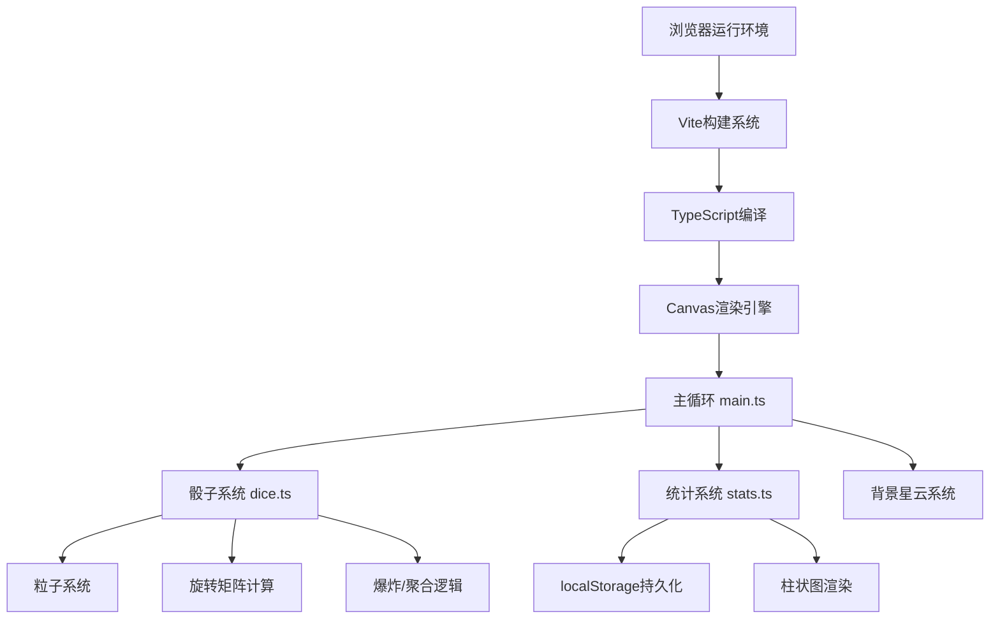

## 1. 架构设计



## 2. 技术描述

- **前端框架**：原生 TypeScript + HTML5 Canvas（无React/Vue，纯Canvas实现以获得最佳性能）
- **构建工具**：Vite 5.x，支持HMR和路径别名@
- **动画库**：canvas-confetti（用于增强粒子效果）
- **数据持久化**：localStorage（保存游戏历史统计）
- **性能优化**：
  - requestAnimationFrame 驱动的主循环
  - 粒子对象池复用
  - 离屏Canvas预渲染骰子面
  - 时间增量计算确保动画速度一致

## 3. 目录结构

```
star-dice/
├── .trae/documents/
│   ├── PRD.md
│   └── TECH_ARCHITECTURE.md
├── src/
│   ├── main.ts          # 游戏主循环，状态管理
│   ├── dice.ts          # 骰子类，粒子系统
│   └── stats.ts         # 统计模块，柱状图渲染
├── index.html           # 入口页面
├── package.json         # 项目配置
├── vite.config.js       # Vite配置
└── tsconfig.json        # TypeScript配置
```

## 4. 核心模块设计

### 4.1 主循环模块 (main.ts)

**状态机**：
```typescript
type GameState = 'idle' | 'rolling' | 'settling';
```

**主要职责**：
- 管理游戏状态流转
- 驱动 requestAnimationFrame 主循环
- 更新背景星云粒子（每帧≤200个）
- 调度骰子动画时序
- 处理用户交互（投掷按钮、颜色选择）
- 协调骰子模块与统计模块

### 4.2 骰子模块 (dice.ts)

**Dice 类接口**：
```typescript
class Dice {
  constructor(x: number, y: number, size: number, color: string);
  setColor(color: string): void;
  roll(targetValue: number, duration: number): Promise<void>;
  update(deltaTime: number): void;
  render(ctx: CanvasRenderingContext2D): void;
  getValue(): number;
}
```

**粒子系统**：
- 每颗骰子维护≥80个粒子对象
- 粒子属性：位置、速度、加速度、颜色、大小、生命周期、拖尾历史
- 爆炸阶段：粒子沿随机方向散开，速度衰减
- 聚合阶段：粒子向目标位置移动，形成骰子面
- 拖尾效果：记录0.3秒内的位置历史，渐变透明度绘制

### 4.3 统计模块 (stats.ts)

**Stats 类接口**：
```typescript
class Stats {
  constructor();
  addResult(values: [number, number, number], score: number, combo: string): void;
  getRecentHistory(count: number): HistoryItem[];
  getComboDistribution(): Map<string, number>;
  renderBarChart(ctx: CanvasRenderingContext2D, x: number, y: number, width: number, height: number): void;
  save(): void;
  load(): void;
  togglePanel(): void;
}
```

**柱状图渲染**：
- 展示最近20局的得分分布
- 横向柱状图，柱子从底部弹入
- stagger延迟0.05秒的入场动画
- 柱顶显示具体数值

## 5. 数据模型

### 5.1 历史记录项

```typescript
interface HistoryItem {
  timestamp: number;
  values: [number, number, number];
  score: number;
  comboType: 'triple' | 'straight' | 'pair' | 'none';
  comboName: string;
}
```

### 5.2 粒子对象

```typescript
interface Particle {
  x: number;
  y: number;
  vx: number;
  vy: number;
  ax: number;
  ay: number;
  color: string;
  size: number;
  life: number;
  maxLife: number;
  trail: { x: number; y: number; alpha: number }[];
}
```

### 5.3 骰子状态

```typescript
type DicePhase = 'idle' | 'rotating' | 'exploding' | 'aggregating' | 'settled';

interface DiceState {
  phase: DicePhase;
  rotationX: number;
  rotationY: number;
  rotationZ: number;
  currentValue: number;
  targetValue: number;
  particles: Particle[];
  color: string;
}
```

## 6. 性能优化策略

1. **粒子池化**：预分配粒子对象数组，避免频繁GC
2. **时间增量**：使用 deltaTime 控制动画速度，不受帧率波动影响
3. **粒子上限**：背景粒子≤200，每颗骰子爆炸粒子≥80
4. **离屏渲染**：骰子面图案预渲染到离屏Canvas
5. **状态批处理**：合并同类型的Canvas绘制调用
6. **主动GC提示**：在动画间隙主动清理不再需要的对象引用

## 7. 配色系统（CSS变量）

```css
:root {
  --bg-deep-purple: #1A0A2E;
  --bg-purple-mid: #2D1B4E;
  --accent-gold: #FF7B24;
  --accent-gold-light: #FFA25A;
  --accent-gold-dark: #E56A1C;
  --particle-glow: rgba(255, 123, 36, 0.8);
  --text-primary: #FFFFFF;
  --text-secondary: rgba(255, 255, 255, 0.7);
  --panel-bg: rgba(26, 10, 46, 0.9);
  --panel-border: rgba(255, 123, 36, 0.3);
}
```
