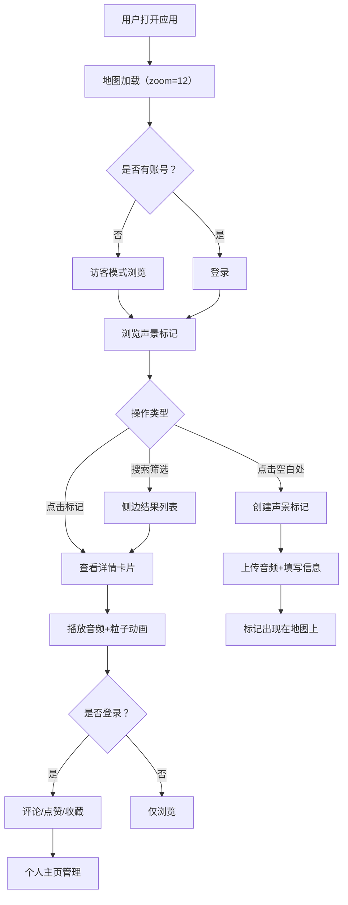

## 1. 产品概述

声景地图（SoundScape Map）是一个面向城市音频爱好者的全栈Web应用，帮助用户将散步时听到的独特环境声音与具体地点、时间、心情可视化关联并分享给社区。用户在地图上标记位置，录制或上传声音，添加文字笔记、情绪标签和现场图片，地图上以动态声波图标展示标记点，点击后弹出详情卡片并播放声音，同时展示基于声谱的流动粒子动画。

- 核心价值：将城市声音体验从"听觉记忆"转化为"可探索、可分享、可收藏"的视觉化地理信息
- 目标用户：城市漫步者、声音艺术家、环境音爱好者、社区探索者

## 2. 核心功能

### 2.1 用户角色

| 角色 | 注册方式 | 核心权限 |
|------|----------|----------|
| 访客 | 无需注册 | 浏览公开声景点、播放声音、查看粒子动画 |
| 注册用户 | 邮箱注册 | 创建/编辑声景标记、评论点赞、收藏管理、个人主页 |
| 管理员 | 系统指定 | 管理所有标记、审核内容、管理用户 |

### 2.2 功能模块

1. **地图探索页**：全屏地图视图、声波动画标记、搜索与筛选栏、标记详情弹窗、粒子动画回放
2. **声景创建/编辑面板**：位置标记、音频上传、文字笔记、情绪标签选择、图片上传、标记拖拽微调
3. **社区互动**：评论、点赞、收藏、90天过期机制
4. **个人主页**：旅行日志列表、收藏夹管理、可见性控制、批量导出JSON

### 2.3 页面详情

| 页面名称 | 模块名称 | 功能描述 |
|----------|----------|----------|
| 地图探索页 | 全屏地图 | Mapbox GL JS地图，zoom=12城市级别，圆角卡片嵌入，加载所有公开声景点 |
| 地图探索页 | 搜索与筛选栏 | 位置名称/标题模糊搜索、按情绪标签/距离/时间排序筛选，结果高亮+侧边列表（最多20条） |
| 地图探索页 | 声波动画标记 | 正弦波幅度20px周期1.2s循环，新添加时波纹扩散0→60px/0.8s |
| 地图探索页 | 详情卡片 | 固定320px宽，图片（柔光遮罩）→播放按钮→粒子动画→文字笔记→情绪标签（带色点）→评论数→点赞数→收藏按钮 |
| 地图探索页 | 粒子动画 | Canvas 320x180px，Web Audio API频率数据，低频深色粒子/中频彩色粒子/高频白色光点，≤150粒子，≥30fps |
| 声景创建面板 | 音频上传 | WAV/MP3格式，最长15秒 |
| 声景创建面板 | 文字笔记 | 最多200字 |
| 声景创建面板 | 情绪标签 | 10个预设标签单选，每个标签对应不同色相（宁静=#6ECB63、喧闹=#FF6B6B等） |
| 声景创建面板 | 图片上传 | JPG/PNG，最大2MB |
| 声景创建面板 | 位置微调 | 创建后支持拖拽标记点调整位置 |
| 声景创建面板 | 信息编辑 | 可修改笔记、标签和图片，不可更换声音文件 |
| 社区互动 | 评论 | 单次最多100字 |
| 社区互动 | 点赞 | 整数累加，显示总数和当天新增数 |
| 社区互动 | 收藏 | 添加到收藏夹，可附加个人备注（最多50字） |
| 社区互动 | 过期机制 | 创建后90天自动转为私有 |
| 个人主页 | 旅行日志 | 自己创建的声景标记列表，时间倒序，每页10条，支持分页 |
| 个人主页 | 标记管理 | 缩略图、标题、创建日期、播放次数、点赞数、可见性切换 |
| 个人主页 | 批量导出 | 全选/反选，导出为JSON文件 |
| 个人主页 | 收藏夹 | 收藏的他人标记列表，同样分页，显示个人备注 |

## 3. 核心流程

### 3.1 声景创建流程
用户点击地图 → 打开创建面板 → 上传音频/填写笔记/选择标签/上传图片 → 提交 → 标记以声波动画出现在地图上（波纹扩散动画）

### 3.2 声景探索流程
用户浏览地图 → 看到声波动画标记 → 点击标记 → 弹出详情卡片 → 播放声音+粒子动画 → 可评论/点赞/收藏

### 3.3 社区互动流程
用户发现感兴趣标记 → 点赞/评论 → 收藏到旅行日志 → 添加个人备注 → 在个人主页查看收藏列表

## 4. 用户界面设计

### 4.1 设计风格

- **主基色**：柔和大地色系
- **背景色**：暖灰 #F5E6C8
- **导航栏**：深棕 #3E2723 背景 + 白色文字
- **按钮**：麦色 #D4A373 背景 + 深棕文字，悬停变浅至 #E0B97E
- **详情卡片**：米白 #FFF8E7 背景 + 深棕 #3E2723 文字
- **地图卡片**：圆角16px，投影 rgba(0,0,0,0.1) 0px 4px 12px
- **动画缓动**：cubic-bezier(0.4, 0, 0.2, 1) 缓入缓出
- **情绪标签色点**：宁静=#6ECB63、喧闹=#FF6B6B、忧郁=#5C6BC0、欢快=#FFD93D、神秘=#AB47BC、悠然=#26A69A、紧张=#EF5350、温馨=#FF8A65、空灵=#42A5F5、怀恋=#8D6E63
- **字体**：展示字体选用 Playfair Display（标题），正文字体选用 Noto Sans SC（中文兼容）
- **图标风格**：线性图标（lucide-react），与大地色系统一

### 4.2 页面设计概览

| 页面名称 | 模块名称 | UI元素 |
|----------|----------|--------|
| 地图探索页 | 顶部导航栏 | 深棕背景，左侧Logo+标题，右侧搜索栏+筛选下拉+用户头像 |
| 地图探索页 | 地图区域 | 圆角16px卡片嵌入，全屏显示，声波动画标记散布 |
| 地图探索页 | 搜索筛选栏 | 半透明浮层于地图上方，搜索框+标签下拉+排序下拉 |
| 地图探索页 | 侧边结果列表 | 右侧半透明列表，最多20条，图标+标题+距离 |
| 地图探索页 | 详情弹窗卡片 | 320px宽，米白背景，图片→播放→粒子→笔记→标签→互动 |
| 地图探索页 | 创建面板 | 模态浮层，表单布局，音频上传区+笔记输入+标签选择+图片上传 |
| 个人主页 | 旅行日志 | 列表模式，每条缩略图+标题+日期+播放次数+点赞数 |
| 个人主页 | 收藏夹 | 类似旅行日志布局，额外显示个人备注 |
| 个人主页 | 批量操作栏 | 全选/反选复选框+导出JSON按钮 |

### 4.3 响应式适配

- 桌面优先设计，最小宽度320px
- <768px：右栏详情卡片改为底部浮层（底部距离20px，宽度95%），左侧筛选列表折叠为悬浮按钮
- 地图始终全屏展示，UI控件以浮层形式叠加
- 触摸设备优化：标记点点击区域增大，卡片滑动关闭

### 4.4 动画与过渡

- 标记添加：从标记点向外扩散圆形波纹，半径0→60px，0.8s完成
- 卡片弹出：缩放+淡入，cubic-bezier(0.4, 0, 0.2, 1)
- 粒子动画：实时音频频率驱动，低频/中频/高频三层粒子系统
- 页面切换：淡入淡出过渡
- 按钮悬停：背景色过渡+微缩放
