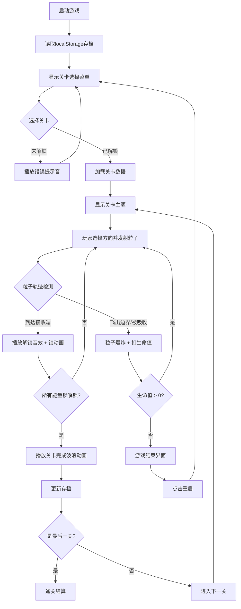

## 1. 产品概述

「量子迷宫：粒子跃迁」是一款基于浏览器的解谜游戏，玩家通过发射光量子粒子在等距菱形网格迷宫中穿行，解锁能量锁来通过关卡。游戏融合了物理反弹、路径规划和多关卡渐进式难度设计，为玩家带来沉浸式的量子科幻解谜体验。

- 核心玩法：方向选择 + 粒子发射 + 物理反弹 + 能量锁解锁
- 目标用户：休闲解谜游戏爱好者、科幻题材游戏玩家
- 产品价值：提供高质量的浏览器端解谜体验，无需安装，即开即玩

## 2. 核心功能

### 2.1 功能模块

1. **关卡选择菜单**：九宫格布局展示9个关卡，带解锁状态图标，支持存档进度加载
2. **游戏主场景**：等距菱形网格迷宫、端口、障碍物、粒子飞行与碰撞系统
3. **能量锁系统**：单/多端口协同解锁机制，带动画反馈
4. **生命值系统**：5次发射机会，失败粒子爆炸效果，游戏结束与重启
5. **关卡过渡系统**：波浪式切换动画、关卡信息展示
6. **音效系统**：Web Audio API生成解锁音、错误提示音
7. **存档系统**：localStorage保存最大解锁关卡数

### 2.2 页面详情

| 页面名称 | 模块名称 | 功能描述 |
|-----------|-------------|---------------------|
| 关卡选择菜单 | 关卡九宫格 | 3x3布局，显示关卡序号与锁图标（青色未解锁/金色已解锁/闪烁金色当前关卡） |
| 关卡选择菜单 | 存档状态 | 显示已解锁至第N关 |
| 游戏主场景 | 等距网格 | 细半透明白色线条绘制菱形网格 |
| 游戏主场景 | 端口系统 | 青色发光发射端（旋转光环）、金色发光接收端（脉动缩放） |
| 游戏主场景 | 障碍物系统 | 石块、能量墙、移动障碍物 |
| 游戏主场景 | 粒子系统 | 抛物线飞行、精确反弹、碰撞光晕、爆炸效果 |
| 游戏主场景 | 引导线 | 半透明蓝色连接线 |
| 顶部UI栏 | 关卡信息 | 当前关卡序号与主题名 |
| 顶部UI栏 | 生命值 | 5个渐变小菱形指示器 |
| 顶部UI栏 | 重置按钮 | 旋转动画圆形图标 |
| 关卡过渡 | 波浪动画 | 从中心向外扩散变亮，持续1秒 |
| 游戏结束 | 结束界面 | "粒子消散"文字 + 闪烁重启按钮 |

## 3. 核心流程

## 4. 用户界面设计

### 4.1 设计风格

- **主色调**：深空黑 #0A0A0F（背景）、暗蓝 #1A1A2E（网格暗态）、亮白 #FFFFFF（网格亮态）
- **强调色**：量子青 #00FFAA（粒子颜色）、端口青 #00AABB（未解锁锁）、金色 #FFD700（已解锁锁/接收端）、紫色（接收端外圈渐变）
- **按钮风格**：圆形重置按钮，悬停时360度旋转并变色
- **字体**：使用 clamp(14px, 1.5vw, 24px) 实现响应式文字大小
- **布局风格**：Canvas居中占视口80%宽度，16:9比例自适应高度，深空黑背景
- **视觉风格**：量子科幻、深空沉浸、发光效果、粒子特效

### 4.2 页面设计概览

| 页面名称 | 模块名称 | UI元素 |
|-----------|-------------|-------------|
| 关卡选择菜单 | 关卡九宫格 | 3x3格子布局，每格含序号和锁图标，悬停反馈，点击动画 |
| 游戏主场景 | 迷宫区域 | 等距菱形网格、装饰性六边形簇背景、发光端口、障碍物带光晕 |
| 游戏主场景 | 粒子效果 | 青色发光粒子、抛物线轨迹、反弹光晕、爆炸光点 |
| 顶部UI栏 | 信息区 | 左：关卡名称，中：生命值菱形，右：重置按钮 |
| 关卡过渡 | 动画层 | 波浪式网格变亮、关卡主题文字淡入淡出 |
| 游戏结束 | 结束层 | 居中"粒子消散"文字，下方闪烁重启按钮 |

### 4.3 响应式设计

- **桌面优先**：1080p和2K分辨率下Canvas居中占视口80%宽度
- **高度自适应**：保持16:9比例
- **文字响应式**：font-size: clamp(14px, 1.5vw, 24px)
- **按钮缩放**：UI元素随视口等比缩放

### 4.4 动画与性能

- **帧率目标**：稳定60fps
- **动画驱动**：全部使用requestAnimationFrame
- **粒子上限**：同时最多50个粒子
- **音效延迟**：Web Audio API < 50ms
- **关键动画**：
  - 发射端旋转光环动画
  - 接收端脉动缩放动画（周期2秒）
  - 关卡波浪过渡动画（1秒）
  - 粒子爆炸效果（300ms）
  - 锁图标解锁粒子散开动画
  - 重置按钮悬停旋转（360度）
