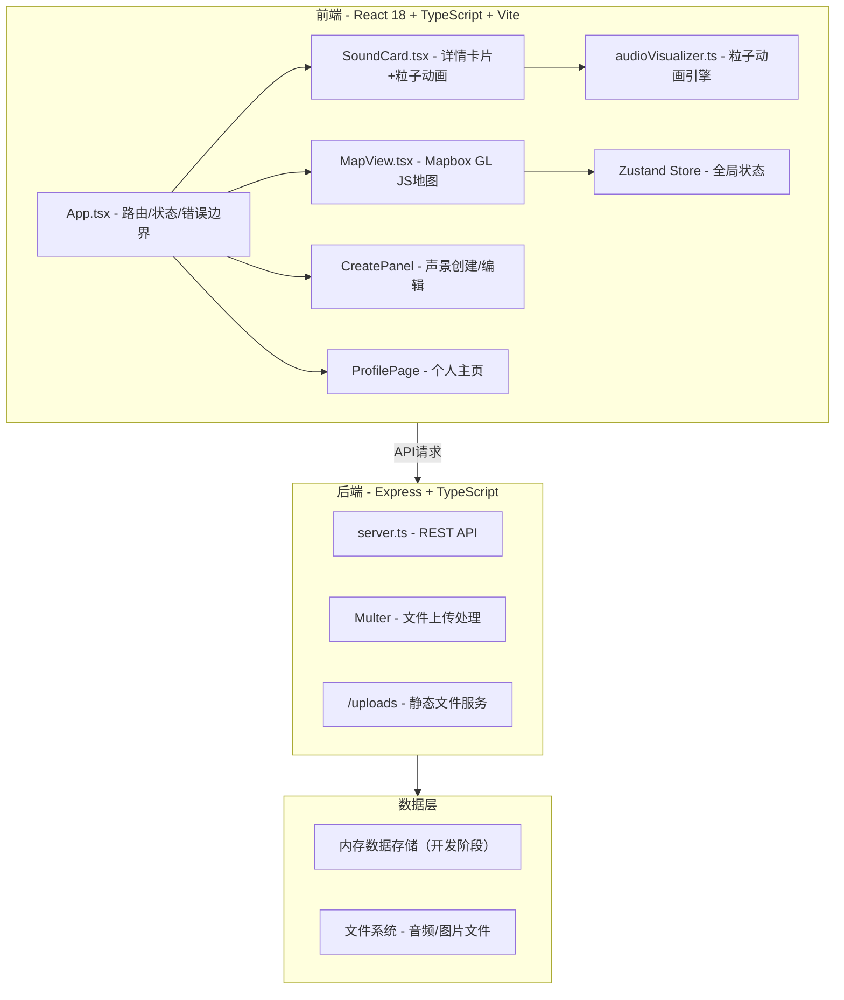
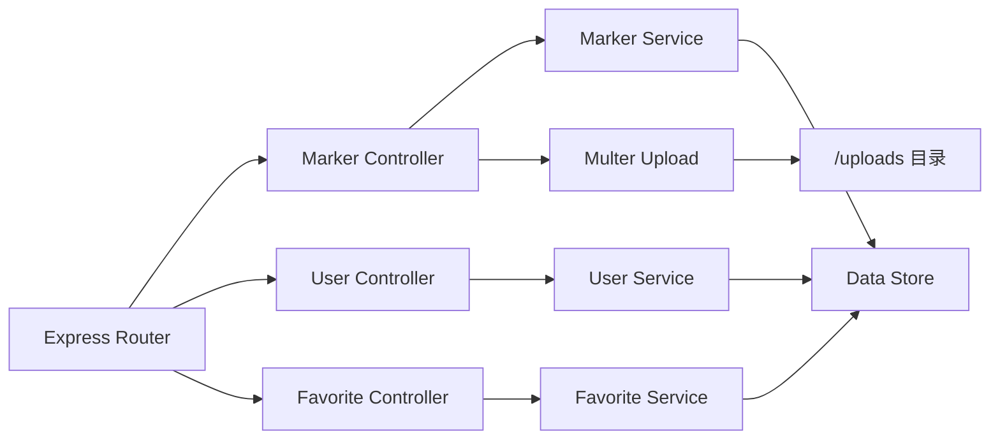
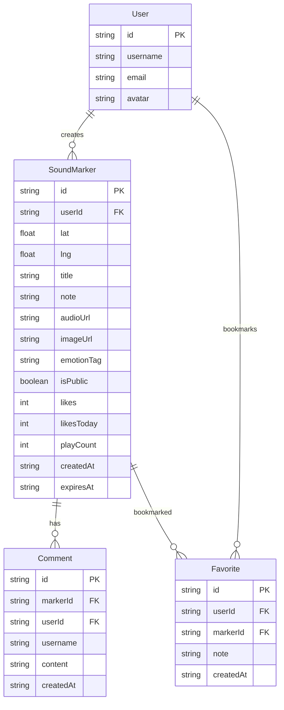

## 1. 架构设计



## 2. 技术说明

- **前端**：React@18 + TypeScript + Vite + Tailwind CSS@3 + Zustand（状态管理）+ Mapbox GL JS（地图）
- **初始化工具**：vite-init（react-express-ts模板）
- **后端**：Express@4 + TypeScript + Multer（文件上传）+ CORS + UUID
- **数据库**：内存数据存储（开发阶段，使用JSON文件持久化）
- **音频处理**：Web Audio API（AnalyserNode, fftSize=256）
- **粒子动画**：Canvas 2D API + requestAnimationFrame
- **地图**：Mapbox GL JS

## 3. 路由定义

| 路由 | 用途 |
|------|------|
| / | 地图探索主页，全屏地图+声景标记 |
| /profile | 个人主页，旅行日志+收藏管理 |
| /profile/favorites | 收藏夹独立页面 |

## 4. API定义

### 4.1 TypeScript类型定义

```typescript
interface SoundMarker {
  id: string;
  userId: string;
  lat: number;
  lng: number;
  title: string;
  note: string;
  audioUrl: string;
  imageUrl: string;
  emotionTag: EmotionTag;
  isPublic: boolean;
  likes: number;
  likesToday: number;
  playCount: number;
  comments: Comment[];
  createdAt: string;
  expiresAt: string;
}

type EmotionTag = 
  | 'serene' | 'noisy' | 'melancholy' | 'cheerful' 
  | 'mysterious' | 'leisurely' | 'tense' | 'warm' 
  | 'ethereal' | 'nostalgic';

interface Comment {
  id: string;
  userId: string;
  username: string;
  content: string;
  createdAt: string;
}

interface Favorite {
  id: string;
  userId: string;
  markerId: string;
  note: string;
  createdAt: string;
}

interface User {
  id: string;
  username: string;
  email: string;
  avatar: string;
}
```

### 4.2 API端点

| 方法 | 路径 | 请求格式 | 响应格式 | 描述 |
|------|------|----------|----------|------|
| GET | /api/markers | query: search, tag, sort, page, lat, lng | { markers: SoundMarker[], total: number } | 获取公开标记列表 |
| POST | /api/markers | multipart/form-data | SoundMarker | 创建新标记（含音频+图片上传） |
| PUT | /api/markers/:id | JSON | SoundMarker | 更新标记信息（笔记/标签/图片/可见性） |
| GET | /api/markers/:id | - | SoundMarker | 获取单个标记详情 |
| POST | /api/markers/:id/like | JSON | { likes: number, likesToday: number } | 点赞 |
| POST | /api/markers/:id/comment | JSON { content: string } | Comment | 评论 |
| GET | /api/users/:id/markers | query: page | { markers: SoundMarker[], total: number } | 获取用户个人标记 |
| POST | /api/favorites/:id | JSON { note?: string } | Favorite | 收藏标记 |
| GET | /api/favorites | query: page | { favorites: (Favorite & { marker: SoundMarker })[], total: number } | 获取收藏列表 |
| DELETE | /api/favorites/:id | - | { success: boolean } | 取消收藏 |

## 5. 服务端架构图



## 6. 数据模型

### 6.1 数据模型定义



### 6.2 情绪标签映射

| 标签键 | 中文标签 | 色值 | 色相偏移 |
|--------|----------|------|----------|
| serene | 宁静 | #6ECB63 | +30° → 绿偏黄 |
| noisy | 喧闹 | #FF6B6B | +30° → 红偏橙 |
| melancholy | 忧郁 | #5C6BC0 | +30° → 蓝偏紫 |
| cheerful | 欢快 | #FFD93D | +30° → 黄偏绿 |
| mysterious | 神秘 | #AB47BC | +30° → 紫偏粉 |
| leisurely | 悠然 | #26A69A | +30° → 青偏绿 |
| tense | 紧张 | #EF5350 | +30° → 红偏黄 |
| warm | 温馨 | #FF8A65 | +30° → 橙偏黄 |
| ethereal | 空灵 | #42A5F5 | +30° → 蓝偏青 |
| nostalgic | 怀恋 | #8D6E63 | +30° → 棕偏红 |
