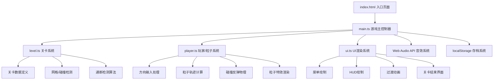

## 1. 架构设计



## 2. 技术说明

- **前端框架**：纯 TypeScript + HTML5 Canvas（无React/Vue，按用户需求）
- **构建工具**：Vite 5.x + TypeScript 5.x（严格模式，目标ES2020）
- **渲染引擎**：2D Canvas API，requestAnimationFrame驱动
- **音频引擎**：Web Audio API（原生，无第三方库）
- **数据存储**：localStorage（存档）
- **外部依赖**：仅 typescript、vite（用户明确指定）

## 3. 文件结构

| 文件路径 | 职责 |
|-------|------|
| `package.json` | 项目依赖与脚本配置 |
| `vite.config.js` | Vite构建配置（支持HMR） |
| `tsconfig.json` | TypeScript编译配置（严格模式，ES2020） |
| `index.html` | 入口HTML，深空黑背景，游戏标题 |
| `src/main.ts` | 游戏入口：Canvas初始化、游戏循环、事件分发 |
| `src/level.ts` | 关卡系统：网格定义、障碍物、端口、关卡生成、碰撞/通断检测 |
| `src/player.ts` | 玩家系统：输入处理、粒子系统、抛物线轨迹、反弹物理、爆炸效果 |
| `src/ui.ts` | UI系统：菜单、HUD、生命值、关卡过渡、结束界面、锁图标动画 |

## 4. 核心类型定义

```typescript
// 网格坐标（等距菱形网格使用行列坐标）
interface GridPos {
    row: number;
    col: number;
}

// 像素坐标
interface PixelPos {
    x: number;
    y: number;
}

// 方向枚举
enum Direction {
    UP = 'UP',
    DOWN = 'DOWN',
    LEFT = 'LEFT',
    RIGHT = 'RIGHT'
}

// 格子类型
enum CellType {
    EMPTY = 'EMPTY',
    OBSTACLE_STONE = 'OBSTACLE_STONE',
    OBSTACLE_ENERGY = 'OBSTACLE_ENERGY',
    EMITTER = 'EMITTER',
    RECEIVER = 'RECEIVER'
}

// 端口数据
interface Port {
    id: string;
    type: 'emitter' | 'receiver';
    position: GridPos;
    lockId?: string;
    unlocked?: boolean;
}

// 障碍物
interface Obstacle {
    id: string;
    type: 'stone' | 'energy' | 'moving';
    position: GridPos;
    path?: GridPos[];
    moveInterval?: number;
}

// 关卡数据
interface Level {
    id: number;
    name: string;
    gridSize: { rows: number; cols: number };
    ports: Port[];
    obstacles: Obstacle[];
    locks: { id: string; receiverIds: string[]; order?: number[] }[];
}

// 粒子
interface Particle {
    id: number;
    position: PixelPos;
    velocity: PixelPos;
    life: number;
    maxLife: number;
    color: string;
    size: number;
}

// 主游戏状态
enum GameState {
    MENU = 'MENU',
    PLAYING = 'PLAYING',
    TRANSITION = 'TRANSITION',
    GAME_OVER = 'GAME_OVER'
}
```

## 5. 核心算法

### 5.1 等距菱形网格坐标转换
```
// 行列坐标 -> 屏幕像素坐标（等距投影）
pixelX = (col - row) * tileWidth / 2 + offsetX
pixelY = (col + row) * tileHeight / 2 + offsetY

// 屏幕像素坐标 -> 行列坐标（逆变换）
col = ( (x - offsetX) / (tileWidth/2) + (y - offsetY) / (tileHeight/2) ) / 2
row = ( (y - offsetY) / (tileHeight/2) - (x - offsetX) / (tileWidth/2) ) / 2
```

### 5.2 粒子反弹物理
- 水平障碍物：翻转 y 方向速度分量
- 垂直障碍物：翻转 x 方向速度分量
- 精确反射：入射角 = 反射角

### 5.3 通断检测
使用BFS/DFS沿网格直线检测粒子路径，考虑障碍物反弹后的可达性。

### 5.4 波浪过渡动画
对每个网格单元计算到中心点的距离，按时间进度 t 控制亮度：
```
brightness = smoothstep(distance - waveWidth, distance, t * maxDistance)
```

## 6. 性能优化策略

| 策略 | 说明 |
|------|------|
| 对象池 | 粒子对象复用，避免频繁GC |
| 脏矩形渲染 | 仅重绘变化区域（优化备选） |
| 离屏Canvas | 静态网格预渲染缓存 |
| 帧率控制 | requestAnimationFrame + deltaTime计算 |
| 粒子上限 | 活跃粒子数 ≤ 50 |
| 事件节流 | 键盘输入去抖动 |

## 7. 音效定义

| 音效 | 波形 | 频率 | 时长 | 触发时机 |
|------|------|------|------|----------|
| 解锁音效 | 正弦波(sine) | 440Hz | 200ms | 粒子到达接收端 |
| 错误提示 | 方波(square) | 200Hz | 100ms | 点击未解锁关卡 |

## 8. 关卡设计

| 关卡 | 主题 | 难度特征 |
|------|------|----------|
| 第1关 | 初始跃迁 | 单发射-单接收，极简路径 |
| 第2关 | 折射初试 | 少量障碍物，一次反弹 |
| 第3关 | 镜面回廊 | 多次反弹路径 |
| 第4关 | 分岔迷途 | 多方向可选，仅一解 |
| 第5关 | 混沌迷宫 | 移动障碍物引入 |
| 第6关 | 时序迷阵 | 移动障碍物 + 精确时机 |
| 第7关 | 双锁之门 | 双端口协同，顺序解锁 |
| 第8关 | 三联核心 | 三端口顺序解锁 |
| 第9关 | 量子终局 | 多端口 + 移动障碍综合挑战 |
