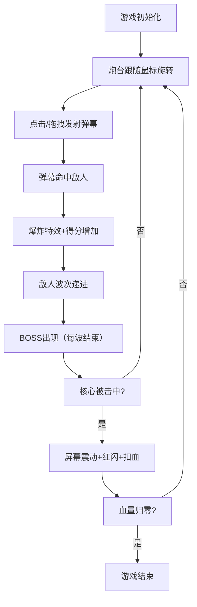

## 1. 产品概述

像素风格行星防御射击游戏，玩家操控轨道炮台抵御来袭的陨石和敌舰，保护行星核心不被摧毁。

- 面向休闲游戏玩家，提供快节奏、易上手的射击体验
- 复古像素风结合现代粒子特效，创造独特的视觉冲击力

## 2. 核心功能

### 2.1 功能模块

1. **游戏主界面**: 游戏画布、UI信息显示、操作提示
2. **炮台控制系统**: 360度旋转瞄准、鼠标点击/拖拽发射弹幕
3. **敌人系统**: 三种敌人类型（大型陨石、小型飞船、BOSS母舰）
4. **粒子特效系统**: 弹幕拖尾、爆炸碎片、击中反馈
5. **UI反馈系统**: 血条、得分、波数、屏幕震动、红色闪烁

### 2.2 页面详情

| 页面名称 | 模块名称 | 功能描述 |
|-----------|-------------|---------------------|
| 游戏主界面 | 炮台控制 | 360度旋转瞄准，鼠标点击/拖拽发射激光弹幕 |
| 游戏主界面 | 敌人生成 | 按波数生成三种类型敌人，BOSS每波结束出现 |
| 游戏主界面 | 碰撞检测 | 弹幕与敌人、敌人与行星核心的碰撞判定 |
| 游戏主界面 | 特效系统 | 弹幕拖尾粒子、爆炸碎片飞溅、击中闪光 |
| 游戏主界面 | UI显示 | 核心血条、当前得分、波数显示、微光脉动动画 |
| 游戏主界面 | 反馈系统 | 核心受击时屏幕震动、红色闪烁效果 |

## 3. 核心流程

玩家进入游戏 → 炮台自动对准鼠标方向 → 点击/拖拽发射弹幕 → 击落敌人获得分数 → 波数递进难度提升 → BOSS出现 → 循环直到核心被摧毁

## 4. 用户界面设计

### 4.1 设计风格

- **主色调**: 深空蓝紫渐变背景 (#0a0a1a → #1a0a2e)
- **强调色**: 霓虹绿 (#39ff14) 用于得分和正反馈，橙红 (#ff4500) 用于血量和警告
- **像素风格**: 8-bit像素绘制所有游戏元素，硬边无抗锯齿
- **按钮/血条**: 微光脉动动画，霓虹发光边框
- **字体**: 像素风格字体，所有UI文字使用霓虹绿/橙红色

### 4.2 页面设计概述

| 页面名称 | 模块名称 | UI元素 |
|-----------|-------------|-------------|
| 游戏主界面 | 背景层 | 深空蓝紫径向渐变，星点闪烁效果 |
| 游戏主界面 | 中央行星 | 像素风格行星，环绕轨道，核心发光 |
| 游戏主界面 | 炮台 | 8-bit像素炮台，360度旋转，炮管发光 |
| 游戏主界面 | 敌人 | 大型陨石（灰色像素块）、小型飞船（红色像素）、BOSS母舰（大型带护盾） |
| 游戏主界面 | 顶部UI | 核心血条（橙红色，脉动边框） |
| 游戏主界面 | 底部UI | 左对齐波数（霓虹绿），右对齐得分（霓虹绿） |
| 游戏主界面 | 特效层 | 弹幕粒子拖尾、爆炸碎片、击中闪光 |

### 4.3 响应式

- Desktop-first设计，Canvas自适应窗口大小
- 移动端触控支持：触摸滑动瞄准，点击发射
- 保持像素比例，避免拉伸变形
- 最小支持尺寸：320x480

### 4.4 性能要求

- 稳定60FPS运行
- 粒子数量>200时自动降低绘制精度（减少粒子数量、简化拖尾）
- 使用离屏Canvas优化渲染
- 采用requestAnimationFrame主循环
