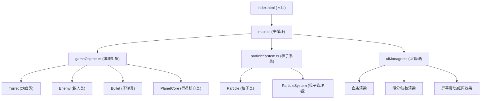

## 1. 架构设计



## 2. 技术描述

- **前端**: TypeScript + HTML5 Canvas 2D + Vite
- **构建工具**: Vite 5.x
- **语言**: TypeScript 5.x (strict模式, target ES2020)
- **无后端**: 纯前端游戏，所有逻辑在客户端运行
- **无外部依赖**: 仅使用typescript和vite作为开发依赖

## 3. 文件结构

```
auto1/
├── package.json          # 项目配置，启动脚本
├── index.html            # 入口HTML，Canvas容器
├── tsconfig.json         # TypeScript配置（严格模式）
├── vite.config.js        # Vite配置
└── src/
    ├── main.ts           # 游戏主循环，初始化/更新/渲染调度
    ├── gameObjects.ts    # 游戏对象类：炮台、敌人、子弹、行星核心
    ├── particleSystem.ts # 粒子系统：爆炸、拖尾粒子管理
    └── uiManager.ts      # UI管理：血条、分数、波数、震动反馈
```

## 4. 核心模块说明

### 4.1 main.ts - 游戏主循环

- 职责：游戏初始化、主循环调度、事件监听、性能监控
- 主要函数：
  - `init()`: 初始化所有模块、绑定事件
  - `gameLoop(timestamp)`: requestAnimationFrame主循环
  - `update(deltaTime)`: 更新所有游戏状态
  - `render()`: 渲染所有游戏元素
  - `handleResize()`: 响应式Canvas缩放

### 4.2 gameObjects.ts - 游戏对象

- **Turret (炮台)**: x, y, angle, rotationSpeed, fireRate, fire()
- **Enemy (敌人)**: 
  - `Asteroid`: 大型陨石，hp高，speed慢，size大
  - `Fighter`: 小型飞船，hp低，speed快，可发射子弹
  - `Boss`: 母舰，hp极高，有护盾，每波结束出现
- **Bullet (子弹)**: x, y, vx, vy, damage, isEnemy
- **PlanetCore (行星核心)**: x, y, maxHp, currentHp, radius

### 4.3 particleSystem.ts - 粒子系统

- **Particle**: x, y, vx, vy, life, maxLife, color, size, type
- **ParticleSystem**:
  - `emitTrail(x, y, color)`: 弹幕拖尾粒子
  - `emitExplosion(x, y, count, colors)`: 爆炸碎片
  - `update()`: 更新所有粒子
  - `render(ctx, quality)`: 根据质量参数渲染

### 4.4 uiManager.ts - UI管理

- `drawHealthBar(ctx, x, y, width, height, current, max, pulseTime)`
- `drawScore(ctx, score, x, y)`
- `drawWave(ctx, wave, x, y)`
- `applyScreenShake(ctx, intensity)`
- `applyRedFlash(ctx, alpha)`

## 5. 性能优化策略

### 5.1 渲染优化
- Canvas `imageSmoothingEnabled = false` 保持像素风格
- 使用 `requestAnimationFrame` 同步屏幕刷新率
- 粒子数量 > 200 时：降低粒子生成率、减小拖尾长度、简化绘制

### 5.2 计算优化
- 空间分区碰撞检测（网格划分）
- 对象池模式复用粒子和子弹对象
- 避免每帧创建新对象，复用已有对象

### 5.3 响应式适配
- 监听 `resize` 事件，动态调整Canvas尺寸
- 计算缩放比例保持游戏区域比例
- 像素坐标使用整数绘制保持清晰

## 6. 输入处理

- **鼠标移动**: 更新炮台瞄准角度
- **鼠标按下/拖拽**: 连续发射弹幕
- **触摸开始/移动**: 移动端瞄准和发射
- **窗口失焦**: 自动暂停游戏

## 7. 游戏数值配置

| 参数 | 数值 | 说明 |
|------|------|------|
| 行星核心最大HP | 100 | 初始血量 |
| 陨石HP | 30/50/80 | 小/中/大 |
| 飞船HP | 15 | 小型飞船 |
| BOSS HP | 500 | 母舰血量 |
| BOSS护盾 | 200 | 可恢复护盾 |
| 弹幕伤害 | 5 | 每发子弹伤害 |
| 敌人碰撞伤害 | 10/5/30 | 陨石/飞船/BOSS |
| 发射间隔 | 100ms | 连射间隔 |
| 粒子上限 | 300 | 超过自动降质 |
