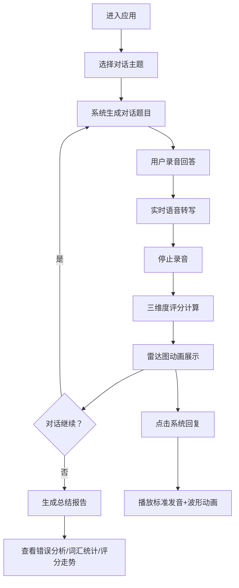

## 1. 产品概述

英语口语陪练和发音评分交互式应用，解决语言学习者缺乏即时反馈和真实对话场景的问题。通过AI驱动的对话模拟、实时语音转写和多维度发音评分，帮助用户提升英语口语能力。

- **核心问题**：传统语言学习缺乏真实对话练习场景，发音错误难以及时发现和纠正
- **目标用户**：英语学习者（初级到中级）、备考雅思/托福的考生、需要提升口语的职场人士
- **市场价值**：提供即时、个性化、低成本的英语口语练习解决方案

## 2. 核心功能

### 2.1 用户角色

| 角色 | 注册方式 | 核心权限 |
|------|---------|---------|
| 普通用户 | 无需注册，直接使用 | 选择对话主题、录音练习、查看评分、听发音示范 |

### 2.2 功能模块

1. **对话主题选择模块**：提供多种生活场景主题供用户选择
2. **语音对话模块**：实时录音、语音转写、对话气泡展示
3. **发音评分模块**：三维度评分（发音准确度、语法正确性、流利度）
4. **总结报告模块**：错误分析、词汇统计、历史评分走势
5. **发音示范模块**：标准美式发音播放、波形动画展示

### 2.3 页面详情

| 页面名称 | 模块名称 | 功能描述 |
|---------|---------|---------|
| 主页面 | 主题选择区 | 卡片式展示对话主题（餐厅点餐、旅行问路、面试等），点击进入对话 |
| 主页面 | 对话聊天区 | 左右分栏，左侧聊天气泡列表，支持从底部滑入动画 |
| 主页面 | 录音控制区 | 麦克风按钮，录音时红色脉冲动画，暂停时灰色 |
| 主页面 | 评分展示区 | 雷达图展示三维评分，渐变填充圆圈动画（2秒），附文字建议 |
| 主页面 | 总结报告区 | 常见错误列表、柱状图词汇统计、折线图评分走势 |
| 主页面 | 发音示范组件 | 点击句子播放发音，波形动画高亮当前单词 |

## 3. 核心流程

用户进入应用 → 选择对话主题 → 系统生成对话题目（气泡显示） → 用户点击录音按钮回答 → 语音实时转写为文本 → 停止录音后系统评分 → 雷达图动画展示结果 → 对话继续或结束 → 查看总结报告（错误列表、词汇统计、评分走势） → 可点击系统回复听发音示范

## 4. 用户界面设计

### 4.1 设计风格

- **主色调**：温和浅蓝色渐变背景（#E0F2FE → #DBEAFE），深蓝色文字（#1E3A5F）
- **辅助色**：用户气泡绿色渐变（#86EFAC → #4ADE80），系统气泡灰色渐变（#E5E7EB → #D1D5DB）
- **卡片样式**：白色背景，圆角20px，微弱阴影（box-shadow: 0 4px 20px rgba(0,0,0,0.06)）
- **按钮风格**：大圆角（16px），录音按钮圆形，带脉冲动画
- **字体**：系统无衬线字体栈，标题加粗，正文适中
- **图标风格**：Lucide React 线性图标

### 4.2 页面设计概览

| 页面名称 | 模块名称 | UI元素 |
|---------|---------|---------|
| 主页面 | 主题选择卡片 | 图标+标题+描述，hover上浮效果，选中高亮边框 |
| 主页面 | 对话气泡 | 渐变圆角矩形，用户左对齐（绿色），系统右对齐（灰色），底部滑入动画 |
| 主页面 | 录音按钮 | 圆形麦克风图标，录音时红色脉冲，灰色待机状态 |
| 主页面 | 雷达图 | Recharts RadarChart，渐变填充，2秒动画加载 |
| 主页面 | 柱状图/折线图 | Recharts组件，蓝色主色调，渐变填充 |
| 主页面 | 发音示范 | 波形条动画，当前单词高亮显示 |

### 4.3 响应式设计

- **桌面端（>1024px）**：左右分栏布局，左聊天区60% + 右评分区40%
- **平板端（768-1024px）**：上下堆叠布局，聊天区在上，评分区在下
- **手机端（<768px）**：全宽纵向排列，所有组件堆叠，字号自适应缩小
- **触摸优化**：按钮最小44x44px，充足间距防止误触

### 4.4 性能指标

- 语音转写延迟 < 3秒
- 评分计算在停止说话后2秒内输出
- 页面首屏加载 < 2秒
- 动画帧率保持60fps
